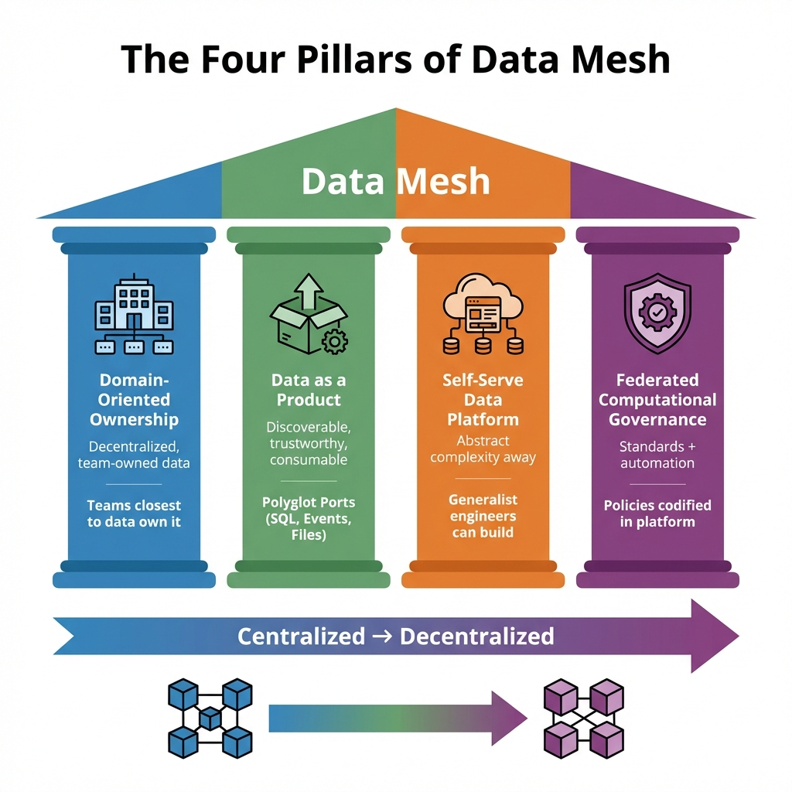
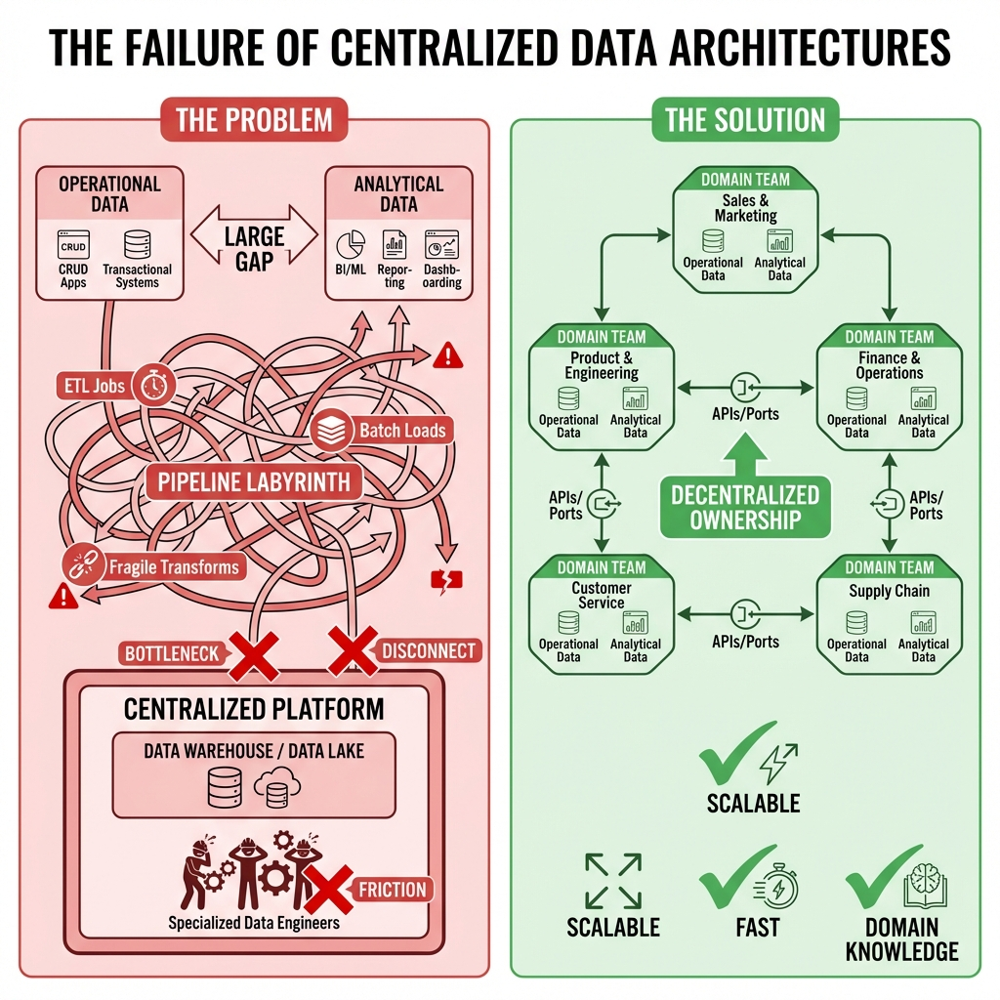
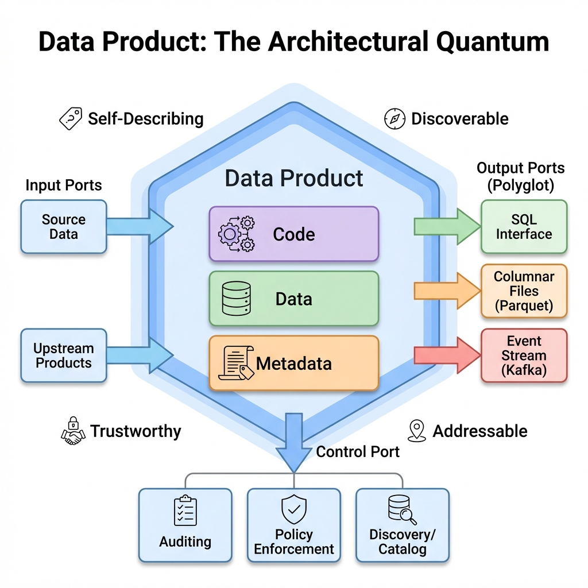

# Data Mesh: The Four Pillars (Zhamak Dehghani)

> **Source**: [Data Mesh Keynote - Zhamak Dehghani](https://youtu.be/L_-fHo0ZkAo?list=TLGGNmc0ZkfHiRkwOTAxMjAyNg)

> [!IMPORTANT]
> **The Core Thesis**: Centralized big data platforms (Data Warehouses, Data Lakes) have failed at scale. The solution is to treat **data as a product** owned by **domain teams**, not a centralized data engineering function.

---

## 📊 The Four Pillars

---

## 🔴 The Failure of Past Paradigms

Organizations have spent millions on first- and second-generation platforms, yet struggle with **scale** and **unproven business results**.

### Root Causes of Failure

| Problem | Description |
| :--- | :--- |
| **Isolated Planes** | Operational data (CRUD) and Analytical data (BI/ML) exist as separate worlds with no shared ownership. |
| **Pipeline Labyrinth** | A fragile maze of ETL jobs connects these worlds. Every pipeline is a point of failure. |
| **Centralized Monoliths** | Both Data Warehouse (canonical relational model) and Data Lake (raw blob storage) are monolithic architectures. |
| **Hyper-Specialized Silos** | Data Engineers are disconnected from data **providers** (source teams) and **consumers** (data scientists). They become a bottleneck. |

---

## 🏛️ Pillar 1: Domain-Oriented Ownership

> **Shift**: From centralized data team → to **decentralized domain teams**.

### The New Model
*   Data ownership is decomposed by **business domain** (e.g., Claims, Members, Orders).
*   The team **closest to the data** (either its origin or its specific consumption) is responsible for serving it.
*   This removes the centralized bottleneck and brings **domain expertise** to data management.

### Implications
| Old Model | New Model |
| :--- | :--- |
| Centralized Data Engineering team | Domain teams own their analytical data |
| Data Engineers far from source | Engineers are part of domain teams |
| Slow handoffs, lost context | Fast iteration, domain knowledge |

---

## 📦 Pillar 2: Data as a Product

> **Shift**: Data is not a byproduct → it is a **first-class product** with SLAs.

### The Architectural Quantum
A Data Product is a unit of architecture containing:
*   **Code**: Transformation logic, validation rules.
*   **Data**: The actual datasets.
*   **Metadata**: Schema, lineage, quality metrics.

### Polyglot Ports
A Data Product exposes multiple interfaces to "delight" consumers:

| Port Type | Example | Use Case |
| :--- | :--- | :--- |
| **Input Ports** | Kafka, S3 files | Receiving upstream data |
| **Output Ports (SQL)** | Presto, Trino | Ad-hoc queries by analysts |
| **Output Ports (Files)** | Parquet, ORC | Bulk loading for ML training |
| **Output Ports (Events)** | Kafka, Kinesis | Real-time streaming |
| **Control Ports** | Metrics API, Catalog | Auditing, discovery, policy |

### Product Qualities
A Data Product must be:
*   **Discoverable**: Listed in a central catalog.
*   **Addressable**: Has a stable URI/identifier.
*   **Trustworthy**: Published SLAs for quality/freshness.
*   **Self-Describing**: Schema and documentation are part of the product.

---

## ⚙️ Pillar 3: Self-Serve Data Platform

> **Shift**: Specialized data engineering → **generalist engineers** using a platform.

### The Goal
Prevent every domain team from reinventing infrastructure. A central **Data Infrastructure Team** provides:
*   Declarative configurations (e.g., YAML to define a data product).
*   Abstracted complexity (ingestion, storage, compute, serving).
*   "Paved roads" that make the right thing easy.

### What the Platform Provides
| Capability | Example Tools |
| :--- | :--- |
| **Compute** | Spark, Flink, dbt |
| **Storage** | Iceberg, Delta Lake, S3 |
| **Serving** | Trino, Pinot, Druid |
| **Orchestration** | Airflow, Dagster |
| **Catalog & Discovery** | DataHub, Atlan, Alation |
| **Quality & Monitoring** | Great Expectations, Monte Carlo |

---

## 🛡️ Pillar 4: Federated Computational Governance

> **Shift**: Centralized governance team → **federated group** making global decisions.

### The Model
*   A group of **domain owners** + **platform owners** defines standards.
*   Standards are **codified in the platform** via automation, not manual review.
*   Balance between **global interoperability** and **domain autonomy**.

### What to Standardize
| Category | Example |
| :--- | :--- |
| **Global Identifiers** | `customer_id`, `order_id` must be consistent across domains for joins. |
| **Quality Thresholds** | Every data product must pass > 99% completeness check. |
| **Schema Evolution** | Backward compatibility required for all changes. |
| **SLA Definitions** | Standard format for freshness, latency, availability. |

> [!WARNING]
> **Codify, Don't Police**: If a policy cannot be enforced via automation (e.g., CI/CD checks, platform validation), it will be ignored. Manual governance does not scale.

---

## 🚀 Execution Strategy

Dehghani emphasizes an **iterative, use-case-driven** approach:

1.  **Identify a Use Case**: Find a specific business need that "closes the loop" (data → insight → automated action).
2.  **Bootstrap Data Products**: Bring online only the products needed for that use case.
3.  **Iterate**: Expand the mesh incrementally.

> [!CAUTION]
> **Refactoring Trap**: Avoid using existing Data Warehouse tables as intermediate sources. They are often optimized for outdated tech (star schemas) rather than source-aligned domain logic.

---

## 📖 A New Language for Data

Dehghani calls for a **new vocabulary** to describe data ecosystems:

| Old Paradigm | New Paradigm |
| :--- | :--- |
| "Ingesting" data | "Consuming" data |
| "Loading" to warehouse | "Serving" via APIs |
| Operational vs Analytical | **Layers of the same ecosystem** |
| Data Engineers (specialized) | Domain Engineers (generalists) |

---

## ✅ Principal Architect Checklist

1.  **Assign Domain Ownership**: Identify 3-5 business domains. Assign data ownership to those teams, not a central team.
2.  **Define Data Product Standards**: Create a template for what a "Data Product" includes (code, data, metadata, SLAs).
3.  **Build the Self-Serve Platform First**: Without a platform, domain teams will build fragmented solutions. Invest upfront.
4.  **Codify Governance in CI/CD**: Every policy (quality, schema, naming) must be enforced via automated checks. Manual review doesn't scale.
5.  **Start with One Use Case**: Don't boil the ocean. Deliver value for one end-to-end use case, then expand.
6.  **Adopt New Language**: Stop saying "ingest" and "load". Start saying "consume" and "serve". Language shapes thinking.

---

## 🏢 Analogy: The City vs. The Factory

> [!TIP]
> **Understanding Data Mesh**:
>
> **Old Model (The Factory)**:
> *   One central factory (Data Team) produces all goods (analytics).
> *   Raw materials (data) are trucked in from everywhere.
> *   Bottleneck at the factory gate. Long lead times.
>
> **New Model (The City)**:
> *   Many independent businesses (Domain Teams) produce their own goods.
> *   They follow city regulations (Governance) and use city infrastructure (Platform).
> *   Goods are traded via a common marketplace (Data Catalog).
> *   **Result**: The city scales. The factory doesn't.
