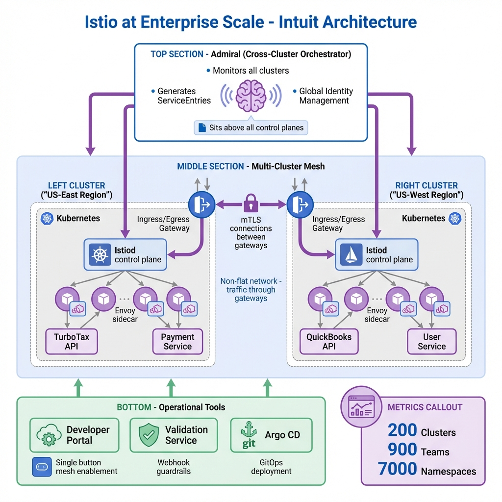
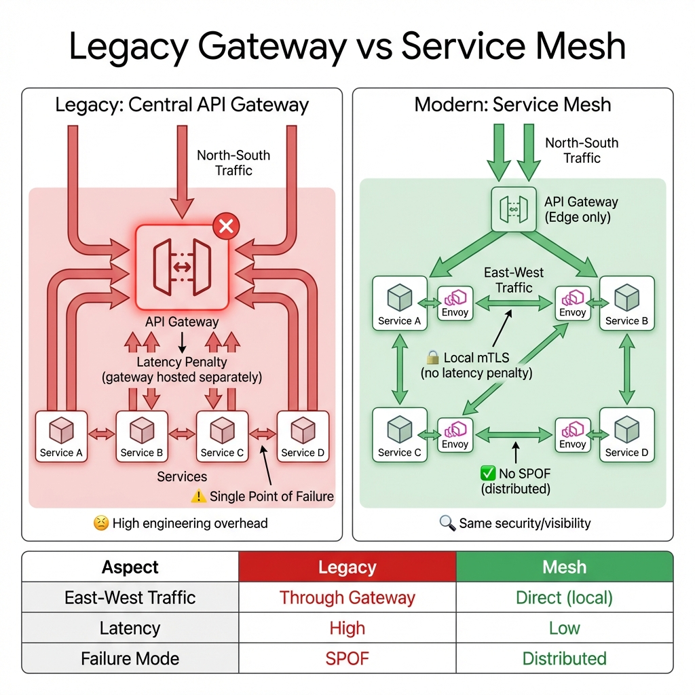
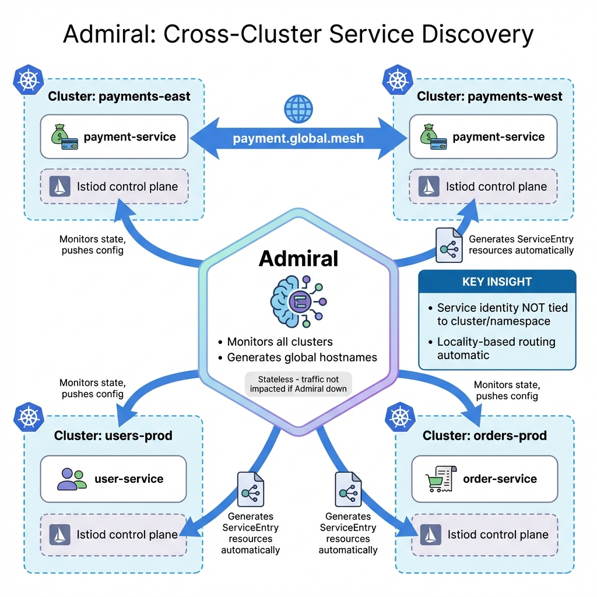

# Istio at Enterprise Scale: Intuit's Service Mesh Journey

> **Source**: [Istio at Enterprise Scale - Intuit (Jason Webb & Charu Joshi)](https://youtu.be/bAl_y6sdFbY)

> [!IMPORTANT]
> **The Scale**: Intuit operates TurboTax, QuickBooks, and Mint with **5,000 developers**, **200 Kubernetes clusters**, **900 scrum teams**, and **7,000 namespaces** serving **50 million customers**. This is what enterprise-grade service mesh looks like.

---

## 📊 Enterprise Architecture Overview

---

## 🏢 The Path to Service Mesh

### The Journey
1.  **Monolith Era**: Single applications, simple infrastructure.
2.  **Microservices Migration**: Broke monoliths into services.
3.  **Kubernetes Adoption**: Managed microservice complexity.
4.  **Gap Identified**: Kubernetes solved orchestration but left **networking gaps** at massive scale.

---

## 🔴 Legacy Architecture: The API Gateway Problem

### How Legacy Worked
*   **All traffic** (North-South AND East-West) routed through a **central API Gateway**.
*   Gateway handled: OAuth2, AuthN/AuthZ, metrics, traffic shaping.

### Benefits of Legacy
| Benefit | Description |
| :--- | :--- |
| **Single Enforcement Point** | All security in one place |
| **High Visibility** | All traffic observable |
| **Traffic Shaping** | Critical for on-prem to cloud migration |

### Why It Broke at Scale

| Problem | Impact |
| :--- | :--- |
| **Latency Penalty** | Gateway hosted separately from workloads. Every call adds network hop. |
| **Single Point of Failure** | Gateway down = everything down. Required massive engineering to mitigate. |
| **Scaling Bottleneck** | Gateway must scale with ALL traffic, not just edge. |

---

## ✅ The Istio Solution

### The New Model
*   **North-South Traffic**: Still goes through API Gateway at cluster ingress.
*   **East-West Traffic**: Stays **local** to clusters using **mTLS** via sidecars.

### What Istio Provides
*   ✅ **Same security** (mTLS replaces OAuth for internal traffic).
*   ✅ **Same visibility** (Envoy proxies emit metrics).
*   ✅ **No latency penalty** (local communication).
*   ✅ **No SPOF** (distributed sidecars).

---

## 🌐 Enterprise-Scale Challenges

Adopting Istio across **200 clusters** introduced unique hurdles:

| Challenge | Description |
| :--- | :--- |
| **Multi-Region/Multi-Cluster** | Clusters spread across East/West US regions. |
| **Non-Flat Network** | No pod-to-pod connectivity across clusters. All cross-cluster traffic through gateways. |
| **Multi-Tenancy** | 900 teams configuring the mesh. One bad config could crash entire infrastructure. |
| **Self-Service** | Service owners must join mesh without manual platform team intervention. |

---

## 🛠️ Key Technical Solutions

### 1. Intuit Developer Portal
A **self-service hub** for developers:
*   Create services with one click.
*   Automatically sets up repos, CI/CD (Argo CD), dashboards.
*   **Single button** to enable mesh: generates PR with Istio annotations (`istio-inject: true`).

### 2. Admiral (Open Source)

**Critical for cross-cluster communication**:
*   Sits **above all control planes**.
*   Monitors clusters, generates **ServiceEntries** automatically.
*   Creates **unique global hostnames** based on service identity.
*   Handles **locality-based routing** (prefer same-region).
*   **Stateless**: If Admiral goes down, existing traffic is NOT impacted.

> [!TIP]
> **Admiral's Superpower**: Service identity is **not tied** to a specific cluster or namespace. You can migrate services or ownership without changing consumers.

### 3. Validation Service
A **Kubernetes Admission Webhook** acting as guardrails:
*   Rejects invalid configurations.
*   Prevents configs that accidentally expose to all namespaces.
*   Blocks references to hostnames the service doesn't own.

### 4. Automated Lifecycle Management
*   **Mesh plugin/add-on** for cluster creation.
*   Automates Istio installation and upgrades.
*   Every cluster gets mesh automatically.

---

## 💡 Developer & Operational Benefits

| Benefit | Description |
| :--- | :--- |
| **Multi-Cluster Identity** | Service identities portable across clusters/namespaces. |
| **Automated Configuration** | All Istio resources rendered into Git repos (GitOps). |
| **Race Condition Prevention** | Startup scripts ensure sidecar is ready before app starts. |
| **Governance at Scale** | Validation service keeps mesh stable with 900 independent teams. |

---

## 📊 Operational Metrics

| Metric | Intuit Scale | Target |
| :--- | :--- | :--- |
| **Clusters Managed** | 200 | Fully automated lifecycle |
| **Scrum Teams** | 900 | Self-service enablement |
| **Namespaces** | 7,000 | Multi-tenant isolation |
| **Mesh Enablement Time** | One button | < 5 minutes |
| **Cross-Cluster Latency** | Via gateways | < 10ms added |

---

## ✅ Principal Architect Checklist

1.  **Start with Gateway Pattern (Temporarily)**: If migrating from legacy, keep API Gateway for North-South initially. Migrate East-West to mesh first.
2.  **Build Self-Service Tooling**: At scale, platform teams become bottlenecks. Invest in developer portals and automation.
3.  **Implement Validation Webhooks**: With many teams, guardrails are mandatory. Prevent bad configs before they apply.
4.  **Adopt Admiral for Multi-Cluster**: Don't try to manage ServiceEntries manually across 200 clusters. Use automation.
5.  **Design for Non-Flat Networks**: Assume pods can't talk directly across clusters. Plan for ingress/egress gateways.
6.  **GitOps Everything**: Mesh configuration should be version-controlled and auditable via Argo CD or similar.

---

## 🔗 Related Documents
*   [Service Mesh at Scale (HashiCorp Consul)](service-mesh-at-scale.md) — Alternative to Istio with multi-cloud focus