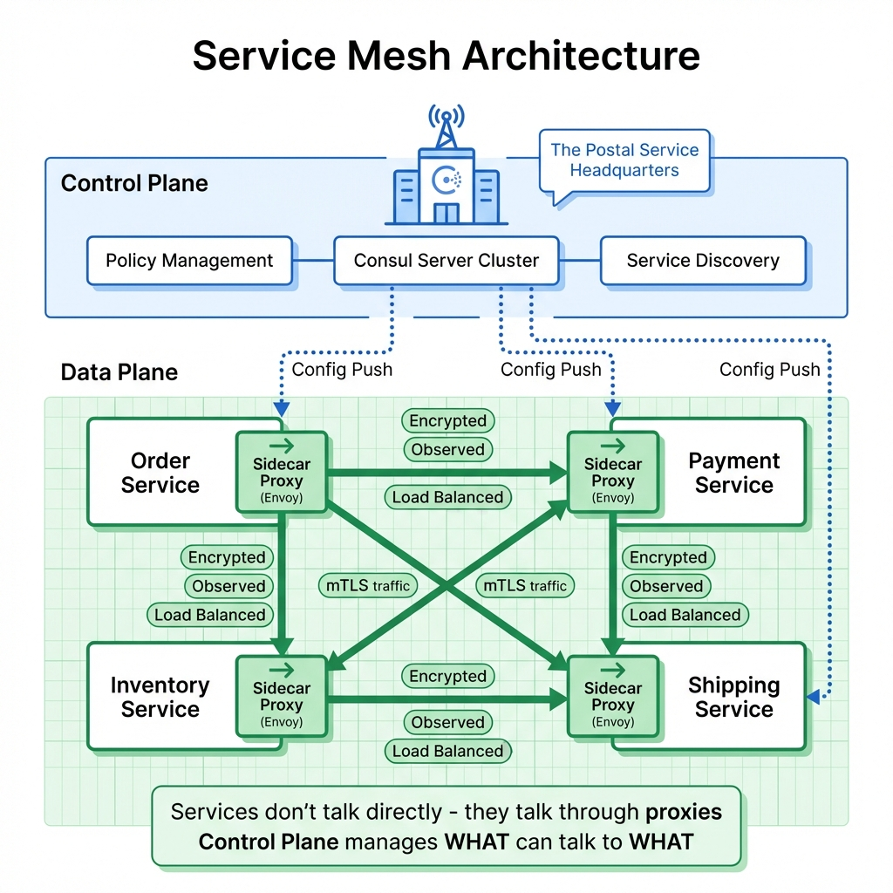
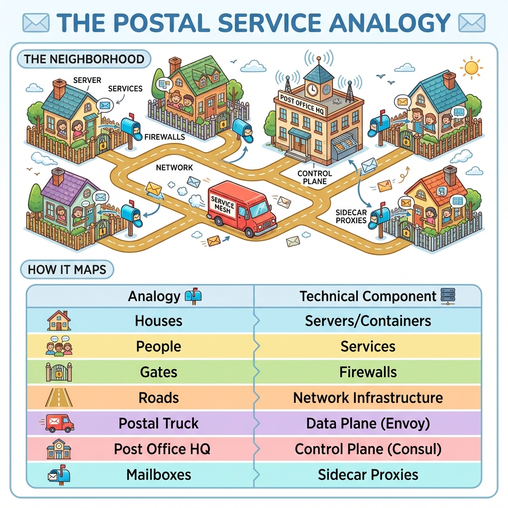
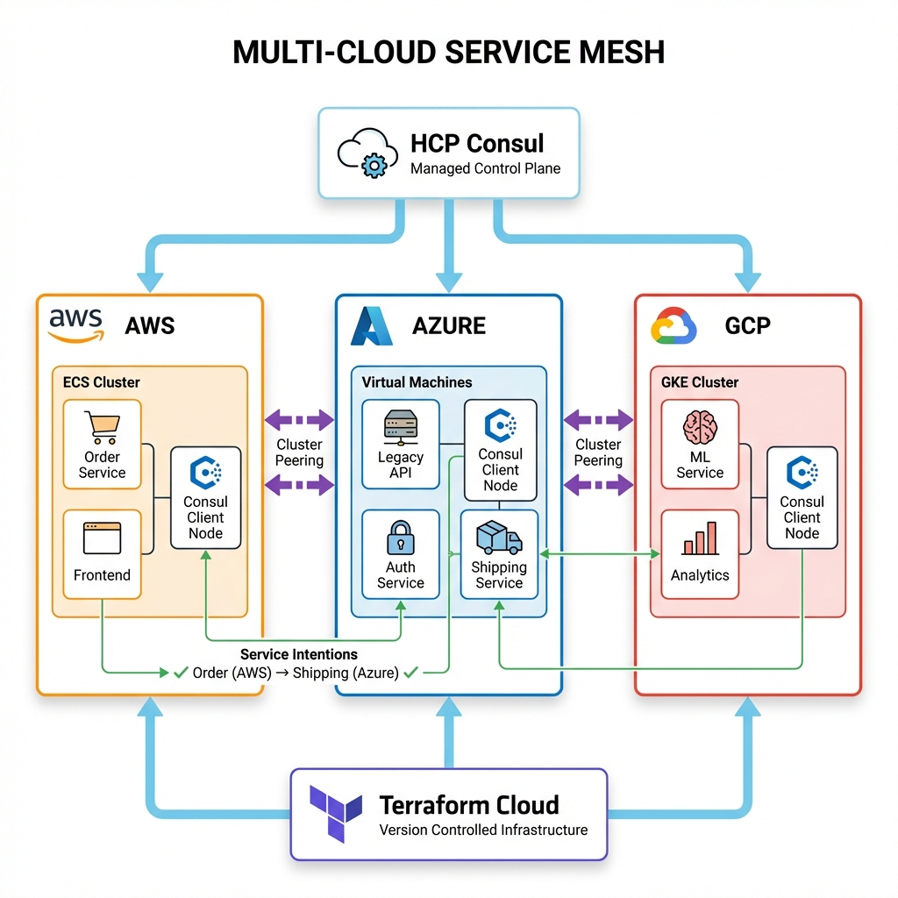

# Service Mesh at Scale: From Monolith to Multi-Cloud

> **Source**: [Service Mesh at Scale - Cole Morrison (HashiCorp)](https://www.youtube.com/watch?v=4WENIQ_zp5c)

> [!IMPORTANT]
> **The Core Problem**: As organizations move from monoliths to microservices, **service-to-service communication** becomes the biggest challenge. A Service Mesh solves this by providing a dedicated infrastructure layer for secure, observable communication.

---

## 📊 Service Mesh Architecture



---

## 🏢 The Scalability Equation

Scalability is **not just a software problem**. It's a bi-directional equation:

```
Users ←→ People ←→ Software ←→ Infrastructure
```

Each component influences the others. You cannot answer "how to scale" if any piece is missing.

---

## 🚀 The Journey from Monolith to SOA

### Stage 1: The Monolith
*   Small team, simple application, single database.
*   **Efficient** for initial size. Easy to deploy and debug.

### Stage 2: Vertical Scaling
*   User base grows. Solution: make things "bigger".
*   Bigger servers, more memory, more CPU.
*   **No structural change** to the application.

### Stage 3: The Bottleneck
*   The monolith becomes an **inefficiency**.
*   Scaling one business domain requires scaling the **entire application**.
*   Development slows down. Deployments become risky.

### Stage 4: Service Oriented Architecture (SOA)
*   **Conway's Law**: Software structure mirrors organizational structure.
*   Break into small, autonomous services owned by small, autonomous teams.
*   Enables **independent scaling** and **asynchronous workflows**.

> [!WARNING]
> **The Trade-off**: SOA solves the monolith problem but creates a **massive new challenge**: communication friction between services.

---

## 🌐 The Communication Problem

As services multiply across regions and clouds, new questions emerge:

| Challenge | Questions |
| :--- | :--- |
| **Service Discovery** | How does Service A find Service B? IPs? DNS? Load balancers? |
| **Access Control** | Who can talk to whom across hundreds of services? |
| **Security** | How do we encrypt traffic between services? |
| **Observability** | How do we trace a request across 10 services? |
| **Multi-Cloud** | How do services in AWS talk to services in Azure? |

---

## 📬 The Postal Service Analogy



### The Mapping

| Analogy | Technical Component |
| :--- | :--- |
| **Houses** | Servers / Containers |
| **People in Houses** | Services |
| **Gates** | Firewalls |
| **Roads** | Network Infrastructure |
| **Mailboxes** | Sidecar Proxies (Envoy) |
| **Postal Truck** | Data Plane |
| **Post Office HQ** | Control Plane (Consul Server) |

### What the Postal Service Provides
*   **Standard Protocol**: Everyone uses the same mailbox format.
*   **Security**: Packages are sealed (mTLS encryption).
*   **Routing**: HQ knows how to deliver anywhere.
*   **Observability**: Every package is tracked.

---

## 🏗️ Control Plane vs Data Plane

| Component | Role | Example |
| :--- | :--- | :--- |
| **Control Plane** | The "brain". Manages policies, discovery, configuration. | Consul Server Cluster |
| **Data Plane** | The "muscle". Proxies that handle actual traffic. | Envoy Sidecar Proxies |

### How They Work Together
1.  **Control Plane** pushes configuration to all proxies.
2.  **Data Plane** (proxies) enforce the configuration on live traffic.
3.  Services never talk directly—they talk through proxies.

---

## ☁️ Multi-Cloud Implementation



### Demo Architecture (from HashiCorp)
A production-grade mesh spanning three clouds:

| Cloud | Runtime | Services |
| :--- | :--- | :--- |
| **AWS** | ECS (Containers) | Order Service, Frontend |
| **Azure** | Virtual Machines | Legacy API, Auth Service |
| **GCP** | GKE (Kubernetes) | ML Service, Analytics |

### Key Components
*   **HCP Consul**: HashiCorp's managed control plane.
*   **Cluster Peering**: Connects clusters across clouds.
*   **Service Intentions**: Define which services can talk (e.g., `Order → Shipping ✓`).
*   **Terraform Cloud**: Version-controlled infrastructure.

---

## 🛠️ Implementation Guideposts

### 1. Baseline Requirements
*   Set up networking ports, firewalls, routing rules.
*   Define the network topology.

### 2. Deploy Control Plane Clusters
*   Create Consul server clusters (the "headquarters").
*   High availability: 3-5 servers per cluster.

### 3. Access Control
*   Implement **ACL tokens** and **HCL policies**.
*   Define who can register services, who can query.

### 4. Client Proxies (mTLS)
*   Deploy sidecar proxies with every service.
*   All service traffic flows through proxies.
*   **Mutual TLS** encrypts everything automatically.

### 5. Peering and Gateways
*   Connect disparate clusters and data centers.
*   Acts as a **built-in VPN** for the mesh.

---

## 📊 Operational Metrics

| Metric | Target | Why |
| :--- | :--- | :--- |
| **mTLS Coverage** | 100% | Any unencrypted traffic is a security risk. |
| **Proxy Latency** | < 1ms added per hop | Proxies should be invisible to performance. |
| **Control Plane Uptime** | 99.99% | If control plane is down, new services can't register. |
| **Service Intention Violations** | 0 | Any violation indicates misconfiguration or attack. |

---

## ✅ Principal Architect Checklist

1.  **Start with Observability**: Before enforcing policies, deploy the mesh in "permissive" mode to observe current traffic patterns.
2.  **Secure Before You Scale**: Enable mTLS from day one. Retrofitting security is painful.
3.  **Use Service Intentions**: Don't rely on network segmentation alone. Define explicit allow/deny rules at the service level.
4.  **Plan for Multi-Cluster**: Even if you start single-cluster, design for peering. Cloud migrations are common.
5.  **Automate with IaC**: Use Terraform/Pulumi to manage mesh configuration. No manual changes to production.
6.  **Monitor Proxy Resources**: Sidecar proxies consume memory and CPU. Plan capacity accordingly (typically 50-100MB RAM per proxy).

---

## 🌍 Analogy: International Trade Network

> [!TIP]
> **Understanding Service Mesh at Scale**:
>
> Originally, one company (**The Monolith**) did everything in one building.
>
> As the company grew, it split into hundreds of specialized factories (**Services**) across different countries (**Clouds**).
>
> A **Service Mesh** is the **global logistics and customs system** that ensures:
> *   Every package is **encrypted/sealed** (mTLS).
> *   Has the right **paperwork** (Access Control / Intentions).
> *   Knows exactly which **ship or plane** to take (Control Plane Routing).
>
> The factories can focus on **building products** rather than worrying about international shipping laws.
