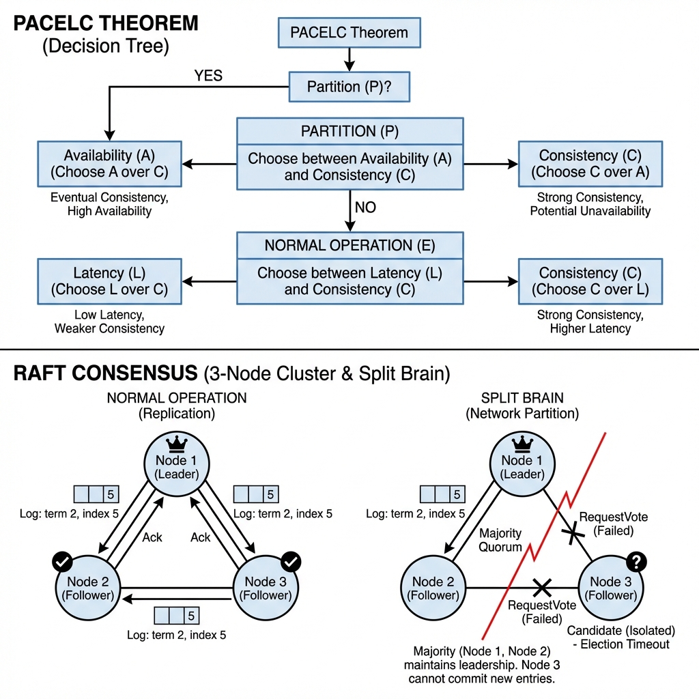
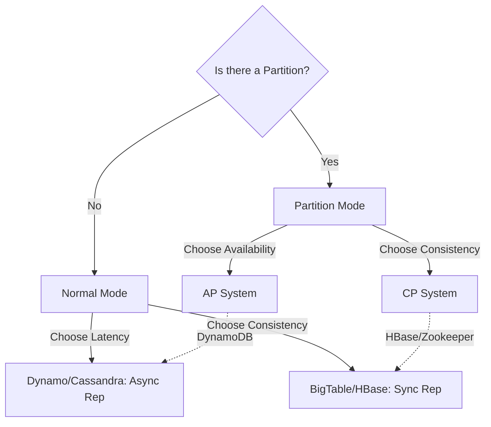
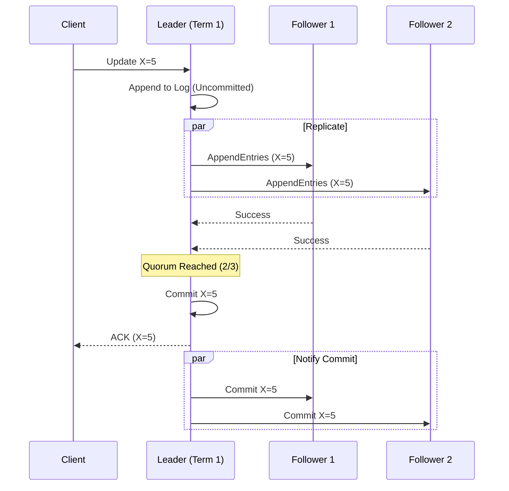

# Distributed Systems Theory: CAP, PACELC, and Consensus

> **Source**: [Distributed Systems in One Lesson](https://youtu.be/uTJvMRR40Ag)

> [!IMPORTANT]
> **The First Law**: A distributed system is "Shared Nothing". Nodes share no memory and no disk. They communicate only via an **unreliable network** (Async, Lossy, Reordered).
> **The Consequence**: You can never truly know if a node is dead or just slow.

---

## 📐 Beyond CAP: The PACELC Theorem

The CAP Theorem (Pick 2 of 3) is too simple. It ignores the system's state when there is *no* partition.
**PACELC** (by Daniel Abadi) states:
*   If **P**artition (P): Choose **A**vailability or **C**onsistency.
*   **E**lse (E) (No Partition): Choose **L**atency or **C**onsistency.

*   **DynamoDB/Cassandra**: Prioritize **Latency**. Writes succeed on 1 node (W=1) and replicate asynchronously. Risk: Stale reads.
*   **Zookeeper/Etcd**: Prioritize **Consistency**. Writes must ack on Quorum (W=Q). Risk: Higher latency.

---

## 💀 Failure Detection: The Epistemological Nightmare

How do you know a node is dead?
*   **Heartbeat**: "Are you there?" ... (Silence) ... "Dead."
*   **Problem**: What if the node is in a Java **Garbage Collection (GC) Stop-the-World** pause? It's alive, just frozen. If you elect a new leader, and the old one wakes up, you have **Split Brain**.

### Phi Accrual Failure Detectors (The Akka Solution)
Instead of a binary "Up/Down", output a **probability** of failure.
*   Collect inter-arrival times of heartbeats.
*   Calculate $\phi$ (Phi): proportional to the probability that the heartbeat is just delayed.
*   If $\phi > 8$, trigger failover. This adapts to network jitter vs. real crashes.

---

## 🗳️ Consensus & Leader Election (Raft)

When you need strong consistency (CP), you need Consensus.

### The "Split Brain" Scenario
A network cut isolates the Leader from the Majority.
*   **Old Leader**: Cannot reach majority. Cannot commit writes. System pauses (Availability suffers).
*   **Majority Side**: Elects **New Leader** (Term 2). Accepts writes.
*   **Rejoin**: Old Leader sees Term 2 > Term 1. Steps down. Rolls back uncommitted logs.

---

## 🕒 The Time Problem (Clock Skew)

Servers depend on NTP. NTP drifts by milliseconds or seconds.
> "Time is an illusion. Lunchtime doubly so." — Douglas Adams

*   **LWW (Last Write Wins)**: If Clock A is fast and Clock B is slow, A's write might overwrite B's write even if B happened *physically* later.
*   **Google Spanner's Solution (TrueTime)**: Use Atomic Clocks + GPS in every datacenter.
    *   API returns an interval: `[earliest, latest]`.
    *   System **waits out the uncertainty** (e.g., 7ms) before committing.
    *   Result: External Consistency (Linearizability) at global scale.

---

## ✅ Principal Architect Checklist

1.  **Assume the Network is Hostile**: Replays, delays, and drops are normal. Design idempotent APIs.
2.  **Define Your Consistency Boundary**: Do you need linearizability (slow) or causal consistency (fast)? Don't pay for CP if existing business logic tolerates AP.
3.  **Beware of Stop-the-World GC**: Use ZGC/Shenandoah (Java) or Go 1.18+ to keep pauses < 1ms. Long GC pauses cause false failovers.
4.  **Use Fencing Tokens**: If a Leader might be a zombie, ensure the storage layer rejects its writes with an old Term ID (Epoch).
5.  **Don't Roll Your Own Paxos**: Use Zookeeper, Etcd, or Consul. Consensus is mathematically hard to implement correctly.
6.  **Monitor Clock Drift**: Alert if NTP drift > 100ms. Distributed databases (Cassandra/CockroachDB) panic if clocks diverge.

---

## 📖 Analogy: The Global Scavenger Hunt via Mail

> [!TIP]
> Distributed Systems are like **coordinating a global scavenger hunt via standard mail**.
>
> *   **The Network**: Mail can be lost, delayed, or eaten by sharks.
> *   **The Partiton**: If mail to Australia stops, do they keep playing (Availability) or stop and wait (Consistency)?
> *   **Split Brain**: Two people declare themselves Captain because they haven't received each other's letters.
> *   **Clock Skew**: You say you found the item at 10:00, I say 9:59. Who wins? If my watch is slow, I cheat you.

---

## 🔗 Related Documents
*   [Database Scaling](../distributive-backend/database/database-scalling.md) — Applying these rules to DBs
*   [Multi-Region Sync](../distributive-backend/multi-tenancy/multi-region-sync.md) — Practical replication
