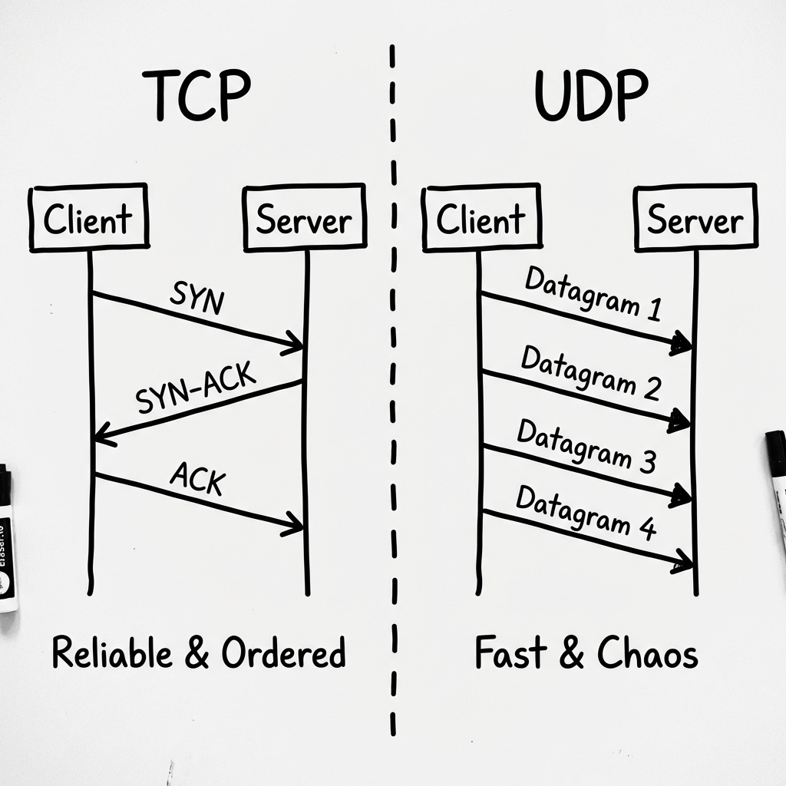
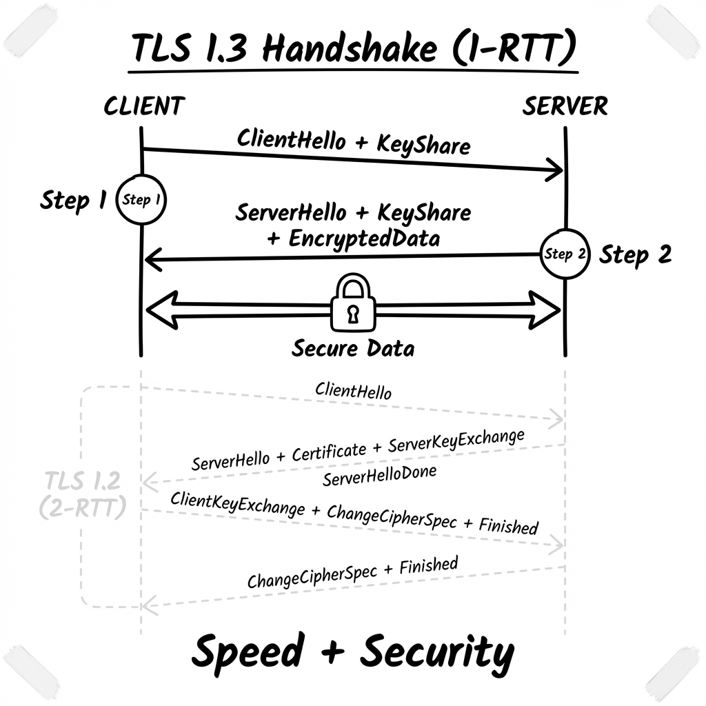
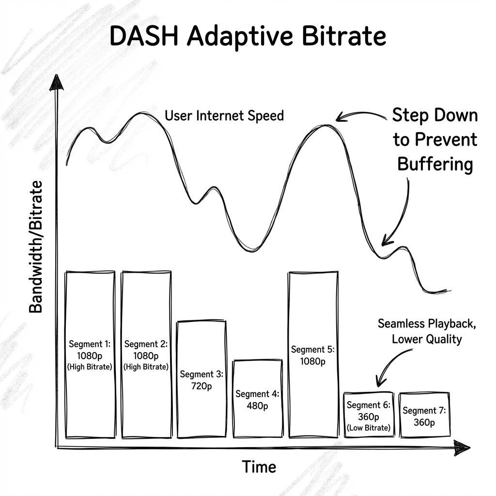
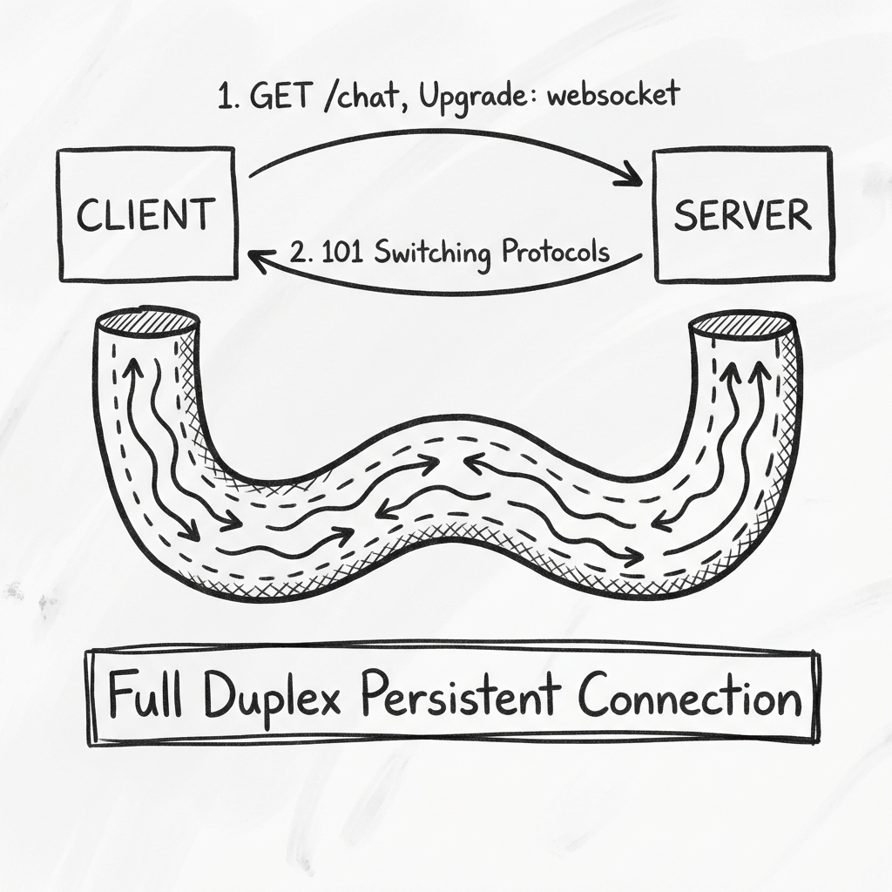
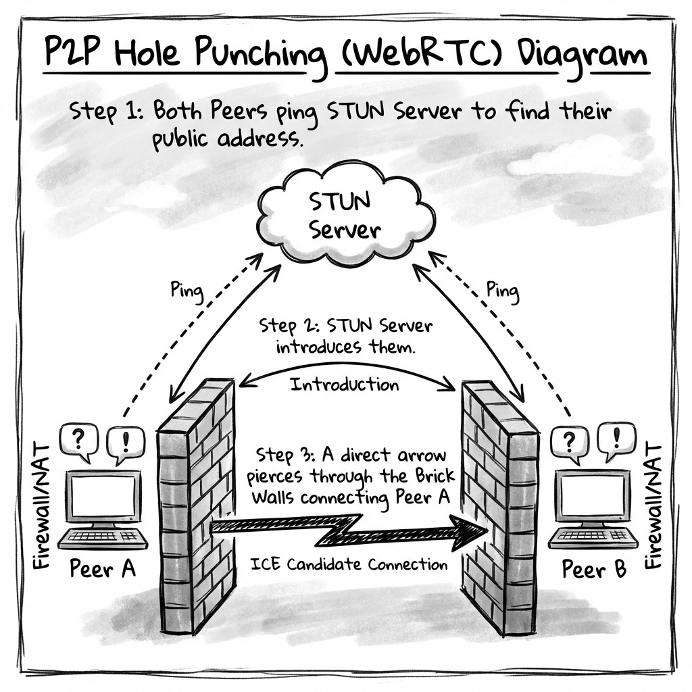

# Streaming Networking: The "Internal Implementation" Guide

> **Level**: Principal Architect / Kernel Engineer
> **Scope**: Implementation details of TCP Stack, QUIC User-Space networking, and Low-Latency Video delivery.

> [!IMPORTANT]
> **The Principal Law**: **Latency is a buffer problem**.
> Every layer (NIC Ring Buffer -> Kernel `sk_buff` -> Socket Buffer -> Application Buffer) adds latency. Real-time streaming is the art of **emptying buffers faster than you fill them**.

---

## 1. TCP vs UDP: The Kernel Perspective

It is not just "Reliable vs Unreliable". It is about **Congestion Control Algorithms**.

### TCP: The "AIMD" Problem
*   **The Mechanism**: TCP uses **Additive Increase / Multiplicative Decrease**.
*   **The Problem (Cubic)**: Standard TCP (Cubic) interprets *Packet Loss* as *Congestion*.
    *   *Scenario*: You are streaming 4K. One packet drops due to a cosmic ray. TCP cuts your bandwidth in **half**. The stream buffers.
*   **The Google Solution (BBR)**: **Bottleneck Bandwidth and Round-trip propagation time**.
    *   BBR does *not* care about packet loss. It models the **Pipe Size** (Bandwidth * Delay). It pumps data at exactly the rate the pipe can handle, ignoring random loss.
    *   **Tuning**: `sysctl -w net.ipv4.tcp_congestion_control=bbr`

### UDP: The "User-Space" Freedom
*   **Kernel Bypass**: UDP allows you to move logic out of the Slow Kernel (fighting with other processes) and into **User Space** (QUIC).
*   **Fragmenetation**: UDP packets (Datagrams) have a hard MTU limit (~1500 bytes). If you send a 4KB frame, IP fragments it. If *one* fragment is lost, the *entire* 4KB is dropped.
*   **Architectural Rule**: Always implement **Path MTU Discovery** to avoid IP Fragmentation.

---

## 2. TLS 1.3 & 0-RTT: The "Handshake Tax"

Latency kills start-up time.

### TLS 1.2 (The Legacy 2-RTT)
1.  **Client**: "Hello, I speak RSA and AES."
2.  **Server**: "Let's use AES. Here is my Certificate."
3.  **Client**: "Verifying Certificate... OK. Here is the Key." (2 Round Trips).

### TLS 1.3 (The Modern 1-RTT)
*   **Changes**: Removed weak ciphers (RSA Key Exchange). Enforced **Forward Secrecy (ECDHE)**.
*   **Flow**: Client guesses the server's key type (usually Elliptic Curve x25519) and sends its Key Share *in the first message*.
*   **0-RTT (Zero Round Trip)**:
    *   If the user has visited before, the client uses a **Session Ticket**.
    *   It encrypts the GET request using the *previous* session key and sends it **with the Hello**.
    *   **Risk**: **Replay Attacks**. (Idempotency is critical here).

---

## 3. LL-DASH & CMAF: "Chunked" Low Latency

Standard DASH has 30s latency because you wait for a 4s segment to be fully created before downloading.

### Low Latency DASH (LL-DASH)
*   **The Trick**: **HTTP/1.1 Chunked Transfer Encoding**.
*   **CMAF (Common Media Application Format)**:
    *   We don't wait for the full 4s `.m4s` file.
    *   The Encoder generates small **"Chunks"** (Processable Units) of 200ms.
    *   The Server sends HTTP chunks `Transfer-Encoding: chunked` as soon as they are encoded.
    *   The Player decodes chunks *while the file is still downloading*.
*   **Result**: 2-3s Latency (Competes with Cable TV).

---

## 4. WebSockets vs HTTP/2 Push

Why do we still use WebSockets when HTTP/2 exists?

### The "Frame" Overhead
*   **WebSocket**:
    *   **Overhead**: Tiny (2-14 bytes per frame). Masking Key (4 bytes) required for Client->Server security.
    *   **State**: Stateful. The server knows "User ID: 123" is on "Socket ID: 456".
*   **HTTP/2**:
    *   **Overhead**: Heavy headers.
    *   **Push**: Server Push was deprecated/removed by Chrome (2022). It was too hard to implement correctly (Cache Digest problems).
    *   **Winner**: WebSockets remain the king for bidirectional signaling for this reason.

---

## 5. WebRTC Internals: The "Traversal" Stack

How exactly does P2P work through a corporate NAT?

### The Stack (It's not just UDP)
1.  **ICE (Interactive Connectivity Establishment)**: The manager. It gathers "Candidates".
    *   *Host Candidate*: My LAN IP (192.168.1.5) - Useless over internet.
    *   *Srflx Candidate*: My Public IP (mapped by NAT) - Found via STUN.
    *   *Relay Candidate*: The TURN Server IP - The last resort.
2.  **DTLS (Datagram TLS)**: You cannot use TLS over UDP. DTLS mimics TLS but handles packet loss (reordering handshake messages).
3.  **SRTP (Secure Real-time Transport Protocol)**: The actual video packets, encrypted with the DTLS keys.
4.  **SCTP (Stream Control Transmission Protocol)**: Used for *Data Channels* (Chat/File transfer). It sits on top of DTLS and provides configurable reliability (Retry 5 times, then give up).

### NAT Types (Why P2P Fails)
*   **Full Cone NAT**: Friendly. One mapping for all external IPs.
*   **Symmetric NAT**: Hostile. New mapping for every different destination IP. **STUN fails here**. You MUST use TURN.

