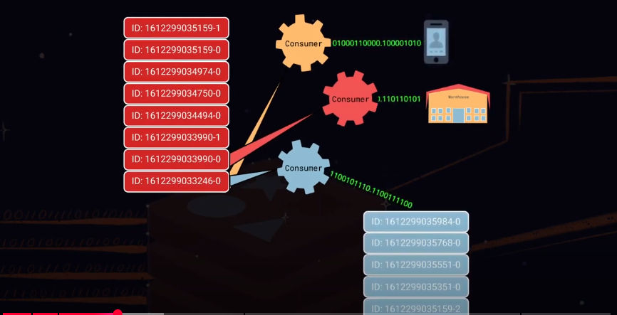
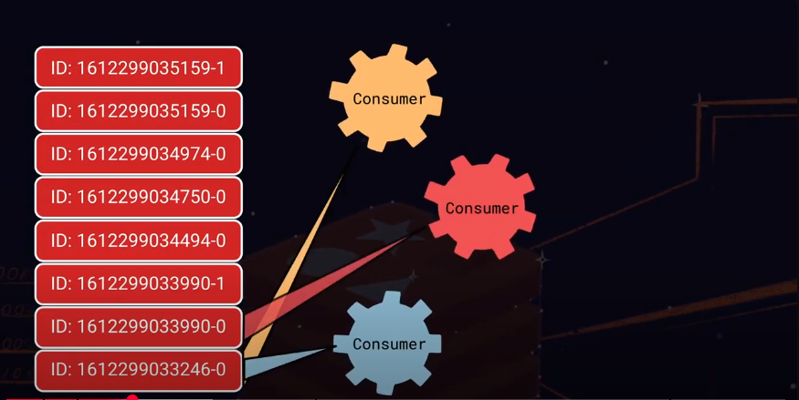
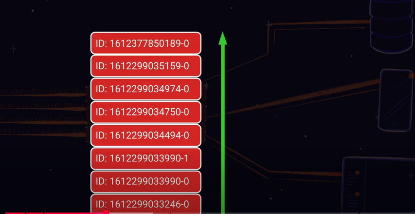
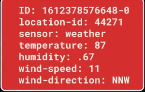
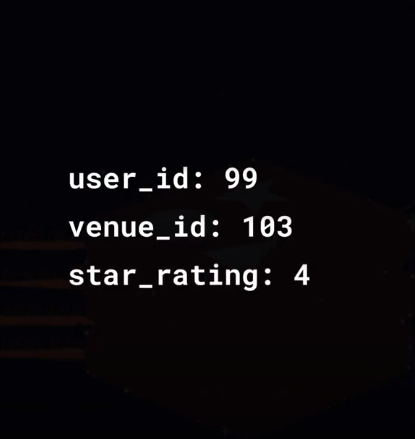
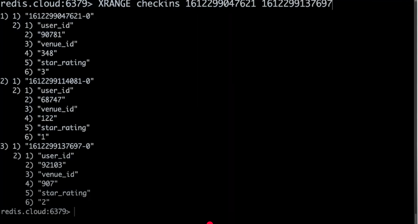
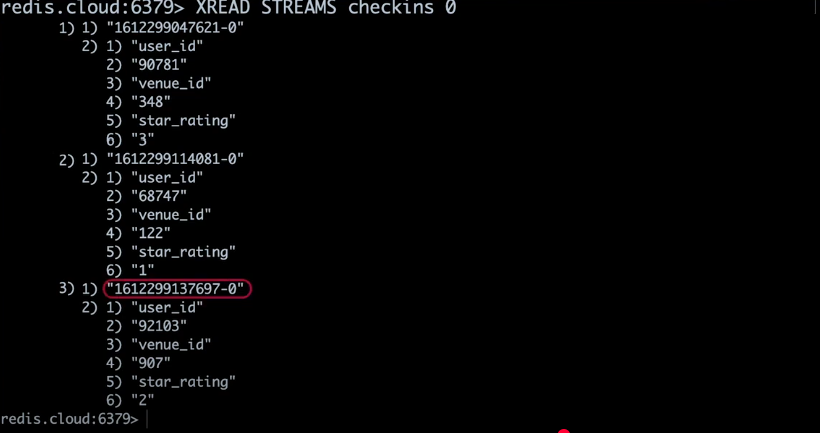
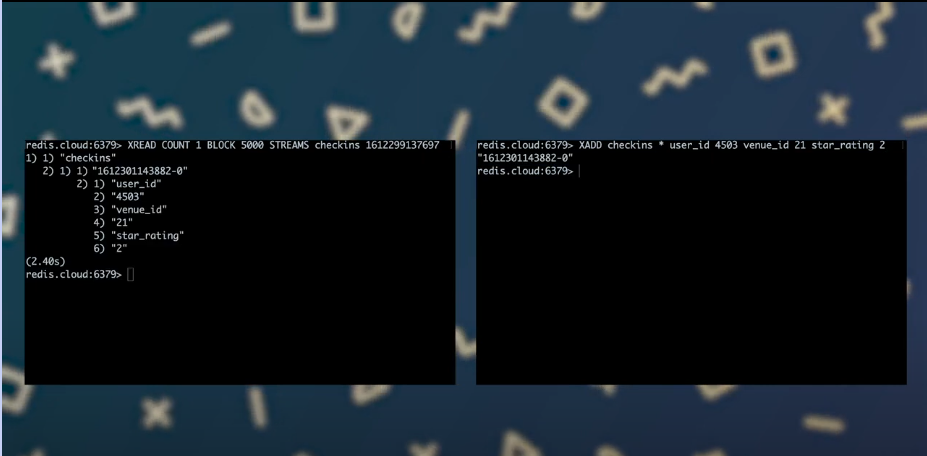
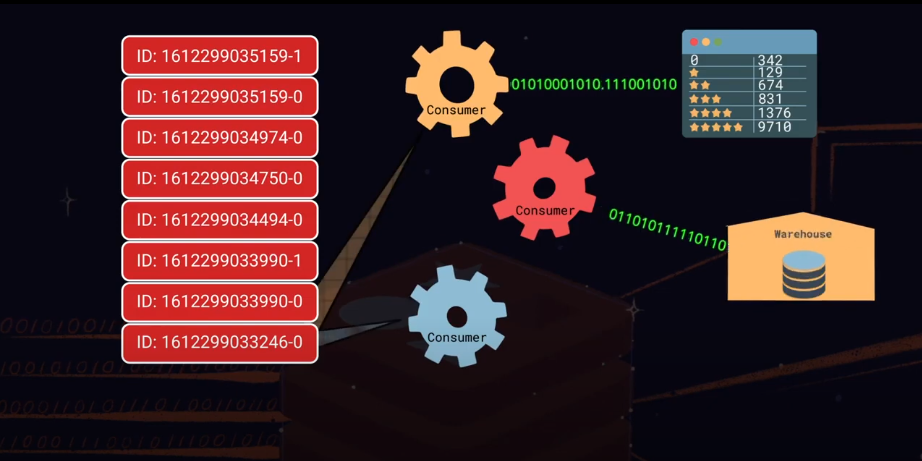

# Streaming data is everywhere

- social networks, analytics, sensors and IOT devices because it generates a constant flow new data coming at us from a huge no. of source

- so, let's see how Redis can help to caputure, manage and make sense of these large and constantly moving/changing volumes of data

# Redis Streams

- Streaming data is a data i.e. generated continiously often from a large number of concurrent sources - an easier way to understand `stream`, assuming `stream` is as a series of events and every entry in the `stream` represents a `new event` e.g. recording a stream weather sensor readings at a given location,
every entry in the stream might consist of a temperature, humidity, wind_drection and wind_speed

# Redis Steams concepts for "distributed application architechture"

- The components that write to `stream` called `producers`, the data they generate is added to a stream with each entty having a unique identifer and its specific fields and at the other ends of the stream are one or more consumers - these consumers processes, read entries from the stream and process them as neccessary.

N.B: Intestingly, there could be more than one consumer reading from reading from the stream (image below 2nd) and each consumer has its role e.g. one type of consumer might create a notifications in a mobile app (so either user do something upon receiving notifications or just receving that notification or such) -> in return could trigger values are seen in the data that another consumer might write all entries to a `data warehouse` later for analysis while a third consumer could act `as a producer for yet another "stream" (below image)` adding only a subset of the entries to the new `stream`

- producers are consumers often operate at different rates and `stream` acts as a buffer between them as well as theh `decoupling layer or mechanlism` - this means that producers and consumers don't directly communicate with each other thus they don't need to know anything about each other implementation's either.

## Redis Stream: Data Strucuture how it works 

- Redis stream is a data structure that behaves like an append-only log, once added an entity in a stream is immutable. Each entry in a `Redis Stream` has unique id and by default these ids are timestamp prefixed (imag below).

- That means that a `Redis Stream` keeps entries orders as a time series that would look like as below and `note that Redis stream is schema-less` while each entry has to have at least one key-value pair and here each doesn't need to have same structure (since it is schema-less) -> Redis allows `consumers` to read `stream entries` in orders. Consumers can also efficiently seek to any entry within the stream.

## Redis streams: in action

- Let's see how "Redis Streams" fit into a commmon use case for streaming data systems recording real-time crowdsourced data

- Now, let's imagine we're building a mobile app that allows users to check it at all sorts of businessess, public spaces and workspaces -> users provide star ratings based on their experience(s) at each location -> Now, each time a (new) user checks-in they will pick out their location from a list that the app provides and then they will select a star rating from 0 to 5 and app will send this data along with their user-id to a server -> Users earn prize draw entries for each check-in and we periodically offer cool prizes to randomly drawn winners -> this incentive encourages users check-in often improving their chance of winning.

- A typical check-in can be represented as a set of name-value pairs (image below)

- Now, off course (above image) is from a single user, in the actual worlds, ratings from many users will be sent continiously to the servers, and those servers produce entries into our "Redis Stream" (3:58-4:00) -> Once the data added to `"Redis Stream"` -> afterward it can be organlized to make sense out of it.

## Let's how each check-in finds its way into a Redis Stream

- First, like other "Redis data strucutures" - a stream is associated with a "Redis key"

- We'll use that key to identify the incoming stream of check-in data

- `XADD checkins * user_id 90781 venue_id 348 star_rating 3` -> XADD commands adds a new entry to a stream -> here we're adding an entry to the "checkin stream" from User 90781 -> this user is visiting location 348 and rating it 3 stars, the asterisk in the above command tells "Redis" to assign this entry a unique id consisting of the current timestamp plus a sequence number -> XADD returns the id that redis is assigned to the new entry (first part is timestamp in millieseconds and second is a sequence number e.g. "1612299047621-0") -> Since stream ids must be unique this convention ensures that we can add as many entries as we need in the same millisecond e.g. `XADD checkins * user_id 36457 venue_id 600 star_rating 4`

- Now, that we've check-ins flodding into our stream it's time to think about how business can make sense of them -> as "Redis" assigns each entry a timestamp based id -> one way that a consumer can view the stream is as a time-series and to do that e.g. `XRANGE checkins 1612299047621 1612299137694` and this would look as below

- Here, using e.g. `XRANGE checkins 1612299047621 1612299137694` to read entries in the check-in stream that fall between this specified start end i.e. `1612299047621 1612299137694` -> XRANGE returns each entry whose id falls within this speciified time perioed i.e. `start end` -> entries are returned in order with the oldest first 

- To limit the number of entries returned, we can use the optional count modifier e.g. `XRANGE checkins 1612299047621 1612299137694 COUNT 2`

- By default `XRANGE will show oldest` but if needed newest entries first then `XREVRANGE checkins 1612299047621 1612299137694`

- And if we don't know what time period for the entries in the steam then `XRANGE checkins - + COUNT 2` -> `-` and `+` represent the "highest" and "lowest" timestamps respetively so off course if used `- +` oldest -> newest otherwise `+ -` newest-oldest for the check-in stream.

## Steams are (always) all about real-time data consumption so we want to build consumers that continiously receive data

- This could be done by pulling the stream using `XRANGE` but that's inefficient, so ideally we want a command that lets us consume the stream blocking when we've seen all the entries until a producer adds new ones -> this is one of the use-cases for the `XREAD` command -> `XREAD` can consume 
`"one or more streams"` optionally blocking until new entries appear -> here calling `XREAD` stream against the check-in stream -> XREAD consumes the streamin returining entries whose ids are greater than the one provided here e.g. `XREAD STREAMS checkins 0` -> this command means - for all the entries with an id greater than 0 (the beginning of the stream) and "Redis" returns the entire stream.

N.B: Theh id of the latest entry for subsequent calls to `XREAD`

- It is possible to invoke `XREAD` in a way that blocks the consumer until new entries are added to the stream e.g. `XREAD COUNT 1 BLOCK 5000 STREAMS checkins 1612299137697` -> so to use `XREAD` in a blocking context, just provide the last entry id for previous call. Also specify that I want to consume a singel new entry and how long to block in case the stream doesn't yet contain any entries newer than the one whose if I'm supplying 

- `XREAD COUNT 1 BLOCK 5000 STREAMS checkins 1612299137697` -> here, I am telling `XREAD` to block for upto 5000 milliseconds or 5 seconds -> when ran this command it blocks because no new messages with higher ids than the one I provided (i.e. 1612299137697) have yet been added to this chekins stream -> while the consumer is blocked , let's use a `second redis cli session` to add a new entry to the stream as soon as I do that the consumer unblocks (image below) and `XREAD` returns newly added entry (which seen in the below image) and if no entries has been added in the given 5 seconds blocking period `XREAD` would have returned a nill response -> then I could choose to block again or give up trying and do something else.

- It's very important to keep in mind that consuming the stream using `XRANGE`, `XREVERANGE` and `XREAD` doesn't remove entries as they are retrieved -> entries remain in the stream to allow other consumers to read the entire dataset. Each processing it its own way.

- Like in the below image, one of the consumer is maintaing, running average star ratings while other consumer writes the entries to a data warehouse and a third adds entries to another stream if the star rating is below a triggered threshold -> So, if new check-ins are constantly pouring into our system and consumers reading them and aren't removing then how do we contain this seemingly never-ending growth -> Remember that a stream models independently log which means that the order and content of entries can't be modified once they have been added however redis supports a "trimming strategy" to manage a stream's memory use.

- Let's assume our stream now contains (8:00 - 8:46) tens of thousands of entries and that we need to control its growth so trimming a stream removes its oldest entries i.e. those of the lowest timestamp ids -> this frees up memory assocaited with these entries -> There are redis commands to "trim a stream".

### TRIM/REMOVE the oldest entries: First Approach

`XTRIM checkins MAXLEN 10000` -> here. we're using `XTRIM` to trim our checkins stream to a new maximum length of 10000 entries -> and this command will return the no. of removed entries

### TRIM/REMOVE the oldest entries: Second Approach

- If we know that we always wanna keep the "checkins stream" to a length of 10000 or less then simply e.g. `XADD checkins MAXLEN 10000 * user_id 10236 venue_id 76 star_rating 5` whenever using `XADD` and then `XLEN checkins`

