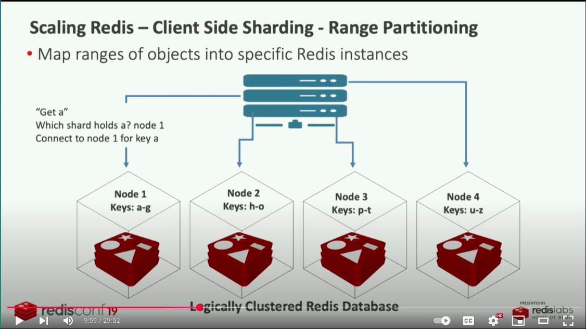
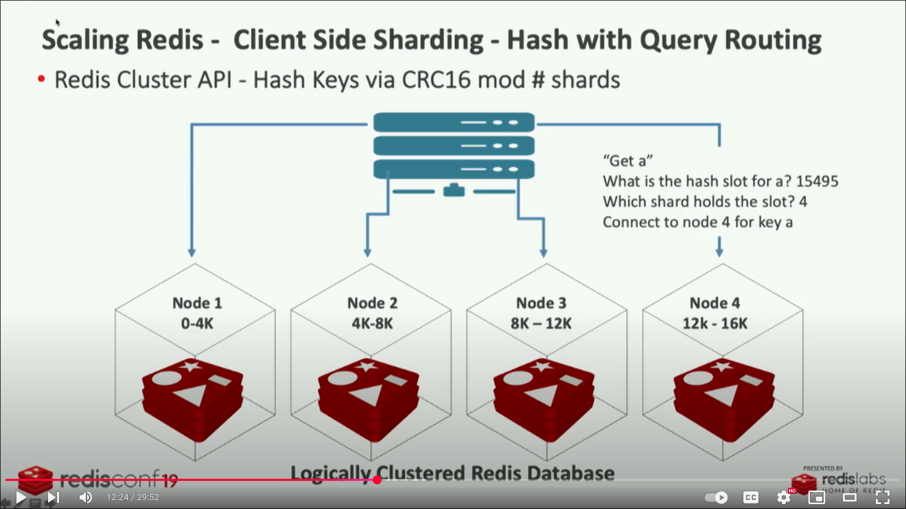
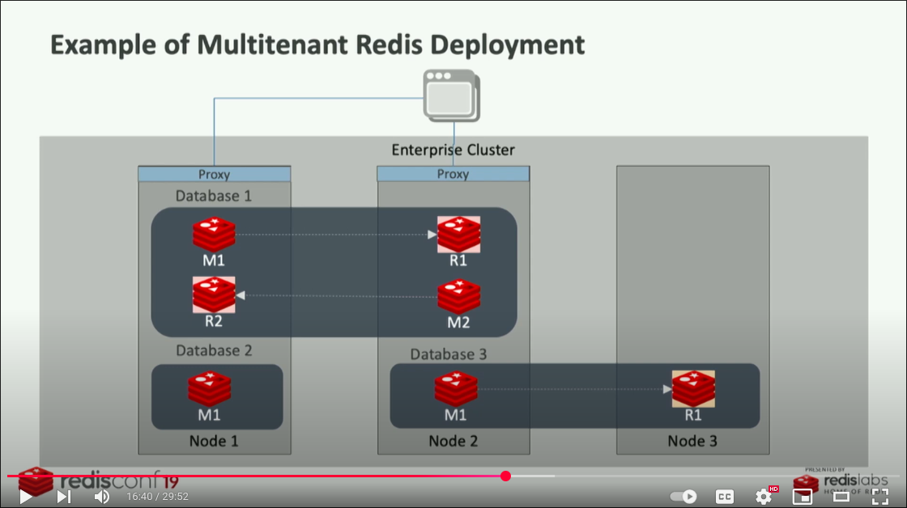
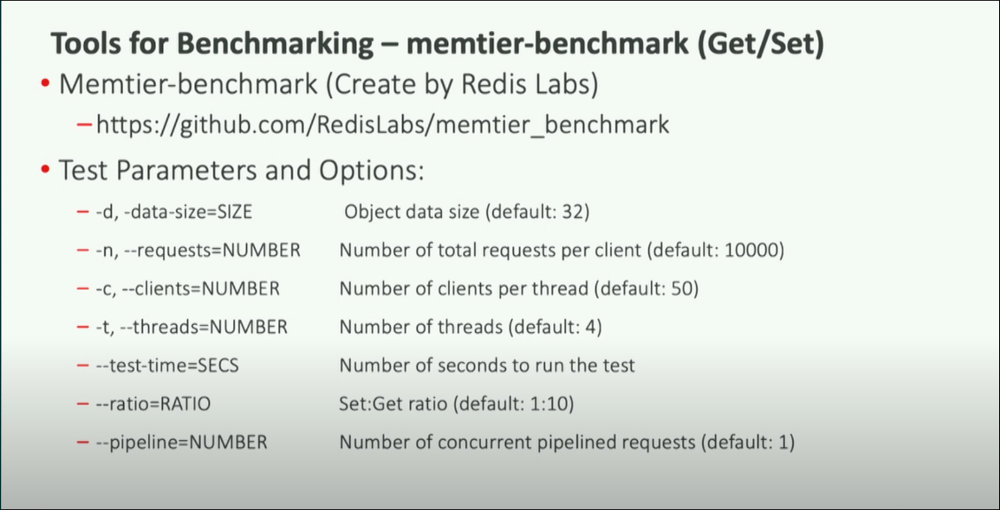
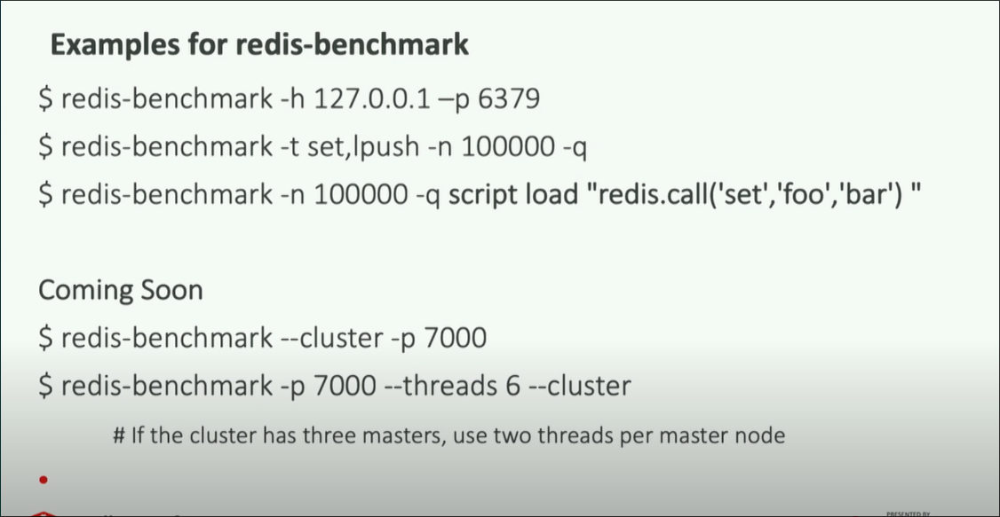

## Reference: https://www.youtube.com/watch?v=55TFuBMFWns

# 1. What to expect From a Single Redis Server Process 

A single Redis server process is designed to be extremely fast and efficient for in-memory data storage and retrieval. It handles all client requests using a single-threaded event loop, which means it can process tens of thousands of operations per second with minimal latency. 

However, because it’s single-threaded, its performance is limited by the CPU core it runs on. 

Redis is best for use cases like caching, session management, real-time analytics, and pub/sub messaging, but for very large workloads or high availability, you’ll need to use clustering, replication, or sharding across multiple Redis instances.

# 2. Redis instance = 1 redis-server process = shard (what does it mean)

A Redis instance is simply a single running redis-server process.

In a sharded Redis setup, each instance is responsible for a portion of the data -> this portion is called a shard. 

So, when you hear 'Redis instance' or 'shard,' it means one redis-server process managing its own slice of the overall dataset. 

If you want to scale Redis horizontally, you run multiple redis-server processes (on one or more machines), each acting as a separate shard, and together they handle more data and traffic than a single instance could alone.

---

## Example: Connecting to a Single Redis Instance (Shard) in Node.js

### Express
```js
const express = require('express');
const Redis = require('ioredis');
const app = express();
const redis = new Redis({ host: '127.0.0.1', port: 6379 }); // single instance/shard

app.get('/cache/:key', async (req, res) => {
  const value = await redis.get(req.params.key);
  res.send({ value });
});

app.listen(3000, () => console.log('Express server running'));
```

### Fastify
```js
const Fastify = require('fastify');
const Redis = require('ioredis');
const fastify = Fastify();
const redis = new Redis({ host: '127.0.0.1', port: 6379 }); // single instance/shard

fastify.get('/cache/:key', async (request, reply) => {
  const value = await redis.get(request.params.key);
  reply.send({ value });
});

fastify.listen({ port: 3000 }, err => {
  if (err) throw err;
  console.log('Fastify server running');
});
```

# Limitation

Yes, that's correct. Saying "Redis instance = 1 redis-server process = shard" is just a precise way of explaining that each Redis process uses a single thread to handle all requests—similar to how JavaScript runs in a single-threaded event loop. 

This design makes Redis extremely fast for most operations, but it also means that scaling requires running multiple processes (shards) rather than adding more threads to one process.

# Scalling Redis

To scale Redis, you do not use Node.js worker threads or child processes to make Redis itself multi-threaded. Redis is designed to run as a single-threaded process, and it does not support worker threads for handling requests internally.

If you need more Redis capacity, you scale by running multiple redis-server processes (shards), possibly on different machines. Your Node.js app can use child processes or worker threads for its own workload, but each Redis instance will still be single-threaded. For true horizontal scaling, use Redis clustering or sharding—not worker threads inside Redis.

# Solution: How to scale Redis ?

If you want Redis to handle more data or traffic, you don’t make Redis itself use more threads. Instead, you run more Redis server processes—each one is still single-threaded, but together they can handle more work. These processes can run on one machine or many machines.

Your Node.js app can use worker threads or child processes to do its own work faster, but every Redis server it talks to will still be single-threaded. To scale Redis, you connect your app to several Redis servers (shards) using clustering or sharding. This way, Redis handles more data by spreading it across multiple single-threaded servers.

# Confirmation

so, to scale horizontally, I can only scale Redis or increase Redis instance and it has nothing to do with Node.js worker thrads or child proecesses since everytime Redis will create its new own process , i.e. independent and separate process, right ?

-- Exactly right. To scale Redis horizontally, you increase the number of Redis instances (each is a separate, independent process). This has nothing to do with Node.js worker threads or child processes—those only help your Node.js app scale its own workload. Each Redis instance runs as its own process, and you connect to more of them for more capacity. Redis does not use Node.js worker threads or child processes for scaling.

# Let's understand scalling nature of Redis


My understanding: so, Redis kinda saying just like you can multiple google chrome instance from like incognutor each being indeopend process of their own (while in this case they are isolated from each other) bit similary , Redis does create that kinda of indicualdual process and its use a single thread but in this one instance of redis can talk to another

now, I know that 1 process could have n of threads but what happens with a CPU 1 core , well technically it should also be handle n no. of process unless RAM burdended then lags

so, in that regard, there are many Redis instance can run and why they done could be destroyed, kept or be idle (this part I am not sure but I know that idle process won't be consumgin RAM/storage eetc most likely)

# Confrimation

You’ve got the right idea. Each Redis instance is like a separate Google Chrome process—independent, single-threaded, and isolated. You can run many Redis instances on one machine, and each uses its own process and memory.

A CPU core can run many processes (like Redis instances), but only one at a time per core; the operating system switches between them quickly. If you run too many Redis instances for your available RAM, the system will slow down or start swapping, which hurts performance.

Idle Redis processes still use some RAM, but much less CPU. They don’t use disk unless you’re persisting data. You can destroy (stop) Redis instances you don’t need, or keep them running if you want fast access. Redis instances can talk to each other in a cluster, but each is still a separate process.

So yes, your gist is correct!


# How many on average Redis instance can run on an i3 16 GM RAM and 1 TB HDD ?

- 10-30 Redis instance can be run

On an i3 CPU with 16GB RAM, a single Redis instance can typically handle 50,000–100,000 requests per second (RPS) for simple GET/SET operations, assuming good network and no disk persistence bottlenecks.

To reach 1 million RPS, you would need to run and load-balance across 10–20 Redis instances, each handling part of the traffic. However, real-world performance depends on your workload, network, and how well you distribute requests.

Safely, you can expect 500,000–1,000,000 RPS total if you optimize everything and use multiple Redis instances, but always benchmark with your actual data and access patterns. For ultra-high RPS, consider using more powerful CPUs, faster network, and possibly Redis Cluster on multiple machines.

# Geo-indexing, Geo-spatial indexing

Redis provides built-in geo-indexing features using the GEOADD, GEOPOS, GEODIST, and GEORADIUS commands. This lets you store locations (latitude/longitude) and quickly query for nearby points, calculate distances, or find all objects within a radius.

For example, you can use GEOADD to store driver or rider locations, and GEORADIUS to find all drivers within 2km of a rider in real time.

## How Lyft uses Redis geo-indexing

Lyft has used Redis geo-indexing to power its real-time driver/rider matching. 

When a rider requests a ride, Lyft stores driver locations in Redis using GEOADD. 

Then, it uses GEORADIUS or GEOSEARCH to instantly find available drivers near the rider’s location. 

This approach is extremely fast and scales well for high volumes of requests, making it ideal for ride-hailing apps. 

Redis geo-indexing helps Lyft deliver low-latency, location-based matching and efficient dispatching, even during peak demand.

# Redis datatypes: strings, sets, Bitmaps, Sorted Sets, Bit Field, Geospatial indexes, Hashes, Hyperlog, Lists, Streams

## How to make Redis into a search database, graph datbase, AI/ML module

Redis can be extended with modules to support advanced use cases beyond caching and key-value storage:

- **Search Database:**
  - Use the Redisearch module. It adds full-text search, secondary indexes, and complex querying to Redis. You can search documents, filter by fields, and rank results—all in-memory and very fast.
  - Example: Store product descriptions and instantly search for keywords or filter by tags.

- **Graph Database:**
  - Use the RedisGraph module. It lets you store and query graph data (nodes and edges) using the Cypher query language. You can model relationships, run graph algorithms, and analyze connections efficiently.
  - Example: Model social networks, recommendation systems, or fraud detection graphs.

- **AI/ML Module:**
  - Use the RedisAI module. It allows you to store, run, and manage machine learning models (TensorFlow, PyTorch, ONNX) directly inside Redis. You can serve predictions, run inference, and manage model lifecycles with low latency.
  - Example: Deploy a trained model to RedisAI and serve real-time recommendations or image classification results.

These modules turn Redis into a multi-purpose data platform, making it suitable for search, graph analytics, and AI/ML workloads—all with Redis’s speed and scalability.

## Where can you place Redis ?

Redis can be placed in many parts of a modern web application:

- As a cache layer to speed up database queries and reduce load
- For storing user sessions, so users stay logged in across requests
- As a job queue, helping background tasks run smoothly
- For pub/sub messaging, letting services communicate in real time
- As a search engine, providing fast full-text search
- For storing and querying location data (geo-indexing)
- For graph data, modeling relationships between users or objects
- For rate limiting APIs, preventing abuse
- For storing JSON documents, analytics, or streaming data

Redis is flexible and fast, so it’s used wherever you need quick access to data, real-time communication, or efficient background processing.


## Scalling Redis via Database clustering

- Use multiple shards to create a logical redis database


- but how to choose which one of these servers should be pointed for client ?

- So, there are different options such as

Let the client logic decide which one of these nodes i.e. which one of these shards you talk to your client application i.e. you write Python or Java code where you define a lookup table to say four keys with ranges from A to G, got to shard 1 or Node 1.

So, on so forth as seen in below image

N.B: Below could be a good way to scale pub/sub

### But Redis is not so great with PUB-SUB but by leveraging a client-based sharding algorithm to partition the different pub/sub channels, scalling out PUB/SUB in this below architechture (image)




But the client has to smart enough to exactly which key belongs to which shard or node

The problem is when you start having to move around your key so you have to recharge your logic and start doing something that has to update the lookup table and it becomes tedious and once you start getting into `high availiability master slave concept` and knowing which ones to point to it gets a litte bit of tricky 


## Does redis has transactional abilities like RDBMS ?

Redis supports basic transactions using the MULTI, EXEC, DISCARD, and WATCH commands. You can group several commands together and run them as a single unit, so they execute in order without interruption from other clients.

However, Redis transactions are not as powerful as those in traditional RDBMS:
- There is no rollback if one command fails; all commands are always executed.
- Redis does not support full ACID guarantees (especially isolation and durability).
- You can use WATCH to implement optimistic locking, but there are no savepoints or nested transactions.

In summary: Redis has simple transactional abilities for atomic operations, but it is not a full replacement for RDBMS transactions. Use Redis transactions for basic atomicity, but rely on RDBMS for complex, multi-step, fully ACID-compliant transactions.


## Scalling Redis - Client Side Sharding - Hash with Query Routing


- Client still has no know which shard it needs to talk but the logic being which shard it goes through is kinda spread out and managed by hashing the keys

- The most popular that everyone a lot of people talked about is the "Redis clustered API" and the concept is - you take a key you apply a CRC 16 bucket basically create 16,000 buckets and assign the buckets and go through like a mod % 4 to determine which one of these nodes are shards own which buckets are which slots are okay

- So, that's what behind the hash with "Query Routing" -> where you take a key and so as seen in below example (below image) I `"get a"` and you are like the client says I need to get it that's a command that it executes and so the first things it needs to is well -> what is the hash law that the key `"a"` belongs to and that has thought if you go through a cluster key slots command you'll find that that slot 2 slot number 15,495 (as seen in the image below) so then though you figure out okay if I do a mod % 4 to identify which ndoe it belongs to then you connect to node 4 to get to get "key a in this case"

- The great thing is that even though this client-side sharding but this logic doesn't need to be writte manaually because a lot of client libraries e.g. ioredis for epxress.js know how to support `Redis Cluster API` -> so when working with the "cluster database" -> you enable it for the clustered API and it now knows oh you're asking for `key a` and that will map to node / shard 4 --> and if you're asking for `key a` and all of a sudden `key a` changed it will actually update you to tell you that it's moved to `"node 2"` and in the client library will go to `"node 2"` to pick up that data -> Nice things about this design/architechture that you are still taking away the middleman even though you calculate for this key for this slot which node you have to go to that gets processed very quickly in the application layer (node.js/java/python/golang) and then it knows directly which node to go to for the current key `so to get the optimum speed -> THIS APPROACH/ARCHITCTECHUTRE is still the fastest way to get access to the REDIS DATA thought clustered API` that go directly to the server with the car that houses the data.s





## Scalling Redis via Proxy-Side Sharding


- So, clients talk to the proxy and from the client view Redis database is still looks like a `single Redis server process` - it's a host it's a port and it grabs the keys that it wants ok -> so, the proxy handles the expertise to know which nodes have which slots so the client just says `get a` then proxy does a hashing thus knows which one of these shards/nodes it needs to go to get the data and passes it back to the client (e.g. java/python/node/golang)

- The advantage it provides is that - what at these nodes moves what if you have to do maintainence or what if you have to change IP address and what if you have to add node, remove a node to all the stuff you have from a maintainence standpoint - it's great from application (java, node, python, golang) view that hey it's just a debate it's database but underneath - it's somebody at the operation layer has to consider how to patch it for security - how to patch it for all the OS updates, how do you do the rolling of in case VM dies and how do you replace something else right 

- so, the advantage of the proxy is that it gives you a little bit of sepration from the client to the underlying infrastructure or the database so that you have the manueverability for the operation efficiecny, the one thing though is you could immediately see the proxy could introduce additional latency so depending on the type of deployment that you have - if you have a proxy as a whole separate layer or a whole separate server then you are introducting client to a server and then proxy server to the underlying shard so there's a couple of `additional network` that are better around it, you could potentially house the proxies into the same nodes as where the shards live and that could minimize some of the overhead but ultimately if you have these shards spread across multiple nodes there are still hops that need to happen for the proxy to talk to all the shards and then return the result set back to the client (java/python)


## Redis: Enterprise Deployment

- When comes to "Enterprise Deployment with Redis" generally a proxy (image below) used because it allows the `operation efficiency` to balance things but we also get the advantage but most importantantly we get the advantage of doing something called `"multi-tenancy" on the distributed database deployment`

- So, with multiple nodes in a three node configuration, could have a logical "Redis database" i.e. let's say database one that has to master two master shards (image below); it has two "slave shards" so it allows for failover and off course can create a separate databae that's just a single master database (i.e. database 2) and also can create a third database (i.e. Database 3) which is just a single "Redis Server Process" with one slave (i.e. Node 3)

- So, play around with the way your databae or your application shards are placed and as long as you specify a port and change the port for different shards you'll be able to configure it in this manner (image below) -> BUT MUST MANAGE THE DEPLOYMENT PROCESS CAREFULLY IF YOU DON"T HAVE A PROXY LAYER THAT ACCOMODATES ON TOP OF THAT.




# Redis : Scalling Patterns and Anti-Patterns


## Use: Pipeline (DO)

- pipelines allow you to send a bunch of commands to Redis, then Redis processes it and then returns it back to the client (java/python/golang/node.js) -> but it doesn't lock the "Redis server process" for the entire time you're sending a 1000 get (here get means the redis method e.g. get, set) to Redis -> This allows to overcome some of network calls that's involved if you have to a single get set method back and forth to Redis.

- So, pipeline is a great way to actually optimize the calls to the Redis as logn as you are not looking for `individual transaction updates` 

## Use: unlink vs DEL (DO)

- DEL breaks the connection between key name vs its value so it's much faster of an operation especially when has `large keys`

## Use: Connection Pooling (DO)


## Aim for small value size < 10kb (DO)

## Understand time complexity 0(1) vs O (Log (N)) vs O(N)

-- look at the time complexities of redis commands

## Shard using hash tags {keeptogether}

- When have keys that belongs together, just make sure to ensure use a curly bracker i.e. {}  or custom-hashtag so that they all belong to same shard. Actually, this doesn't impact scalling but the rather how application will behaves but you're just gonna get errors if you're `trying to do a multi-exact on a bunch of keys` they're supposed to be together but they are actually spread across multiple shards -> because all the commands were rather still apply at the shard level. 

Actually, for Redis cluster - it will be at the slot level so if they are violating and if they're not in the same slot then it will be errors.

## Monitor: Slow logs

- To benchmark my own applications, take a look at the slow log to see if things come up by default. Redis will start writing the commands that are longer  than 10ms into slow log


## Running keys * in prod (DON'T)

- In general, it's a very very expensive call if you lots and lots of keys - very easy to do in deployment but really you should be using `scan`

- be careful with sorted set queries
- some of the persistent choices that made , db vs aof

- Espeically, when persisting from master shard, could be expensive

- caching keys without TTLs especailly, so usually a key with TTL (e.g. 30 seconds will be cleaned up and its memory will cleared in the background) and in case of a key witout TTL then be careful of eviction and it should be handled proeprly.







## Quick demo: Redis Enterprise (webapp) starts at 26:50