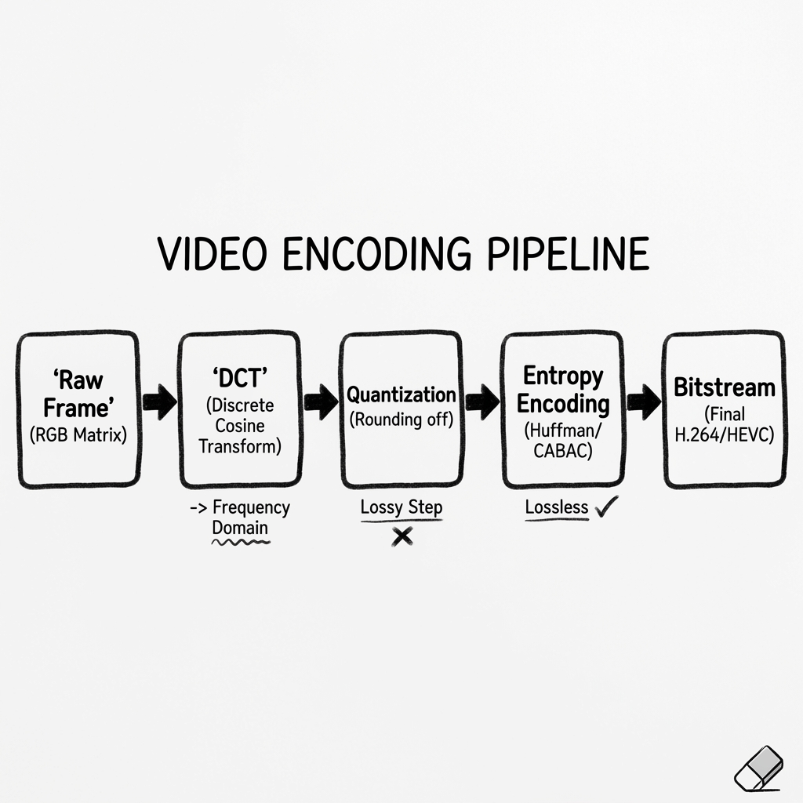
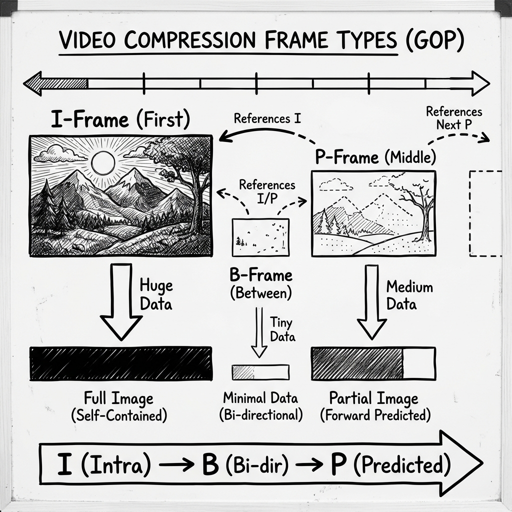
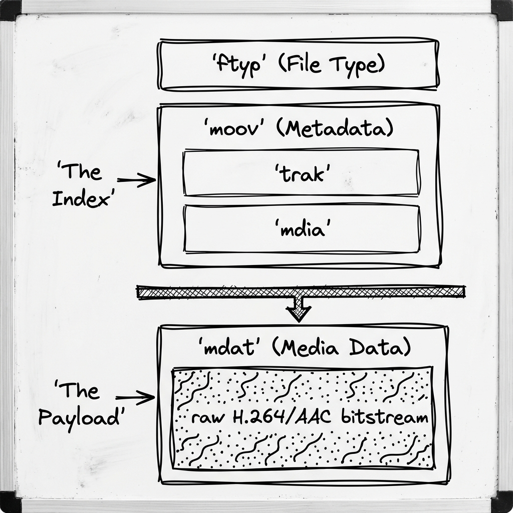
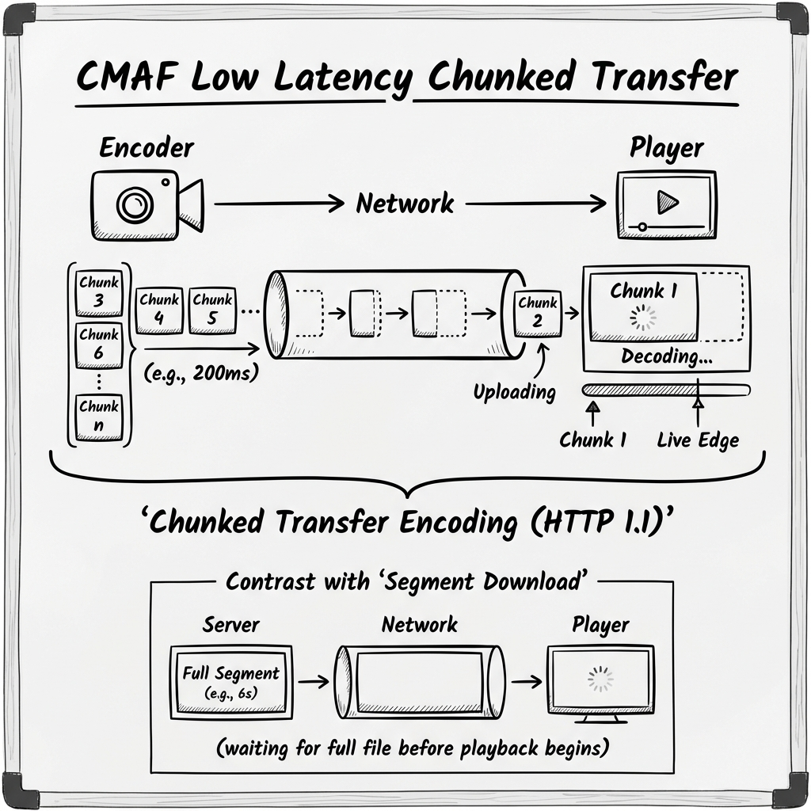
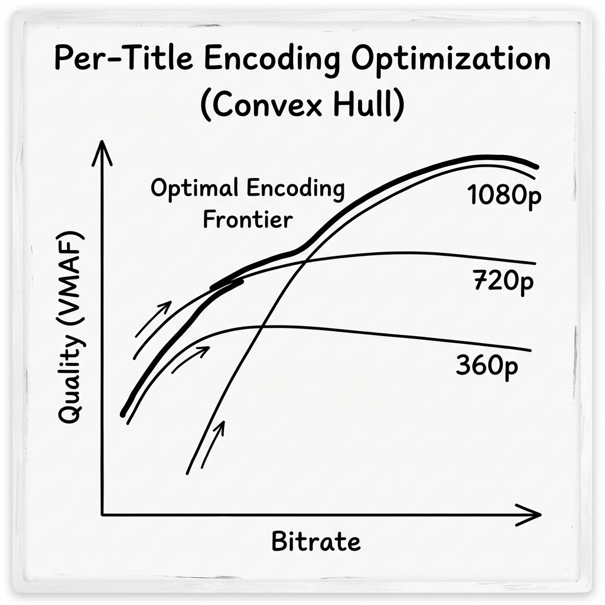

# Video Encoding: The "Compression Physics" Guide

> **Level**: Principal Media Engineer / Codec Architect
> **Scope**: Discrete Cosine Transform (DCT), GOP Structures, Container Atoms, and Per-Title Optimization.

> [!IMPORTANT]
> **The Principal Law**: **Compression is the art of throwing things away**.
> The goal is not to preserve the original signal (that's impossible at scale). The goal is to preserve the *Human Perception* of the signal.

---

## 1. The Physics: DCT & Quantization

How do we turn a 10MB raw image into a 100KB JPEG? We move from the **Spatial Domain** to the **Frequency Domain**.

### The Pipeline
1.  **Macroblocks**: The image is sliced into 16x16 pixel blocks.
2.  **DCT (Discrete Cosine Transform)**:
    *   Converts pixel brightness values into **frequency coefficients**.
    *   *Low Frequencies* (Broad colors/shapes) -> Top Left.
    *   *High Frequencies* (Fine details/noise) -> Bottom Right.
3.  **Quantization (The Lossy Step)**:
    *   We divide the High Frequency numbers by a large integer (the Quantization Parameter or **QP**) and round to zero.
    *   **Result**: The fine noise disappears (becomes zeros). We only keep the broad shapes.
4.  **Entropy Encoding (CABAC)**: Run-Length Encoding compresses the long strings of zeros.

---

## 2. GOP Structure: Time Travel Dependencies

Video is just a stack of images, but we don't compress them individually (Motion JPEG). We use **Inter-Frame Prediction**.

### The Frame Types
1.  **I-Frame (Intra)**: A full JPEG. Zero dependency. Indispensable but huge.
2.  **P-Frame (Predicted)**: "Only what changed since the last I-Frame." (e.g., a person moved, background stayed still). Moderate size.
3.  **B-Frame (Bi-directional)**: "What changed between the *previous* frame and the *next* frame?"
    *   **The Magic**: B-frames require the decoder to know the *future*. This introduces **Presentation Timestamp (PTS)** vs **Decode Timestamp (DTS)** complexity.
    *   **Efficiency**: Tiny size (often <10% of I-Frame).

> [!WARNING]
> **Surveillance Note**: Avoid B-Frames in CCTV. They add latency (you must wait for the future frame to decode the current one) and CPU complexity. Use IP-Only GOPs for low latency.

---

## 3. Container Internals: MOOV vs MDAT

You are not watching an "H.264 file". You are watching an **MP4 container** holding an H.264 bitstream.

### The Atom Structure (ISOBMFF)
*   **ftyp**: "I am an MP4 file."
*   **moov** (Movie Box): **The Metadata Index**.
    *   "Frame 1 is at byte 0. Frame 2 is at byte 5003."
    *   **Critical**: The player *cannot* start playback until it reads the `moov` atom.
*   **mdat** (Media Data): The immense binary blob of video/audio frames.

### Fast Start (Web-Optimized)
*   **The Problem**: By default, FFMPEG writes `moov` at the *end* of the file (because it doesn't know the file size until it's done).
*   **The Fix**: Flattening (`-movflags faststart`). Moves `moov` to the **beginning**.
*   **Why**: The browser reads the first 10KB, gets the index, and can immediately seek/play.

---

## 4. CMAF & Low Latency: The "Chunked" Revolution

How do you get live latency from 30s (HLS) down to 3s (LL-DASH)?

### The Trick: Chunked Transfer Encoding
*   **Standard Segment**: Wait 4 seconds for segment to finish -> Upload -> Download -> Play. (Latency: 4s+).
*   **CMAF Chunk**:
    *   Break the 4s segment into **200ms Chunks** (tiny `moof` + `mdat` pairs).
    *   Use HTTP/1.1 `Transfer-Encoding: chunked`.
    *   The Player starts decoding Chunk 1 *while Chunk 20 is still being encoded*.
*   **Result**: You are "streaming the stream".

---

## 5. Per-Title Encoding: The Convex Hull

Netflix doesn't use a fixed bitrate ladder (e.g., "1080p is always 5Mbps"). That's inefficient.
*   **Action Movie**: Needs 8 Mbps for 1080p (high motion).
*   **Anime/Cartoon**: Needs 1.5 Mbps for 1080p (flat colors).

### The Algorithm
1.  **Measure VMAF**: Video Multi-Method Assessment Fusion (Perceptual Quality metric).
2.  **Encode Multi-Pass**: Encode the clip at 360p, 720p, 1080p at various bitrates.
3.  **Construct Convex Hull**: Plot Quality vs Bitrate.
4.  **Select Frontier**:
    *   If 720p @ 2Mbps looks better (VMAF 90) than 1080p @ 2Mbps (VMAF 85), **serve the 720p file**.
    *   Don't waste bits on resolution if the bitrate creates "blocky" artifacts.

