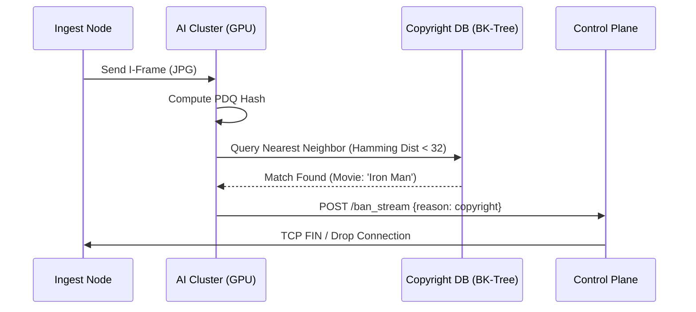

# Facebook Live Advanced: The "Social Real-Time" Stack

> **Level**: Principal Architect / Distributed Systems Engineer
> **Scope**: Reactive Streams (RSocket), LogDevice, S2 Indexing, and PDQ Hashing.

> [!IMPORTANT]
> **The Principal Law**: **The Broadcast is easy. The Interaction is hard.**
> Sending video to 1M people is just bandwidth. Handling 1M comments/sec on that video is a distributed systems nightmare (Thundering Herd on Write).

---

## 1. Real-Time Comments: RSocket & Backpressure

**Scenario**: A celebrity goes live. 1 Million people watch. 50,000 people comment "Hello!" in the same second.
*   **Naive Approach**: WebSockets push everything to the client.
*   **Result**: Client CPU Melts (Parsing 50k JSONs/sec). The UI freezes.

### The Solution: Reactive Streams (RSocket)
We don't just "push" data. We use **Application-Level Flow Control (Backpressure)**.

1.  **Transport**: **RSocket** (Binary protocol over TCP/WebSocket).
2.  **Backpressure**:
    *   Client says: `REQUEST_N(5)` ("I can handle 5 comments").
    *   Server sends 5 comments.
    *   Server **buffers** or **drops** the rest based on priority.
    *   *The server never overwhelms the client.*

### The Architecture: Write-Behind with LogDevice
We replace generic Kafka with **LogDevice** (Facebook's internal log store).
*   **Why LogDevice?** It separates **Sequencing** (Ordering) from **Storage** (Data).
*   This allows hitless scaling of throughput independent of storage capacity.

```mermaid
flowchart LR
    User[User (Writer)] -->|RSocket| Edge[Edge PoP]
    Edge -->|Append| LogDevice[LogDevice (Sequencer)]
    LogDevice -->|Stream| Aggregator[Spark Stream]
    Aggregator -->|Batch Write| HBase[(HBase Cluster)]
    
    subgraph Read Path
    Aggregator -->|Top-K| PubSub[Pub/Sub Tree]
    PubSub -->|Fan-Out| Viewer[1M Viewers (RSocket)]
    end
```

---

## 2. Live Map: "Find Streams Near Me" (Spatial Indexing)

**Scenario**: You open the "Live Map" and see streams happening in your city.
*   **Challenge**: "SELECT * FROM streams WHERE dist(me, stream) < 5km".
*   **Scale**: millions of streams, millions of moving users.

### The Solution: Google S2 Geometry (Hilbert Curve)
Standard Lat/Lon queries (R-Trees) are too slow for high-write-rate data. We use **S2 Geometry**.

1.  **Hilbert Curve**: S2 maps the 2D sphere (Earth) onto a 1D line (Hilbert Curve).
    *   **Property**: Points close on the 1D line are *guaranteed* to be close on Earth.
2.  **Cell IDs**: The world is divided into hierarchical squares.
    *   **Level 30**: Leaf node (cm²).
    *   **Level 12**: City block.
3.  **The Query (Prefix Scan)**:
    *   "Give me streams in Cell `0x487a...`".
    *   In RocksDB (LSM Tree), this is a sequential disk read. **Zero random I/O.**

```mermaid
graph TD
    User((User)) -->|Query: Cell ID Prefix| Index[S2 In-Memory Index]
    Index -->|Prefix Scan| Cell1[Cell 0x487a (NYC)]
    Index -->|Prefix Scan| Cell2[Cell 0x487b (Brooklyn)]
    Cell1 --> Stream1[Stream A]
    Cell1 --> Stream2[Stream B]
    
    subgraph S2 Logic
    Earth[2D Sphere] -->|Projection| Cube[Cube Face]
    Cube -->|Hilbert Curve| Line[1D Integer]
    end
```

---

## 3. Content Moderation: PDQ Hashing

**Scenario**: A user starts streaming a copyright movie or violence.
*   **Constraint**: Must be blocked in < 60 seconds.
*   **Attack Vector**: Pirates crop/rotate/resize the video to evade hash matching.

### The Solution: PDQ Hashing (Perceptual Hashing)
We don't use MD5/SHA256 (Cryptographic hashes). We use **PDQ Hashing**.
*   **Property**: If image A is similar to image B (rotated/cropped), `HammingDistance(Hash(A), Hash(B))` is small.
*   MD5 would be completely different.

### The Pipeline
1.  **Frame Sampling**: Ingest Node samples 1 I-Frame/sec.
2.  **Inference**:
    *   **PDQ Hash**: Generate 256-bit signature.
    *   **BK-Tree Search**: Find nearest visual match in Copyright DB.
    *   **CNN (ResNet)**: Violence probability score.
3.  **The Kill Switch**: API call to Edge Router to drop packets.



---

## 4. Real-Time Analytics: "Gorilla" (TSDB)

**Scenario**: The "Like" counter. It needs to update instantly for 1M concurrent users.

### The Problem with UPDATE
`UPDATE streams SET likes = likes + 1 WHERE id = 123`
*   This locks the row. 1M updates/sec = Deadlock Hell.

### Solution: In-Memory TSDB (Gorilla)
Facebook's "Gorilla" (now open-sourced as Beringei).
1.  **Delta-of-Delta Compression**:
    *   If likes increase by +10 every second, we store `0` (change in change).
    *   Compresses 16 bytes -> 1 bit.
2.  **Sharded Aggregation**:
    *   Counters are sharded by `StreamID % 100`.
    *   Aggregators read shards and sum them up in RAM.

```mermaid
flowchart TB
    U1[User 1] -->|Like| Shard1[Counter Shard 1]
    U2[User 2] -->|Like| Shard2[Counter Shard 2]
    U3[User 3] -->|Like| Shard1
    
    Shard1 -->|Push Delta| Gorilla[Gorilla TSDB (RAM)]
    Shard2 -->|Push Delta| Gorilla
    
    Gorilla -->|Query| Dashboard[Broadcaster Dashboard]
```

---

## 5. Engineer's Checklist for Social Real-Time

1.  **Backpressure is Mandatory**: Use **RSocket** or GRPC Flow Control. Never push faster than the client can consume.
2.  **Log-First Architecture**: Use **LogDevice** (or Kafka) as the source of truth. Databases are just materialized views of the log.
3.  **Spatial Locality**: Use **S2 Geometry** for anything geo-related. R-Trees don't scale to write-heavy workloads.
4.  **Perceptual Hashing**: Use **PDQ** for media matching. Cryptographic hashes are useless for content safety.
