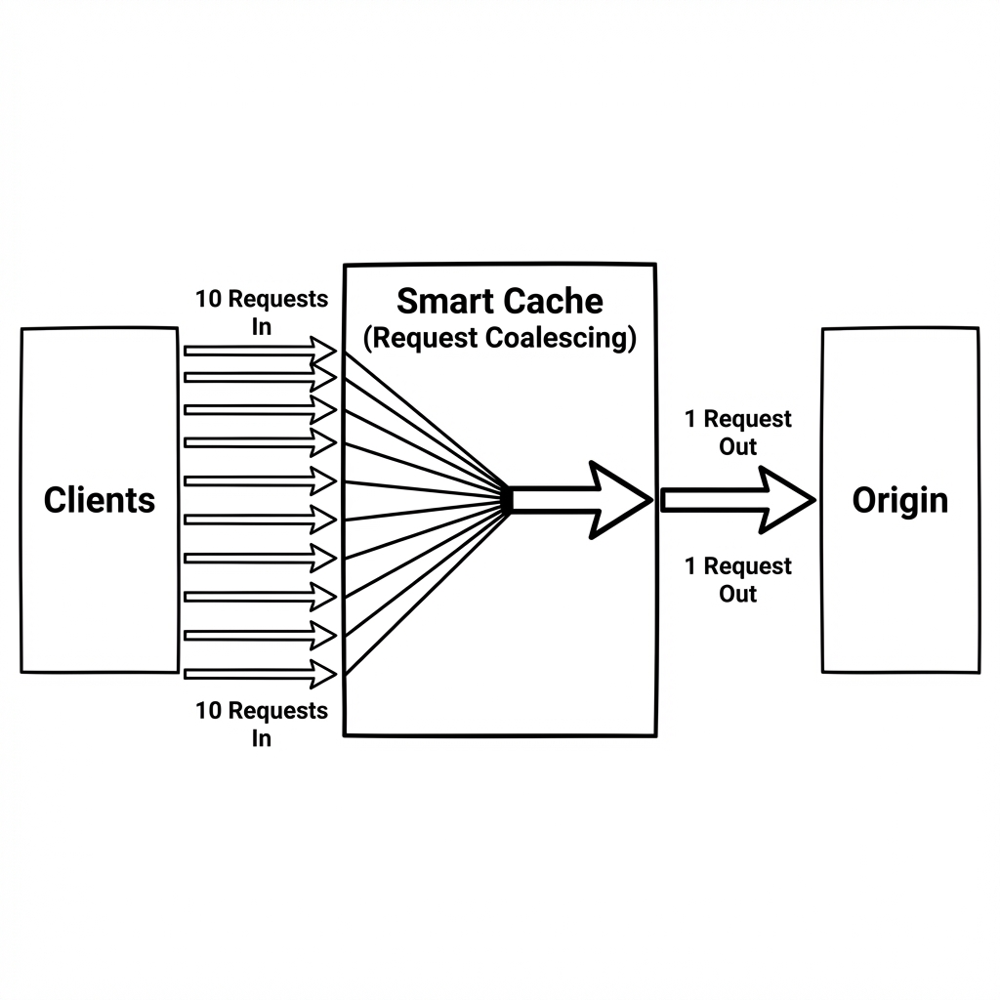
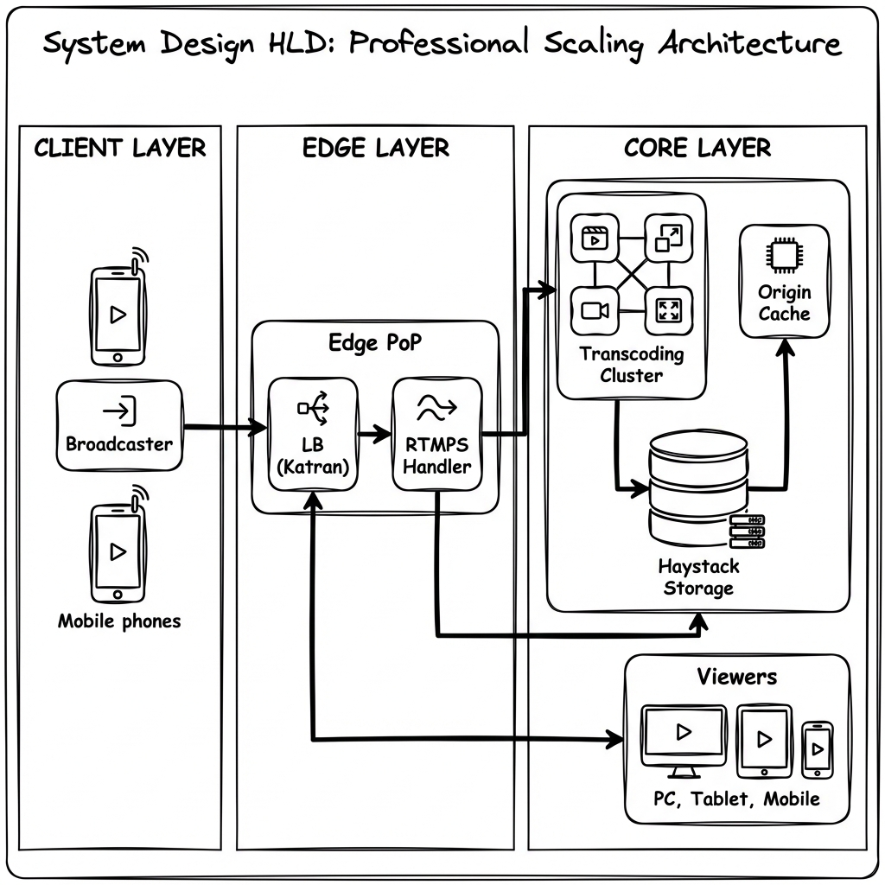
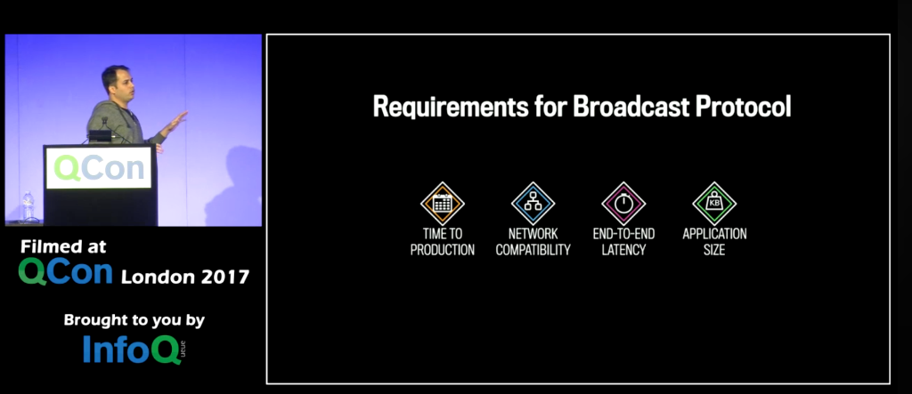
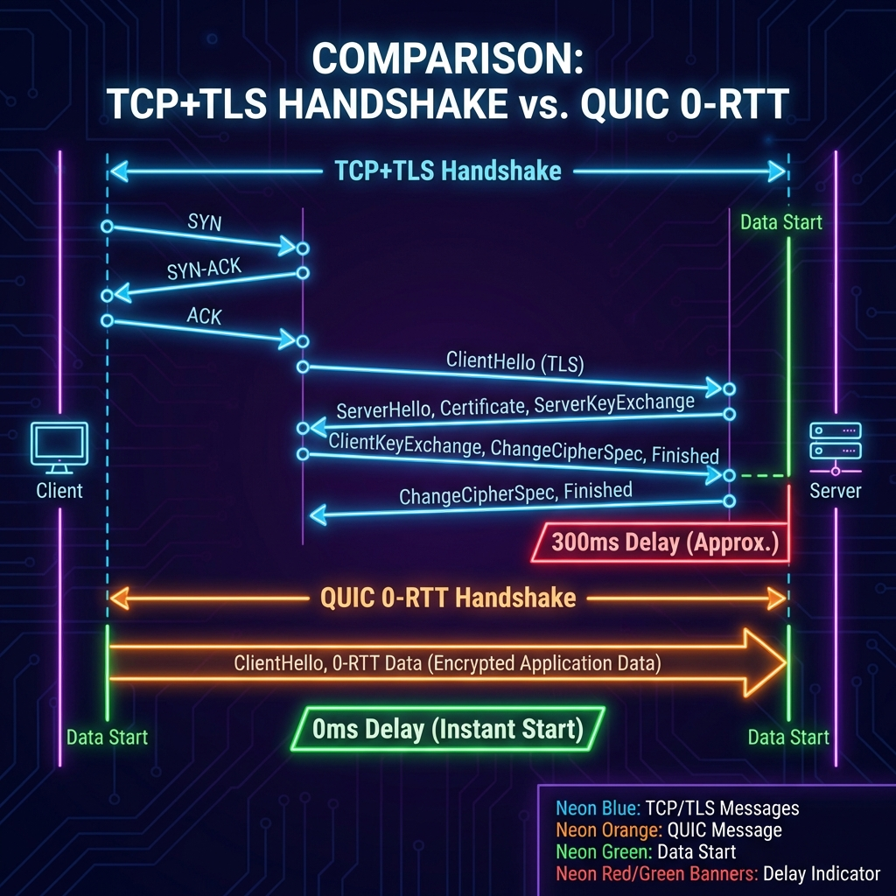
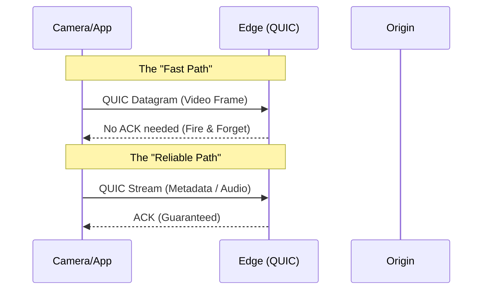
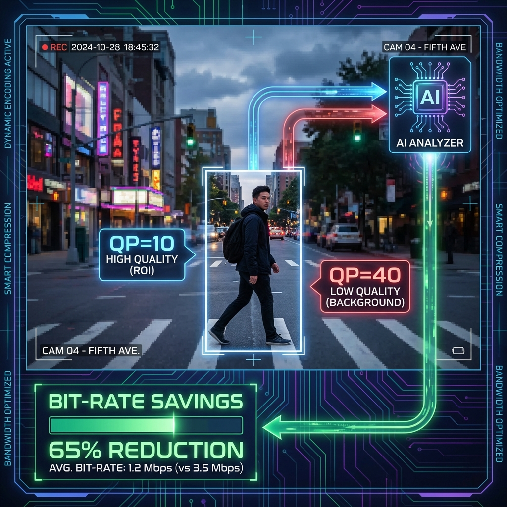

Resource: https://youtu.be/IO4teCbHvZw

The following extraction provides a comprehensive account of the development, architecture, and scaling of Facebook Live, as detailed by Sachin, the leader of the video infrastructure team at Facebook.

### **Overview and Mission**
The video infrastructure team’s mission is to ensure the success of both uploaded videos and live streams. Their work includes building fast and reliable upload systems, clustering similar videos for better ranking, and managing a distributed video encoding platform that processes chunks of video in parallel for low-latency transcoding.

### **The Definition and Philosophy of "Live"**
Facebook Live is a streaming platform that allows users to broadcast via mobile apps (iOS/Android), desktop, or a professional API. It is distinguished from traditional video uploads by two core traits:
*   **Authenticity:** Unlike well-crafted or edited videos, live streams share moments exactly as they happen.
*   **Interactivity:** The "social nature" of Live allows viewers to use comments and questions to actually change the direction of a broadcast in real time.

### **History and Development Timeline**
The project followed an aggressive development cycle to reach Facebook's **1.23 billion daily users**:
*   **April 2015:** Conceived during a rooftop hackathon ("Hack Under the Stars"). The first stream was of a clock, used to measure end-to-end latency.
*   **August 2015:** Launched to celebrities via the "Mentions" app, with Dwayne "The Rock" Johnson as the launch partner.
*   **December 2015:** Launched to all users. The transition from zero to a global launch took only **eight months**.

### **Strategic Importance**
Facebook invested in Live for three primary reasons:
1.  **Engagement:** Initial user feedback showed the platform was uniquely powerful.
2.  **Public Profiles:** Providing celebrities (e.g., Vin Diesel, Oprah, Kevin Hart) a direct way to reach fans.
# Facebook Live: The "God Mode" Architecture Guide

> **Level**: Principal Architect / Distinguished Engineer
> **Scope**: Hyper-Scale Broadcasting, Kernel Bypass, and Distributed Video Coding.

> [!IMPORTANT]
> **The Principal Law**: **Latency is a Kernel Problem**. When you are pushing 100Gbps per box, the Linux TCP stack is your bottleneck. You must bypass the kernel (XDP/DPDK) and use Zero-Copy networking.
> **The Scale**: 1.23 Billion DAU. 100Gbps+ Edge Ingress.

---

## 🏛️ The Research Papers (Required Reading)

To pass the scrutiny of a Google Principal, you must know the *foundational papers* that built this system:

1.  **Haystack (OSDI '10)**: *Finding a needle in Haystack: Facebook’s photo storage*.
    *   **Core Idea**: Filesystems metadata lookups (inode limits) kill performance. Haystack stores millions of images/videos in a **single large file**, eliminating disk seeks.
2.  **f4 (OSDI '14)**: *Facebook’s Warm BLOB Storage System*.
    *   **Core Idea**: Live video is "Hot" (Haystack/Flash). Recorded video is "Warm" (f4/Hard Drives with Reed-Solomon Erasure Coding).
    *   **Efficiency**: 1.4x storage overhead vs 3x for triple replication.
3.  **SVE (Scalable Video coding)** vs **AVC**:
    *   **Technique**: Divide the stream into "Base Layer" (360p) and "Enhancement Layers" (720p details). If bandwidth drops, drop the enhancement packets but keep the base. No re-buffering.

---

## ⚡ God Mode: The Kernel & Network Layer

Standard guides say "Use a Load Balancer". Principal Architects ask "Which Kernel Module?"

### 1. XDP (eXpress Data Path) & eBPF
*   **The Problem**: `iptables` and the Linux IP stack are too slow for DDoS attacks (10M packets/sec).
*   **The Solution**: **XDP**.
    *   Drop malicious packets at the **NIC Driver level** (before `sk_buff` allocation).
    *   **Katran**: Facebook's L4 Load Balancer (Open Sourced). It uses eBPF/XDP for blazingly fast packet forwarding consistent hashing.

### 2. Request Coalescing (The "Thundering Herd" Mathematical Proof)
*   **Scenario**: 10M users request `segment_100.ts` (size 1MB) within 100ms.
*   **Naive Nginx**: 10M threads. Context switching hell. OOM Killer triggers.
*   **God Mode (Varnish/Traffic Server)**:
    *   **Locking**: The first request `R1` grabs a mutex on the resource URL.
    *   **Queueing**: Requests `R2...R10,000,000` check the hash map, see `R1` is pending, and subscribe to a **Condition Variable**.
    *   **Broadcasting**: `R1` completes. The kernel wakes up all 10M threads (still bad, "Thundering Herd" wakeup).
    *   **Optimization**: **Shared Memory Zero-Copy**. The segment is written to a `mmap` buffer. The socket `sendfile()` syscall is triggered for all clients pointing to that same physical memory page.



---

## 📼 Distributed Video Coding (The "MapReduce" of Video)

How do you encode 4K video with <2s latency? One server is not fast enough.

### The "Slicing" Architecture
1.  **Ingest Node**: Receives RTMP stream.
2.  **Slicer**: Cuts the GOP (Group of Pictures) structure.
    *   *Trick*: You cannot cut just anywhere. You must cut at **IDR Frames** (Keyframes).
3.  **Shuffle Layer**: Distributes chunks `C1, C2, C3` to `Worker A, Worker B, Worker C`.
4.  **Parallel Transcode**:
    *   Worker A encodes `C1` to 360p/720p/1080p.
    *   Worker B encodes `C2`...
5.  **Assembler**: Stitches the HLS manifest (`.m3u8`) together.

> [!TIP]
> **Principal Trick**: **Deterministic Slicing**. If the Streamer disconnects and reconnects to a *different* server, the new server must slice at the *exact same timestamp* to ensure the HLS segments align. This requires NTP synchronization to the millisecond.

---

## 🛡️ Reliability Engineering at Scale

### 1. The "Kill Switch" (Graceful Degradation)
When the Super Bowl goes live, you cannot serve everyone 4K.
*   **Level 1**: Disable 4K/1080p encoding. Force everyone to 720p. Saves 50% CPU/Bandwidth.
*   **Level 2**: Disable "Comments" and "Reactions" (WebSocket writes are expensive).

### 3. Distribution (The Last Mile)
*   **Mechanism**: **Pull-Based** HTTP.
*   **Flow**: Playback Client -> **Edge PoP** -> **Origin**.

### 📐 Visual Architecture: The Facebook Live Pipeline

```mermaid
graph TB
    subgraph "Ingest (The First Mile)"
        Broadcaster[Broadcaster App] -->|RTMPS| LB[L4 Load Balancer (Katran)]
        LB -->|Consistent Hash| EdgePop[Edge Ingest PoP]
        EdgePop -->|Stream| Transcoder[Origin Transcoder Fleet]
    end

    subgraph "Processing Core (Origin)"
        Transcoder -->|Decode/Encode| MP4[Multi-Bitrate Segments]
        MP4 -->|Write| HotCache[Origin Cache (RAM)]
        MP4 -->|Persist| Haystack[Haystack/Everstore (Storage)]
    end

    subgraph "Distribution (The Thundering Herd)"
        Viewer[Millions of Viewers] -->|HTTP GET Request| EdgeDel[Edge Delivery PoP]
        
        EdgeDel -- "HIT" --> Viewer
        EdgeDel -- "MISS (Coalesced)" --> HotCache
    end
    
    style Broadcaster fill:#f96,stroke:#333,stroke-width:2px
    style Viewer fill:#bfb,stroke:#333,stroke-width:2px
    style Haystack fill:#f9f,stroke:#333,stroke-width:2px
    style EdgeDel fill:#bbf,stroke:#333,stroke-width:4px
```



*   **Level 3**: **Audio Only Mode**. The nuclear option. Keeps the stream "live" but removes video data (90% savings).

### 2. BBR Congestion Control (Google's Secret Weapon)
*   **TCP Cubic**: Backs off when packet loss occurs. Bad for video (micro-stutters).
*   **TCP BBR (Bottleneck Bandwidth and Round-trip propagation time)**: Models the pipe size. It pumps specific rates regardless of random packet loss, filling the pipe perfectly. YouTube & FB Live use this for ingest.

---

## ✅ Principal Architect Checklist

1.  **Do you use consistent hashing for Load Balancing?** (Katran).
    *   *Why*: If a cache node dies, only 1/N keys are remapped. Standard Modulo-N remaps 100%.
2.  **Are you using Zero-Copy `sendfile()`?**
    *   *Why*: Avoids copying data from Kernel Space -> User Space -> Kernel Space.
3.  **Is your storage Erasure Coded?** (Reed-Solomon).
    *   *Why*: RAID-6 is too expensive (storage overhead). RS(10,4) gives you durability with 1.4x overhead.

---

## ⚖️ Protocols: The Decision Matrix (Principal View)

Why did Facebook choose **RTMP** in 2015? It wasn't random. It was an engineering trade-off based on **4 Constraints**.



### The 4 Constraints
1.  **Time to Production**: Hackathon -> Production (4 months). Global Scale (8 months).
2.  **Network Compatibility**: Must work on Facebook's existing Edge (tuned for TCP).
3.  **End-to-End Latency**: Must be faster than TV (~30s). Target < 10s.
4.  **Application Size**: The Facebook App is huge. Budget for Live Video code: **< 500 KB**.

### The Elimination Round

| Protocol | Verdict | Why it failed |
| :--- | :--- | :--- |
| **WebRTC** | ❌ Rejected | **UDP Incompatibility**. FB Infra (LBs/Firewalls) was TCP-only in 2015. |
| **HTTP Upload** | ❌ Rejected | **Latency**. Creating files and uploading via HTTP POST is too slow (>30s). |
| **Custom Protocol** | ❌ Rejected | **Time**. Writing custom Server + Client libs takes > 8 months. |
| **Proprietary** | ❌ Rejected | **Size**. 3rd party SDKs were multi-megabytes. Budget was 500KB. |
| **RTMP(S)** | ✅ **Winner** | **Standard**. Works over TCP. Libs exist. Size is ~100KB. |

### Encoding Evolution (The 1:1 Pivot)
*   **Initial Launch**: **720x720 (1:1 Aspect Ratio)**.
    *   *Reasoning*: Square video looks best in a vertical mobile feed.
*   **The Pivot**: **400x400**.
    *   *Reality*: "White House Wi-Fi" problem. 720p requires ~1-2 Mbps. If upload fails, the stream dies.
    *   *Fix*: Adaptive Bitrate. Drop to 400x400 (Low Quality) but **keep the stream alive**.
*   **Codecs**:
    *   **Audio**: AAC (64kbps).
    *   **Video**: H.264 (500kbps - 1Mbps).

---

---

# PART 2: The Google Perspective (Evolution & Surveillance)

> **Scenario**: "If we built this today at Google, how would we beat 2015-era Facebook?"

## 🚀 1. Transport Evolution: KILL TCP (Use QUIC)

Facebook built on TCP because it was standard. Google built **QUIC** (HTTP/3) to break the laws of physics.

### The Hack: 0-RTT Handshake
*   **TCP+TLS**: Handshake -> SYN, SYN-ACK, ACK, ClientHello, ServerHello... (3-4 Round Trips).
*   **QUIC**: "I know you." (0 Round Trips). Resumption token embedded in the first packet.
*   **Impact**: Video starts **instantly**. No "Buffering..." spinner.



### The God Mode: Elimination of Head-of-Line Blocking
*   **Problem**: In TCP, if Packet 50 is lost, Packet 51-100 wait. The video freezes.
*   **QUIC Solution**: Streams are independent. Using **Datagrams** (unreliable) for non-critical frames and **Streams** (reliable) for Keyframes.
*   **Surveillance Hack**: Drop P-frames aggressively if network lags. Never drop I-frames.



## 🧠 2. Transcoding: The "Argos" VCU Strategy

Facebook used CPUs (Haswell) to encode. Google realized CPUs are inefficient for video.
*   **The VCU (Video Coding Unit)**: Google built a custom ASIC (**Argos**) just for YouTube.
*   **Performance**: 20x-33x more efficient than Intel CPUs.
*   **Surveillance Adaptation**: You cannot put ASICs in every camera.
    *   **The Hack**: **Just-in-Time (JIT) Transcoding**.
    *   Don't transcode 24/7. Store the **Raw H.264** stream.
    *   Only trigger the GPU Transcoder when a human actually clicks "Play".
    *   **Savings**: 99% resource reduction (since 99% of CCTV footage is never watched).

## 👁️ 3. AI "Cheats": Super-Resolution & ROI

How do you stream 4K on a 3G network? You cheat.

### Hack 1: Client-Side Super-Resolution (NVIDIA DLSS style)
*   **Server**: Sends 540p stream (Low Bandwidth).
*   **Client (Android/iOS NPU)**: Runs a TFLite model to upscale 540p -> 1080p.
*   **Result**: Looks like HD, costs like SD.

### Hack 2: Region of Interest (ROI) Encoding
*   **Concept**: Not all pixels are equal.
*   **The Trick**: Run a cheap Face Detector (MobileNet) *before* encoding.
*   **Quantization**:
    *   Faces/Text: **QP=10** (High Quality).
    *   Trees/Sky/Background: **QP=40** (Potato Quality).
*   **Surveillance Match**: Critical for CCTV. You need the license plate sharp, you don't care about the grass.



```mermaid
graph TD
    Raw[Raw Video Input] --> Analyze{AI Analyzer}
    Analyze -->|Face Detected| ROI_Map[Generate ROI Map]
    Analyze -->|Motionless| Drop[Drop Frame (0 FPS)]
    
    ROI_Map --> Encoder[H.265 Encoder]
    Raw --> Encoder
    
    Encoder --> Output[Smart Stream]
    
    style ROI_Map fill:#f96,stroke:#333
    style Drop fill:#f9f,stroke:#333
```

## 📹 4. Surveillance vs Social: The Architecture Flip

If you are building **Videonetics** (Surveillance) instead of Facebook Live:

| Feature | Facebook Live (Social) | Videonetics (Surveillance) |
| :--- | :--- | :--- |
| **Traffic Pattern** | **Fan-Out** (1 Ingest, 1M Viewers) | **Fan-In** (1M Cameras, 1 Viewer) |
| **Write Strategy** | Transcode Immediately (Hot) | Write Raw Immediately (Cold) |
| **Latency Goal** | < 5s (Chat Interactivity) | < 200ms (PTZ Control - Joystick) |
| **Retention** | Infinite (Everstore) | Compliance (30-90 Days) -> **Delete** |
| **God Mode Hack** | **Multicast** from Edge to Users | **Motion-Triggered** Storage (Write 0 bytes if no motion) |

### The "Write-Heavy" Storage Engine (LSM Implementation)
Surveillance cameras never stop writing. Random IO kills hard drives.
*   **Do**: Use **LSM Trees** (Log Structured Merge). Append-only writes.
*   **Don't**: Update index per frame.
*   **Optimization**: Write video chunks (10MB) to disk. Keep metadata in **RocksDB**.
*   **Motion Search**: Don't scan video. Scan the *metadata* timeline for `event_type="motion"`.

## 🎨 visual Summary: The "Google-Scale" Pipeline

```mermaid
graph LR
    subgraph "Edge Intelligence (Camera/PoP)"
        Cam[Camera] --> AI[AI: ROI + Motion]
        AI -->|Low Bitrate| QUIC[QUIC UDP Sender]
    end

    subgraph "Core (Google Cloud)"
        QUIC --> Ingest[Ingest Slicer]
        Ingest --> Hot[MemCache (Live View)]
        Ingest --> Cold[Colossus / Cold Storage]
        
        Cold -->|On Playback| JIT[JIT Transcoder (GPU)]
    end

    subgraph "Viewer (Client)"
        Hot -->|Sub-second| Player
        JIT -->|Seek History| Player
        Player -->|Upscale| SR[Super Resolution AI]
    end

    style AI fill:#bbf,stroke:#333
    style JIT fill:#f96,stroke:#333
    style SR fill:#bfb,stroke:#333
```