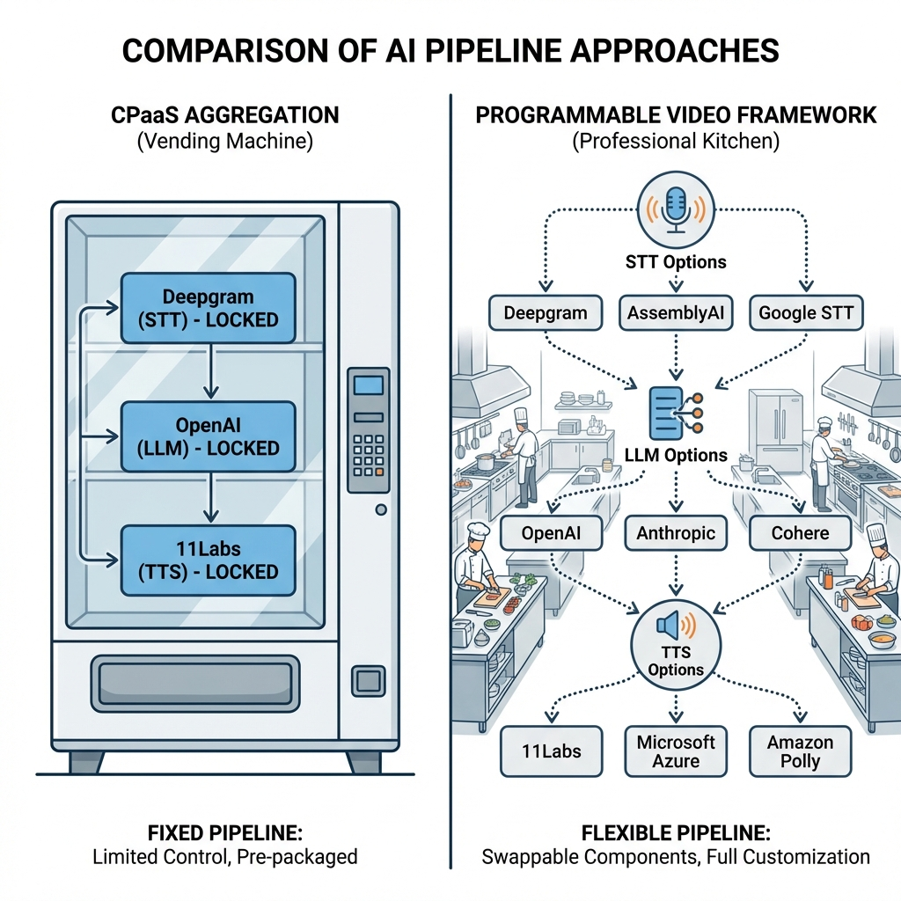
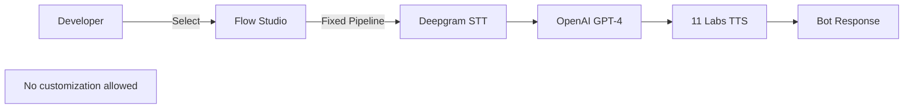
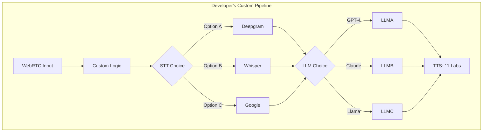
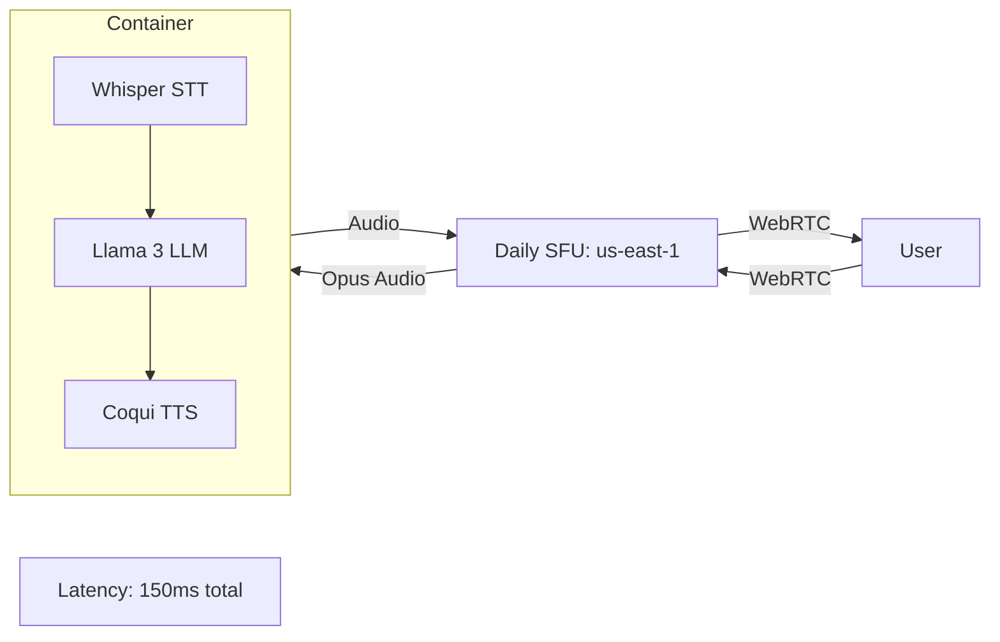

# AI Marketplace Strategy: CPaaS vs Programmable Video

> **Source**: [WebRTC & AI Marketplace Analysis](https://youtu.be/vGrIaUmHTrQ)

> [!IMPORTANT]
> **The Strategic Divide**: Traditional CPaaS vendors (Twilio, Vonage) treat AI as "another API to aggregate". Programmable Video vendors (Daily, LiveKit, Agora) provide **frameworks** for developers to build custom AI pipelines.
> **The Winner**: Flexibility beats simplicity in the AI era.

---

## 🏛️ The CPaaS Aggregation Mindset



### The Legacy Model (Voice/SMS)
Traditional CPaaS vendors succeeded by **aggregating carriers**.
*   **Problem**: Developers don't want to deal with Verizon, AT&T, T-Mobile individually.
*   **Solution**: One API, route to cheapest/best carrier automatically.
*   **Value Prop**: "Just send SMS. We handle the rest."

### The AI Mistake: Applying the Same Logic
These vendors now aggregate **LLMs** and **STT/TTS** engines.
*   **Offering**: "We support OpenAI, Gemini, Claude. Pick one."
*   **Reality**: This is a **drag-and-drop flow studio** with fixed pipes.



### Why This Fails
*   **No Flexibility**: You cannot swap **Deepgram** for **Whisper**, or inject custom logic between STT and LLM.
*   **Echo Chamber**: They optimize for **contact centers** (their existing customers), ignoring other use cases.
*   **Opinionated**: "We know best" doesn't work when AI models change every 3 months.

---

## 🎯 The Programmable Video Framework Approach

### The Leaders
1.  **Daily**: Pipecat (Open source)
2.  **LiveKit**: Real-Time Agents (Open source)
3.  **Agora**: Custom framework

### The Philosophy
"We give you the **building blocks**. You assemble the pipeline."



### Why This Wins
*   **Flexibility**: Swap **any** component without rewriting the app.
*   **Niche Support**: Developer can optimize for **Russian accent** or **medical terminology** by choosing specialized models.
*   **Future-Proof**: When GPT-5 launches, upgrade the `llm:` line. Done.

---

## 💰 The Latency Problem: Cross-Cloud "Ping-Pong"

### The Anti-Pattern
*   **CPaaS (AWS)** → **STT (Google)** → **LLM (Azure)** → **TTS (AWS)** → **User**
*   **Latency**: 100ms (network) + 50ms (STT) + 200ms (LLM) + 50ms (TTS) = **400ms**.
*   **Cost**: 4x egress fees (cross-cloud bandwidth).

### The Solution: Containerized Pipelines (Daily's Approach)
Run **STT + LLM + TTS** in a **single Docker container** on the same cloud region as the media server.

**Architecture**:


**Benefits**:
*   **Latency**: 150ms (vs 400ms).
*   **Cost**: No cross-cloud egress.
*   **Control**: Developer owns the container, can swap models at will.

---

## 🎮 Hardware Innovation: Telnyx's GPU Play

### The Problem
If you run on Cloudflare/AWS, you rent their GPUs at **$2/hour**.

### Telnyx's Bet
*   **Sell GPUs**: Telnyx offers **dedicated GPUs** to customers.
*   **Why**: Run LLMs **on Telnyx's network**, closer to their SIP/WebRTC infrastructure.
*   **Benefit**: Lower latency (same data center), lower cost (you "own" the GPU).

### Trade-off
*   **Pros**: Best latency, predictable cost.
*   **Cons**: Lock-in (you're on Telnyx's network).

---

## 📊 Vendor Comparison Matrix

| Vendor | Type | Philosophy | Flexibility | Use Case |
| :--- | :--- | :--- | :--- | :--- |
| **Twilio** | CPaaS | Aggregation | 🔴 Low | Contact Centers |
| **Vonage** | CPaaS | Aggregation | 🔴 Low | SMS + Voice Bots |
| **SignalWire** | Hybrid | Scripting | 🟡 Medium | Custom IVR |
| **Daily** | Video | Framework (Pipecat) | 🟢 High | Custom AI Apps |
| **LiveKit** | Video | Framework (Agents) | 🟢 High | OSS + Self-hosted |
| **Agora** | Video | Managed Framework | 🟢 High | Global Scale |
| **Telnyx** | Hybrid | GPU Infra | 🟡 Medium | Low-latency AI |

---

## ✅ Principal Architect Checklist

1.  **Avoid Vendor Lock-in**: Use frameworks (Pipecat, LiveKit) over opinionated APIs. AI models change every quarter.
2.  **Co-locate AI and Media**: Run STT/LLM/TTS in the same cloud region as your SFU. Saves 100ms+ latency.
3.  **Plan for Model Swaps**: Design your pipeline so swapping **GPT-4 → Claude** is a 1-line config change.
4.  **Monitor Cross-Cloud Costs**: If you're using AWS SFU + Azure OpenAI, you're paying **egress fees**. Consolidate.

---

## 🔬 Advanced Pattern: Multi-Model Fallback

For production-grade AI, use **fallback chains**:
```python
# Example: Pipecat pipeline
pipeline = Pipeline([
    STT(provider="deepgram", fallback="whisper"),
    LLM(provider="openai", fallback="claude", fallback2="llama"),
    TTS(provider="elevenlabs", fallback="coqui")
])
```

*   **Why**: If OpenAI is down (happens), failover to Claude automatically.
*   **Cost**: Run health checks every 60s. Minimal overhead.

---

## 🔗 Related Documents
*   [WebRTC Evolution](./webrtc-evolution-guide.md) — AI as the "Fourth Era" of WebRTC.
*   [Cloudflare Strategy](./cloudflare-webrtc-strategy-guide.md) — Edge AI orchestration.
