# Cloudflare's WebRTC Strategy: The Triple Play

> **Source**: [Cloudflare's Real-Time Communication Strategy](https://youtu.be/7uwKHAcIQeM)

> [!IMPORTANT]
> **The Thesis**: Cloudflare is betting they can win **three separate markets** simultaneously: Group Calling (SDK), Live Streaming (MoQ), and Voice AI (Edge).
> **The Risk**: Most competitors (Daily, LiveKit) are "all-in" on **one** market. Can Cloudflare execute on three?

---

## 🌐 Cloudflare's Advantage: 300+ Edge Cities

Cloudflare operates **300+ data centers** globally, making them the **4th largest cloud vendor** behind AWS, Azure, and Google.

### Why This Matters
*   **Latency**: Most users are <50ms from a Cloudflare PoP (Point of Presence).
*   **Bandwidth**: Cloudflare's network is optimized for **CDN traffic** (already handling 20% of global HTTP).
*   **Cost**: They own the infrastructure. No per-GB egress fees like AWS.

---

## 🎯 Strategy 1: Group Calling (The SDK "Surrender")

### The Problem
Cloudflare launched a **TURN server** and **SFU**, but **no signaling protocol**.
*   *Result*: Developers couldn't use it. Too low-level.
*   *Complaint*: "I don't want to manage Simulcast layers manually."

### The Solution: Acquire Dyte
*   **What**: Dyte is an Indian CPaaS vendor with an SDK.
*   **Why**: Cloudflare admits they need **APIs and SDKs** (the "white flag").
*   **Outcome**: Now competes directly with **Agora**, **Twilio Video**, and **Amazon Chime**.

> [!TIP]
> **Principal Architect Insight**: This is a **"Build vs Buy"** case study. Cloudflare chose "Buy" (Dyte) over spending 2 years building an SDK. Time-to-market > NIH (Not Invented Here) syndrome.

---

## 🚀 Strategy 2: Live Streaming (Media over QUIC)

### The New Protocol: MoQ
**Media over QUIC (MoQ)** is Cloudflare's bet to replace WebRTC for live streaming.

### How It Works

### MoQ vs WebRTC
| Feature | WebRTC | MoQ |
| :--- | :--- | :--- |
| **Protocol** | RTP/UDP | HTTP/3 (QUIC) |
| **Latency** | 100-200ms | 200-500ms |
| **Scale** | Requires custom SFU | Native to CDN |
| **Browser Support** | Universal | Chrome only (2025) |
| **Use Case** | P2P, Small Groups | Live Broadcasting |

> [!WARNING]
> **Adoption Risk**: MoQ is **not standardized** until Q1 2026. Early adopters risk being on the bleeding edge if the spec changes.

---

## 🤖 Strategy 3: Voice AI at the Edge

### The Problem Cloudflare Solves
Running a **Conversational AI bot** (STT → LLM → TTS) requires low latency.
*   **Traditional Approach**: Centralized cloud (AWS us-east-1). Latency = 100-300ms.
*   **Cloudflare Approach**: Run the **orchestration** at the edge (user's nearest PoP). Latency = 20-50ms.

### The Architecture

```mermaid
graph LR
    User[User: WebRTC/Opus] -->|WebRTC| Edge[Cloudflare Edge]
    
    subgraph "Edge Processing"
        Edge -->|AI Gateway| Transform[Transcode: Opus → PCMU]
        Transform -->|WebSocket| STT[STT Service]
    end
    
    STT -->|Text| LLM[LLM: OpenAI/Anthropic]
    LLM -->|Response| TTS[TTS Service]
    TTS -->|Audio| Edge
    Edge -->|WebRTC| User
```

### The AI Gateway (Codec Translation)
*   **Input**: WebRTC (Opus codec).
*   **Output**: WebSocket (PCMU/G.711 codec).
*   **Why**: Most STT engines (Google, Deepgram) expect **PCMU**, not Opus.

### Competitive Landscape
| Vendor | Focus | Flexibility | Latency |
| :--- | :--- | :--- | :--- |
| **Pipcat** | DIY Framework | High (Custom pipeline) | Variable |
| **Daily** | Managed Voice AI | Medium (Pre-built flows) | Low |
| **LiveKit** | OSS + Cloud | High (Self-hosted) | Medium |
| **Cloudflare** | Edge Orchestration | Low (Opinionated) | **Lowest** |

> [!TIP]
> **Use Cloudflare if**: You want "one-click" Voice AI and are already on Cloudflare. Use **Pipcat** if you need custom LLM routing (e.g., fallback from GPT-4 to Llama).

---

## 🎭 The Strategic Question: Can They Win All Three?

Cloudflare is simultaneously competing in:
1.  **Unified Communications** (vs Twilio, Agora).
2.  **Live Streaming** (vs YouTube Live, AWS IVS).
3.  **Voice AI** (vs Daily, LiveKit, Pipcat).

### The Bull Case
*   **Bundling**: Existing Cloudflare customers (50M+ domains) get WebRTC "for free".
*   **Cost**: No egress fees. AWS charges $0.09/GB. Cloudflare charges $0.
*   **Latency**: 300 PoPs = Lowest RTT (Round-Trip Time).

### The Bear Case
*   **Focus**: Competitors (Daily, LiveKit) are **all-in** on Voice AI. Cloudflare is spreading resources across 3 markets.
*   **Complexity**: Each market has different customers. SaaS companies (Group Calling) vs Media companies (Live Streaming) vs AI startups (Voice AI).
*   **Execution Risk**: If MoQ fails to standardize, the entire Live Streaming bet collapses.

> [!CAUTION]
> **Principal Architect Warning**: Beware of "Strategic Plateaus". Cloudflare may win the infrastructure layer (TURN/SFU) but **lose the application layer** to vendors with better DX (Developer Experience).

---

## ✅ Principal Architect Checklist

1.  **Evaluate MoQ Carefully**: If your live stream needs <500ms latency AND you can wait until Q1 2026 for standardization, MoQ is worth testing. Otherwise, stick with WebRTC.
2.  **Use Cloudflare for Cost Optimization**: If you're already on Cloudflare CDN, adding WebRTC is **free** (no egress fees). This is a no-brainer for existing customers.
3.  **Don't Lock In**: Cloudflare's Voice AI is opinionated. Build an **abstraction layer** so you can swap to Daily or Pipcat if needed.
4.  **Monitor SIP Support**: Traditional contact centers use **SIP**, not WebRTC. If that's your market, ensure your vendor (including Cloudflare) supports SIP-to-WebRTC gateways.

---

## 🔗 Related Documents
*   [WebRTC Evolution](./webrtc-evolution-guide.md) — AI integration and WHIP/WHEP.
*   [Live Streaming Guide](../live-streaming-guide.md) — WebRTC vs HLS protocols.
*   [Group Streaming Architecture](./group-streaming-architecture-guide.md) — SFU scaling patterns.
