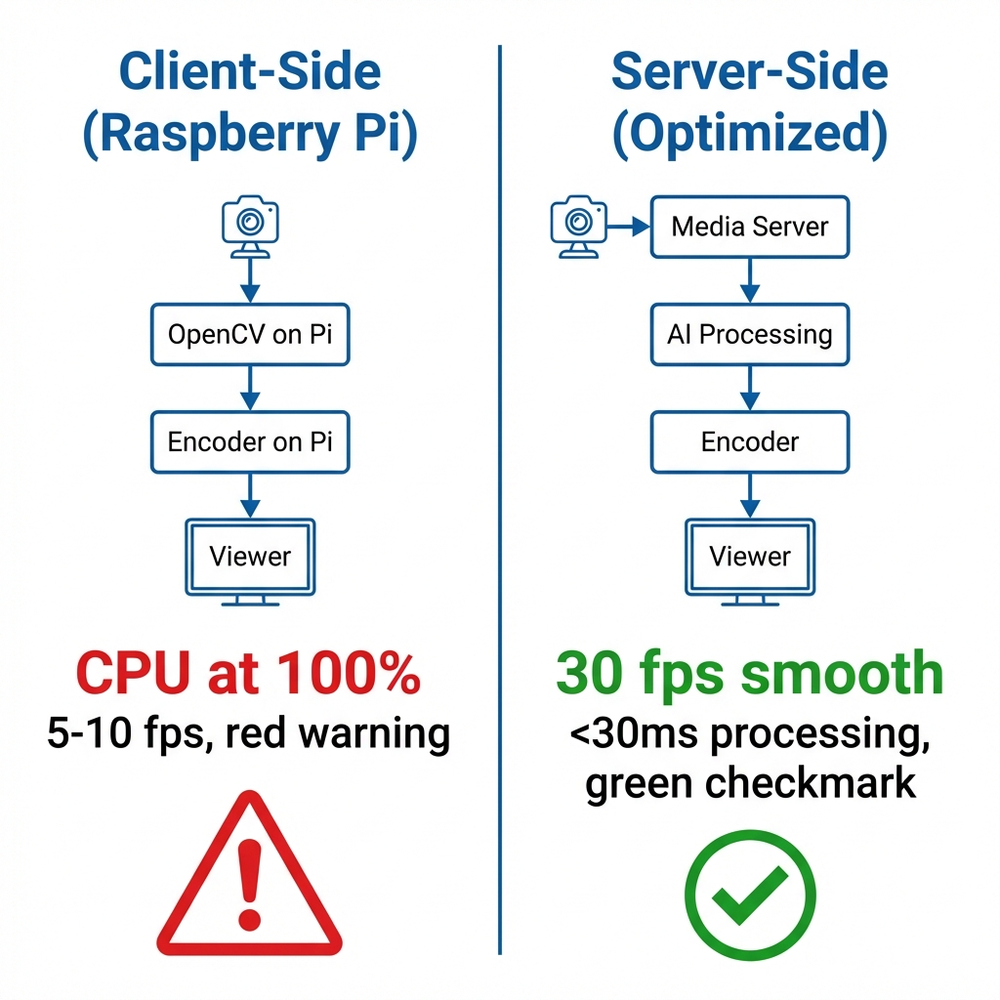
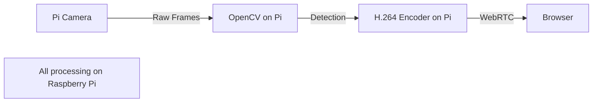
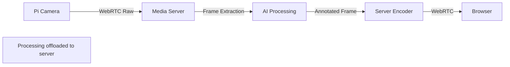

# Edge AI Processing: Client vs Server Trade-offs

> **Source**: [AI on Low-Power Hardware (Raspberry Pi + WebRTC)](https://youtu.be/wk6cWrCXTEo)

> [!IMPORTANT]
> **The Core Challenge**: Running AI (image detection, segmentation) on **low-power devices** (Raspberry Pi, IoT cameras) with real-time video.
> **The Trade-off**: Process on the **client** (device) or **server** (media server)?

---

## 🎯 The Problem: AI on Edge Devices

### The Use Case
*   **Surveillance**: Detect humans vs cats in a live video stream.
*   **Hardware**: Raspberry Pi (quad-core, 1GB RAM).
*   **Protocol**: WebRTC (low-latency, sub-second).

### The Constraint
*   **Client Processing**: Raspberry Pi cannot run OpenCV + encode video simultaneously.
*   **Result**: Missed frames, stuttering video.

---

## 🏗️ Architecture Pattern 1: Client-Side Processing

### How It Works

### Performance
*   **Frame Rate**: 5-10 fps (vs target 30 fps).
*   **CPU**: 100% (encoder + AI).
*   **Latency**: 200-300ms (acceptable).

### Verdict
❌ **Unusable** for production. Video quality is unacceptable.

---

## 🚀 Architecture Pattern 2: Server-Side Processing

### How It Works

### Media Server Options

| Server | Built-in AI | Ease of Use | Performance |
| :--- | :--- | :--- | :--- |
| **Kurento** | ✅ Face detection, masking | 🟢 High (plugins) | 🟡 Medium |
| **Janus** | ❌ None | 🔴 Low (manual) | 🟢 High |
| **mediasoup** | ❌ None | 🔴 Low (manual) | 🟢 High |

### Initial Performance (Unoptimized)
*   **Processing Time**: 50ms per frame.
*   **Frame Rate**: 20 fps.
*   **Total Latency**: 2+ seconds.
*   **Verdict**: ❌ Too slow.

---

## ⚡ The Optimization: OpenCV + GStreamer Tuning

### The Problem
Default OpenCV settings are optimized for **accuracy**, not **speed**.

### The Solution
1.  **Reduce Resolution**: Process at 480p (vs 1080p).
2.  **Skip Frames**: Process every 3rd frame (10 fps AI, 30 fps video).
3.  **GStreamer Hardware Acceleration**: Use GPU-accelerated encoder.
4.  **Model Simplification**: Use **MobileNet** (vs ResNet).

### Optimized Performance
*   **Processing Time**: <30ms per frame.
*   **Frame Rate**: 30 fps (smooth).
*   **Total Latency**: 500ms (acceptable).
*   **Verdict**: ✅ **Production-ready**.

---

## 🔬 Kurento vs Janus: Implementation Comparison

### Kurento (Easier)
**Pros**:
*   **Built-in plugins**: Face detection, object tracking.
*   **Configuration**: Change XML config, restart server.
*   **Development Time**: 1-2 days.

**Cons**:
*   **Performance**: Slower than Janus (more abstraction layers).
*   **Maintenance**: Project is less active (2024).

### Janus (Harder, Faster)
**Pros**:
*   **Performance**: Lowest latency (C-based).
*   **Flexibility**: Full control over media pipeline.

**Cons**:
*   **No AI plugins**: Must integrate OpenCV manually.
*   **Development Time**: 1-2 weeks.

> [!TIP]
> **Principal Architect Recommendation**: Use **Kurento** for MVP (1 week to market). Migrate to **Janus** if latency becomes a bottleneck (>100 viewers).

---

## 📊 Cost Analysis: Client vs Server AI

### Scenario: 100 Raspberry Pi cameras

**Client-Side Processing**:
*   **Device**: $50/Pi (buy once).
*   **Power**: Minimal.
*   **Total**: $5,000 (one-time).

**Server-Side Processing**:
*   **Server**: c5.4xlarge (16 vCPU, 32 GB) = $0.68/hour.
*   **Capacity**: 20 streams per instance.
*   **Instances Needed**: 100 ÷ 20 = 5 instances.
*   **Cost**: 5 * $0.68 * 24 * 30 = **$2,448/month**.

### Breakeven
*   **Month 2**: Server costs ($4,896) < Client costs ($5,000).
*   **Month 12**: Server costs ($29,376) >> Client costs ($5,000).

> [!WARNING]
> **The Hidden Cost**: Server-side scales linearly ($2.5k/month forever). Client-side is **one-time** but requires powerful edge devices.

---

## 🎬 Real-World Use Cases

### 1. Surveillance (Use Server-Side)
*   **Why**: Cameras are dumb (H.264 only). Server does AI.
*   **Example**: Detect "person near door" for alerts.

### 2. Factory Wearables (Use Client-Side)
*   **Why**: Worker's AR glasses have GPU.
*   **Example**: Detect "hand near machine" for safety alerts.

### 3. Drone Control (Hybrid)
*   **Why**: Drone has GPU (object tracking), server does post-processing (analytics).
*   **Example**: Live "follow me" mode (client) + incident reporting (server).

---

## ✅ Principal Architect Checklist

1.  **Profile Before Optimizing**: Run unoptimized first. Measure actual CPU, not assumptions.
2.  **Reduce Resolution for AI**: Process at 480p, display at 1080p. Human eye won't notice.
3.  **Skip Frames Strategically**: AI at 10 fps, video at 30 fps. Object detection doesn't need every frame.
4.  **Use Kurento for Prototypes**: Built-in plugins save 2 weeks of OpenCV integration work.

---

## 🔗 Related Documents
*   [WebRTC Evolution](./webrtc-evolution-guide.md) — AI as the Fourth Era.
*   [AI Marketplace Strategy](./ai-marketplace-strategy-guide.md) — Containerized AI pipelines.
*   [Cloudflare Strategy](./cloudflare-webrtc-strategy-guide.md) — Edge AI orchestration.
