# Group Streaming Architecture: Meeting → Livestream

> **Source**: [Group-to-Livestream Architecture](https://youtu.be/JFS5ygCateI)

> [!IMPORTANT]
> **The Core Problem**: You have 4 people in a "meeting" that 100,000 people want to watch.
> **The Trade-off**: Real-time (WebRTC) vs Scale (CDN/HLS). You cannot have both without significant cost.

---

## 🏗️ The Architecture Decision Tree

```mermaid
graph TD
    Start[Group Meeting: 4 People] --> Viewers{How many viewers?}
    
    Viewers -->|<100| ClientMix[Client-Side Mixing]
    Viewers -->|100-10k| ServerMix[Server-Side Mixing + CDN]
    Viewers -->|>10k| Cascade{Need Real-Time?}
    
    Cascade -->|Yes: Betting, Finance| CascadeSFU[Cascading SFUs]
    Cascade -->|No: Webinars| CDN[RTMP → CDN → HLS]
    
    ClientMix --> Note1[Each viewer downloads 4 streams]
    ServerMix --> Note2[Server mixes to 1 stream]
    CascadeSFU --> Note3[Complex, Expensive]
    CDN --> Note4[5-30s latency, Cheap]
```



---

## 📊 Pattern 1: Client-Side Mixing (<100 Viewers)

### How It Works
*   Each viewer's browser connects to the **SFU** and downloads **all participant streams** (4 video + 4 audio).
*   The browser **locally** composites them into a grid layout.

### Pros
*   **Zero server-side mixing cost**.
*   **Real-time** (100-200ms latency).
*   **Customizable layouts**: Each viewer can rearrange the grid.

### Cons
*   **Bandwidth**: Each viewer downloads `N * bitrate`. For 4 participants at 2 Mbps each = **8 Mbps per viewer**.
*   **CPU**: Client device must decode 4 video streams simultaneously (kills mobile).

> [!WARNING]
> **The Mobile Problem**: A 2019 Android phone cannot decode 4x 1080p streams. You'll get frame drops and battery drain.

---

## 🎥 Pattern 2: Server-Side Mixing (CDN Distribution)

When you cross 100 viewers, you **must** mix on the server.

### The Workflow
1.  **Meeting**: 4 participants → SFU.
2.  **Mixing**: Server combines 4 streams into 1 composite stream.
3.  **Ingest**: Send composite to CDN via **RTMP**.
4.  **Distribution**: CDN outputs **HLS/DASH** to millions.

### Latency
*   **Meeting Participants**: 100-200ms (WebRTC).
*   **Livestream Viewers**: 5-30 seconds (HLS).

---

## 💰 The Cost Analysis: Headless vs Native Mixing


### Method 1: Headless Browser (Chromium + Puppeteer)

**How it works**:
1.  Spawn a **headless Chromium** instance on a cloud VM.
2.  Navigate to a "mixing page" (HTML/CSS/JS grid layout).
3.  Capture the screen using **FFmpeg** or **GStreamer**.
4.  Encode to RTMP and push to CDN.

**Cost Breakdown** (per 1-hour stream):
| Resource | Specification | Cost (AWS) |
| :--- | :--- | :--- |
| **VM** | c5.2xlarge (8 vCPU, 16 GB) | $0.34/hour |
| **Chromium Memory** | 2-4 GB per instance | Included |
| **Egress (RTMP)** | 2 Mbps * 3600s = 900 MB | $0.09/GB = $0.08 |
| **Total** | | **$0.42/hour** |

**Pros**:
*   **Easy to build**: Use web technologies (HTML/CSS).
*   **Flexible**: Complex layouts (PiP, overlays) are trivial.

**Cons**:
*   **Resource-heavy**: Chromium uses 2-4 GB RAM just to render a grid.
*   **Ugly to scale**: Each concurrent stream needs a dedicated VM.

---

### Method 2: Native Mixing (FFmpeg/GStreamer)

**How it works**:
1.  Use **FFmpeg** `overlay` filter to composite streams.
2.  Encode directly to RTMP.

**Example Command**:
```bash
ffmpeg \
  -i rtmp://sfu/participant1 \
  -i rtmp://sfu/participant2 \
  -filter_complex "[0:v][1:v]hstack=inputs=2[out]" \
  -map "[out]" \
  -f flv rtmp://cdn/stream
```

**Cost Breakdown** (per 1-hour stream):
| Resource | Specification | Cost (AWS) |
| :--- | :--- | :--- |
| **VM** | c5.large (2 vCPU, 4 GB) | $0.085/hour |
| **Egress (RTMP)** | 2 Mbps * 3600s = 900 MB | $0.08 |
| **Total** | | **$0.165/hour** |

**Pros**:
*   **60% cheaper** than headless browsers.
*   **Lower CPU/Memory**: No browser overhead.

**Cons**:
*   **Hard to build**: FFmpeg filter syntax is arcane.
*   **Limited flexibility**: Complex layouts require custom code.

> [!TIP]
> **Google-Scale Recommendation**: Start with Headless for MVP (1 week to build). Migrate to Native when you hit 100+ concurrent streams (ROI breakeven).

---

## 🎬 Pattern 3: Client-Side Recording (Post-Production)

### The Problem
*   Live RTMP streams suffer from **packet loss**.
*   The recorded file has artifacts (frozen frames, audio glitches).

### The Solution
Each participant records locally using **Media Recorder API**.

**Workflow**:


**Benefits**:
*   **Pristine quality**: No network artifacts.
*   **Cheaper storage**: Upload post-event (no real-time egress cost).

**Trade-offs**:
*   **Delay**: Recordings available 5-10 minutes after the event.
*   **Participant responsibility**: If P1 closes the tab early, their recording is lost.

---

## 🚀 Pattern 4: Cascading SFUs (Real-Time at Scale)

For **betting, finance, or interactive gaming**, you need <1 second latency for 100k viewers.

### The Architecture
```
Participants → Origin SFU → Edge SFU 1 → Viewers (Shard A)
                          → Edge SFU 2 → Viewers (Shard B)
```

*   **Origin SFU**: Mixes or routes streams.
*   **Edge SFUs**: Distributed globally (20-30 servers).
*   **Sharding**: Each Edge serves 5k viewers.

**Cost** (100k viewers):
*   **Servers**: 20 edge SFUs * $0.34/hour = **$6.80/hour**.
*   **Bandwidth**: 100k viewers * 2 Mbps * $0.12/GB = **$90/hour**.
*   **Total**: **~$100/hour** (vs $0.50 for HLS/CDN).

> [!WARNING]
> **The 200x Cost Multiplier**: Real-time scale costs 200x more than HLS. Only use for high-value content (e.g., $1M/hour sports betting revenue).

---

## ✅ Principal Architect Checklist

1.  **Match Latency to Business Value**: If the content isn't worth $100/hour, use HLS. Don't over-engineer.
2.  **Start with Headless, Migrate to Native**: Headless = 1 week. Native = 6 weeks. The 60% cost savings only matter at >100 streams.
3.  **Always Use Client-Side Recording**: Even if you record the RTMP stream, also record locally. You'll thank yourself during post-production.
4.  **Monitor Simulcast Layers**: Ensure the SFU is sending appropriate bitrates (240p for mobile, 1080p for desktop).

---

## 🔬 Advanced Techniques (God-Mode)

### 1. Dynamic Layout Switching
*   **Problem**: Host wants to change from "Grid" to "Spotlight" mid-stream.
*   **Solution**: Use **RTMP metadata** to signal layout changes to the mixer. FFmpeg reads metadata and switches filter graphs on-the-fly.

### 2. ABR (Adaptive Bitrate) for WebRTC
*   **Problem**: Viewers on 4G cannot handle 1080p.
*   **Solution**: Use **Simulcast** (SFU sends 3 layers: 240p, 480p, 1080p). Client selects based on bandwidth.

### 3. Hybrid Recording
*   **Problem**: Participant A has a bad connection (packet loss). Participant B is perfect.
*   **Solution**: Use **B's local recording** + **A's RTMP stream** (fallback). FFmpeg syncs via timestamp.

---

## 🔗 Related Documents
*   [WebRTC Evolution](./webrtc-evolution-guide.md) — AI integration and WHIP/WHEP.
*   [Live Streaming Guide](../live-streaming-guide.md) — WebRTC vs HLS trade-offs.
