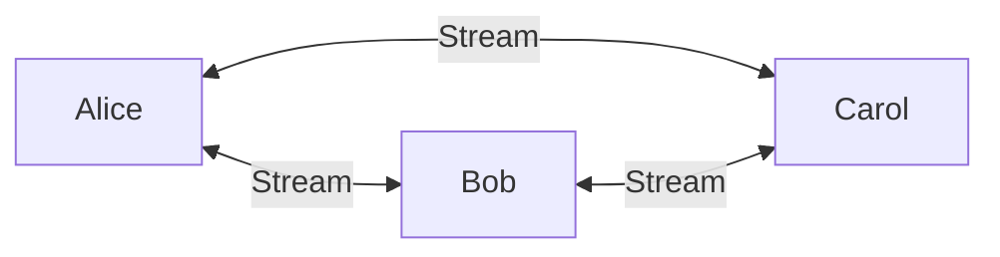
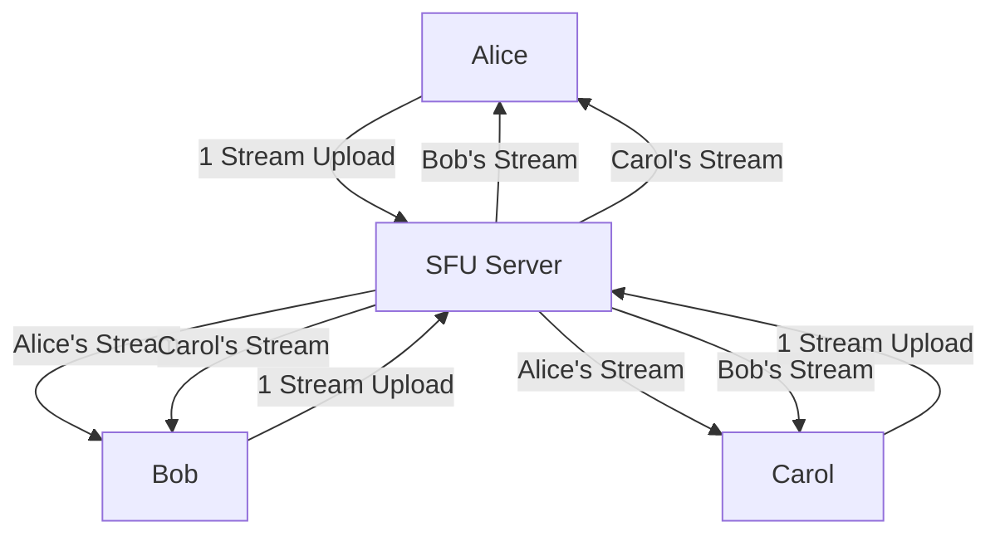
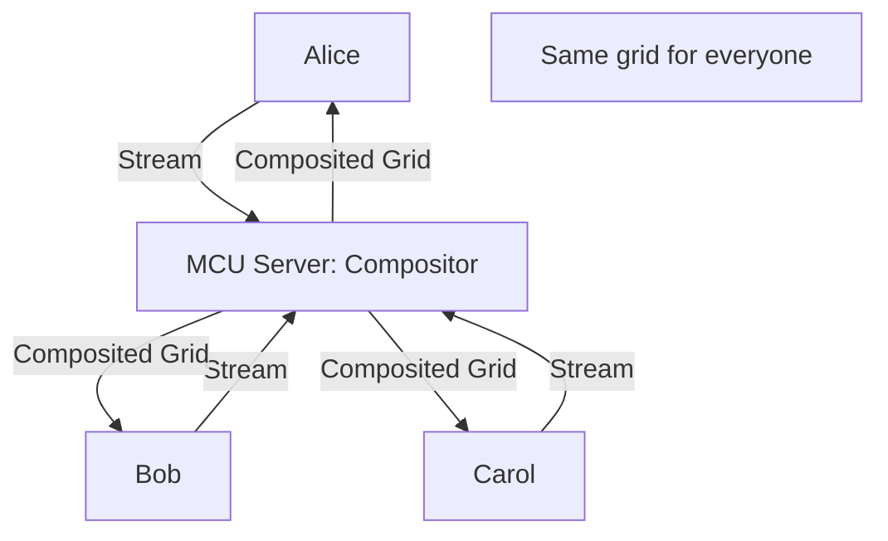
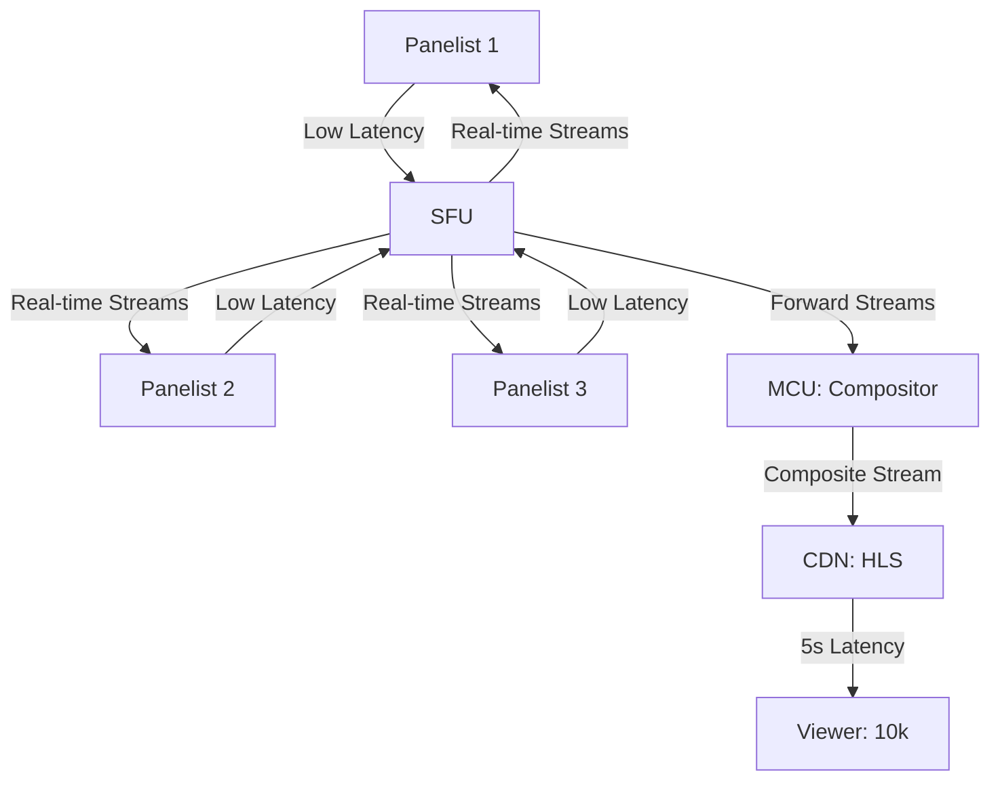

# SFU vs MCU: Media Server Architecture Guide

> **Source**: [SFU vs MCU Architecture](https://youtu.be/tHHpLraJKpQ)

> [!IMPORTANT]
> **The Decision**: SFU for **low latency** (group chat), MCU for **low client CPU** (mobile, broadcasts).
> **The Hybrid**: Use **both** for complex scenarios (real-time panel + 10k viewers).

---

## 📊 The Three Topologies

### Topology Comparison

| Topology | Max Participants | Client Upload | Client Download | Server CPU | Use Case |
| :--- | :--- | :--- | :--- | :--- | :--- |
| **Mesh (P2P)** | 4-5 | N-1 streams | N-1 streams | None | 1-to-1 calls |
| **SFU** | 100+ | 1 stream | N-1 streams | Low | Group chat, E2EE |
| **MCU** | 1000+ | 1 stream | 1 stream | High | Mobile, webinars |

---

## 🔀 Architecture 1: Mesh (Peer-to-Peer)

### How It Works

*   **Connections**: N * (N-1) / 2 = For 5 people, **10 connections**.
*   **Bandwidth**: Each client uploads **4 streams** (4 * 2 Mbps = **8 Mbps upload**).

### The Breaking Point
*   **Upload**: Most home internet = 5-10 Mbps upload. 4-person call maxes out.
*   **CPU**: Client must encode/decode 4 video streams simultaneously (100% CPU on older devices).

> [!WARNING]
> **The Rule**: Mesh doesn't scale beyond **4-5 participants**. Period.

---

## 🚀 Architecture 2: SFU (Selective Forwarding Unit)

### How It Works

### The Math (5 Participants)
*   **Client Upload**: 1 stream = 2 Mbps.
*   **Client Download**: 4 streams = 8 Mbps.
*   **Server CPU**: Minimal (just routing, no encoding).

### Pros
*   ✅ **Low Server Cost**: No transcoding CPU needed.
*   ✅ **Individual Layout Control**: Each user sees different layout (active speaker vs grid).
*   ✅ **E2EE Possible**: Server doesn't decrypt (Insertable Streams API).

### Cons
*   ❌ **Variable Bandwidth**: Download scales with participants (10 people = 18 Mbps).
*   ❌ **Client CPU**: Must decode N-1 streams.

---

## 🎛️ Architecture 3: MCU (Multipoint Control Unit)

### How It Works

### The Math (5 Participants)
*   **Client Upload**: 1 stream = 2 Mbps.
*   **Client Download**: 1 stream = 2 Mbps (**constant**, regardless of participants).
*   **Server CPU**: **High** (must encode composite video).

### Pros
*   ✅ **Predictable Bandwidth**: Always 2 Mbps up + 2 Mbps down.
*   ✅ **Low Client CPU**: Only decode 1 stream (works on 2015 Android phones).
*   ✅ **Recording/Features**: Server has access to media (easy to record, add overlays).

### Cons
*   ❌ **High Server Cost**: CPU-intensive (transcoding + compositing).
*   ❌ **No Custom Layouts**: Everyone sees the same grid.
*   ❌ **No E2EE**: Server must decrypt to composite.
*   ❌ **Higher Latency**: +100-200ms (compositing delay).

---

## 💰 Cost Analysis (100 Participants)

### SFU Cost
*   **Server**: c5.large (2 vCPU, 4 GB) = $0.085/hour.
*   **Capacity**: 100 participants per instance (routing only).
*   **Cost**: $0.085/hour = **$61/month**.

### MCU Cost
*   **Server**: c5.4xlarge (16 vCPU, 32 GB) = $0.68/hour.
*   **Capacity**: 50 participants per instance (transcoding + compositing).
*   **Instances**: 100 ÷ 50 = 2.
*   **Cost**: 2 * $0.68 * 24 * 30 = **$979/month**.

**Insight**: MCU costs **16x more** than SFU for same participant count.

---

## 🎭 Hybrid Architecture (The Best of Both)

### Use Case: Live Panel + Broadcast

**Scenario**: 5-person panel discussion → Broadcast to 10,000 viewers.

### The Workflow
1.  **Panelists**: Use **SFU** (100ms latency, interactive).
2.  **MCU**: Composites 5 streams into 1 grid.
3.  **CDN**: Distributes via HLS to 10k viewers (5-30s latency).

### Benefits
*   **Panelists**: Low latency, interactive (can interrupt each other).
*   **Viewers**: Scalable, works on any device (HLS = universal).
*   **Recording**: MCU handles composition AND recording simultaneously.

---

## 📞 SIP Integration (Telephony Gateway)

### The Problem
Legacy phone systems use **G.711 codec** (8 kHz audio). WebRTC uses **Opus** (48 kHz).

### The Solution: MCU as Gateway

**Why MCU**: It must **decode** and **re-encode** (SFU can't do this).

---

## ✅ Decision Framework

### Choose SFU If:
*   **Latency** <500ms is critical (group chat, gaming).
*   **E2EE** is required (healthcare, finance).
*   **Individual layouts** needed (user customization).
*   **Budget** is limited (low server cost).

### Choose MCU If:
*   **Mobile devices** are primary clients (2015-era phones).
*   **Bandwidth** is **severely** limited (<2 Mbps).
*   **Recording** is required (server-side composition).
*   **SIP integration** needed (phone dial-in).

### Choose Hybrid If:
*   **Panel + Broadcast** (real-time speakers + mass audience).
*   **Recording + E2EE** (use SFU for call, MCU for recording only).

---

## 🔗 Related Documents
*   [WebRTC Production Readiness](./webrtc-production-readiness-guide.md) — Scalability patterns.
*   [Group Streaming Architecture](./group-streaming-architecture-guide.md) — Cascading SFUs.
*   [WebRTC Architecture Decision](./webrtc-architecture-decision-guide.md) — Build vs buy.
