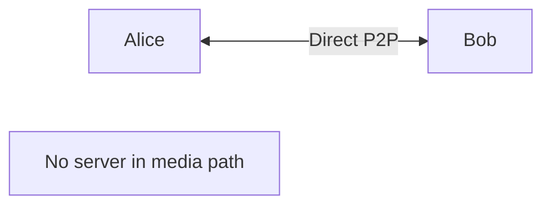
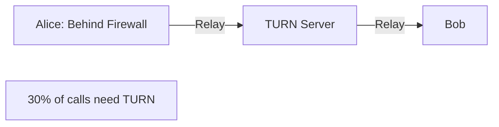

# Twilio WebRTC Go: The Freemium Strategy

> **Source**: [Twilio Signal 2020: WebRTC Go Announcement](https://youtu.be/jxIiDgcmZdo)

> [!IMPORTANT]
> **The Strategy**: Offer **free** P2P video (with TURN) to hook developers. Monetize when they scale to group chat.
> **The Bet**: Developer loyalty > Immediate revenue.

---

## 🎯 What Is WebRTC Go?

### The Offer
*   **Free**: 1-to-1 video (P2P topology).
*   **Free TURN**: 25 GB/month (~100k participant minutes).
*   **Platforms**: Web, iOS, Android SDKs.

### What's NOT Included (Paid)
*   **Group Chat**: 3+ participants (requires SFU/MCU).
*   **Recording**: Server-side recording.
*   **Advanced Features**: Network stats, quality monitoring.

---

## 🏗️ The Architecture: P2P with TURN Fallback

### Peer-to-Peer (Mesh)


*   **Latency**: 50-100ms (best case).
*   **Cost**: $0 (no server).
*   **Limitation**: Only works for 1-to-1.

### TURN as Fallback (When P2P Fails)


*   **When**: Corporate firewalls block UDP.
*   **Cost**: TURN bandwidth (expensive).
*   **Twilio's Gift**: 25 GB/month free.

---

## 💰 The Economics: Why Free TURN Matters

### TURN Cost Breakdown
**Scenario**: 1000 concurrent 1-to-1 calls.
*   **Assumption**: 30% use TURN (industry average).
*   **TURN Calls**: 300.
*   **Bitrate**: 2 Mbps per call (video + audio).
*   **Bandwidth**: 300 * 2 Mbps = 600 Mbps.

**Monthly Cost** (AWS):
*   **Bandwidth**: 600 Mbps * 3600s/hr * 24hr/day * 30days = **~200 TB/month**.
*   **Egress**: 200 TB * $0.09/GB = **$18,000/month**.

**Twilio's Free Tier**:
*   **25 GB/month** = ~12.5 hours of TURN usage for a single 2 Mbps call.
*   **100k participant minutes** = 1,666 hours total.
*   **Value**: ~$1,500/month if you were paying AWS directly.

> [!TIP]
> **Principal Architect Insight**: The 25 GB limit is **very generous** for early-stage startups (1000s of users). It's a trap for scale (10k+ users → forced upgrade).

---

## 🎮 The Competitive Landscape (2020)

### Twilio's Competitors

| Vendor | Free Tier | TURN Included | Group Chat |
| :--- | :--- | :--- | :--- |
| **Twilio** | ✅ P2P | ✅ 25 GB/month | ❌ Paid |
| **Agora** | ✅ 10k mins/month | ✅ Included | ✅ Included |
| **Amazon Chime** | ❌ Paid only | ✅ Included | ✅ Included |
| **Daily** | ✅ 10k mins/month | ✅ Included | ✅ Up to 10 users |
| **Vonage** | ❌ Paid only | ✅ Included | ✅ Included |

### Twilio's Differentiation
*   **Developer Experience**: Best-in-class documentation (famous for "5-minute quickstarts").
*   **Ecosystem**: Integrates with Twilio SMS, Voice, Messaging.
*   **Trust**: Established brand (founded 2008).

---

## 🪝 The "Hook" Strategy

### Phase 1: Free (Onboarding)
*   **Target**: Solo developers, MVPs, side projects.
*   **Value Prop**: "Build Zoom for therapy sessions in 1 hour."
*   **Lock-in**: Developer learns Twilio's SDK APIs.

### Phase 2: Paid (Scale)
*   **Trigger**: Product needs group chat (3+ users).
*   **Objection**: "I could switch to Agora."
*   **Response**: "You've already built on our SDK. Migration = 2 weeks."

### Phase 3: Expansion (Upsell)
*   **Additions**: Recording, transcription, phone dial-in.
*   **Revenue**: $0.004/min (video) + $0.014/min (phone) + $0.05/min (recording).

---

## 📊 The Growth Funnel

```mermaid
graph TD
    Free[10,000 Free Users] -->|10% convert| Paid[1,000 Paid Users]
    Paid -->|20% add features| Upsell[200 Enterprise Users]
    
    Free -->|Revenue: $0|
    Paid -->|Revenue: $50k/month|
    Upsell -->|Revenue: $200k/month|
    
    Note[Total: $250k/month from 10k signups]
```

### The Math
*   **CAC** (Customer Acquisition Cost): $0 (self-serve).
*   **LTV** (Lifetime Value): $500 (avg 10 months at $50/month).
*   **LTV/CAC**: ∞ (holy grail).

---

## ⚠️ The Limitations (What Twilio Doesn't Tell You)

### 1. P2P Doesn't Scale
*   **Problem**: 5-person call = Each client uploads **4 streams** (4 Mbps upload).
*   **Reality**: Most home internet can't upload 4 Mbps.
*   **Result**: Forced to upgrade to SFU (paid).

### 2. TURN Bandwidth Cap
*   **25 GB/month** sounds generous.
*   **Reality**: 1 hour of video (2 Mbps) = 900 MB. 25 GB = **~28 hours**.
*   **Scenario**: If 10% of your 1000 users use the app for 3 hours/month, you exceed the cap.

### 3. No Recording
*   **Problem**: Telehealth, education, and corporate use cases **require** recording (compliance).
*   **Result**: Forced to pay $0.05/min.

---

## ✅ Principal Architect Checklist

1.  **Use Free Tier for MVP**: Twilio's onboarding is fastest (< 1 day).
2.  **Plan for Migration**: If you expect >1000 DAU, budget for SFU costs upfront. Don't get surprised.
3.  **Monitor TURN Usage**: Set CloudWatch alerts at 80% of 25 GB. You don't want to hit the wall mid-call.
4.  **Compare Total Cost of Ownership**: At 10k DAU, Twilio ($0.004/min) vs Agora ($0.0009/min) = $30k/year difference.

---

## 🔗 Related Documents
*   [WebRTC Production Challenges](./webrtc-production-challenges-guide.md) — TURN economics and NAT traversal.
*   [Group Streaming Architecture](./group-streaming-architecture-guide.md) — P2P vs SFU scaling.
*   [AI Marketplace Strategy](./ai-marketplace-strategy-guide.md) — CPaaS vendor positioning.
