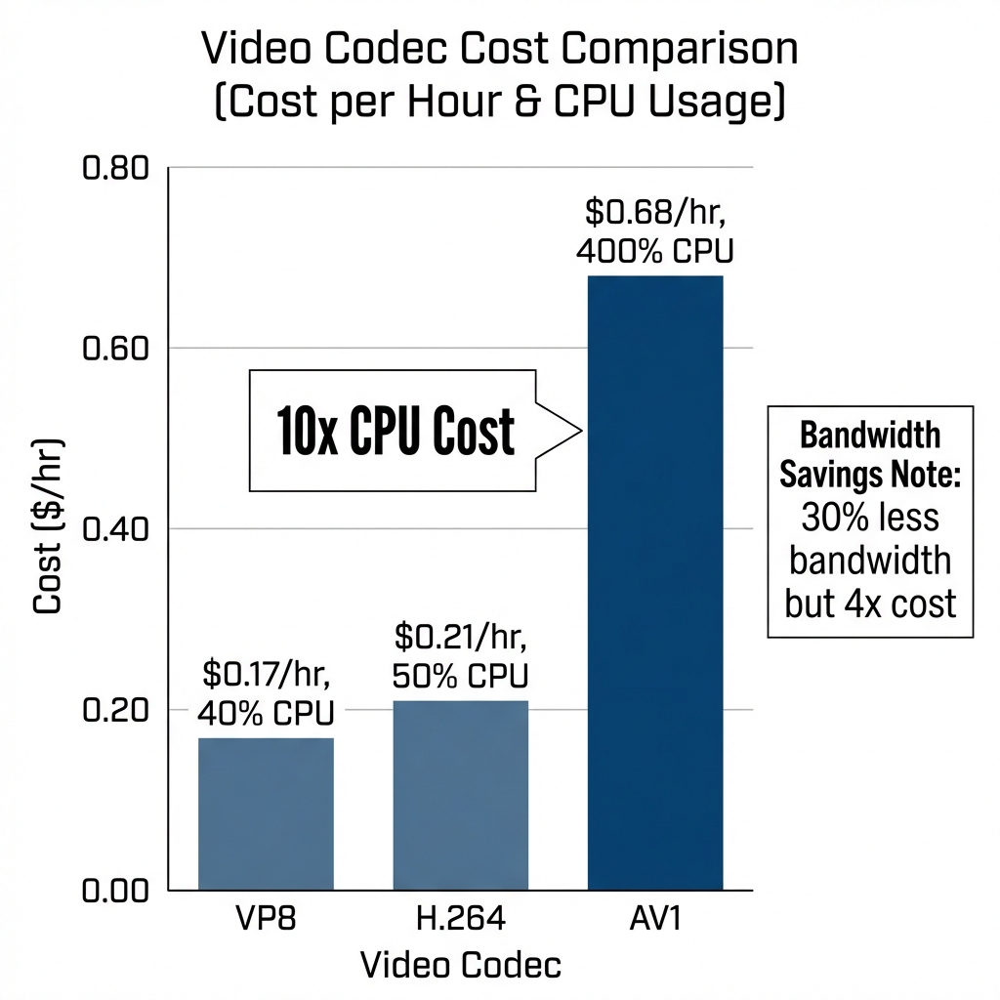
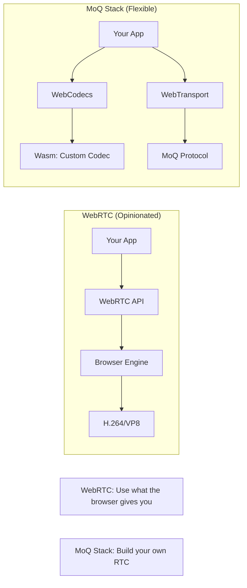

# WebRTC in 2026: Industry Predictions

> **Source**: [WebRTC Predictions for 2026](https://youtu.be/M9xbLI7gjZY) (WebRTC.ventures, Nov 2025)

> [!IMPORTANT]
> **The Meta-Prediction**: WebRTC will remain dominant, but the **MoQ Stack** (MoQ + WebCodecs + Wasm) will fragment the market.
> **The Wildcard**: AI upscaling may make 4K recording obsolete.

---

## 🔮 Prediction 1: WebRTC Will Still Be Hated (More Than MoQ)

### The Question
Which technology will developers complain about more in 2026: WebRTC or MoQ?

### The Answer: WebRTC
**Why**: MoQ is in the "honeymoon phase".
*   **Early Adopters**: Current MoQ users are **enthusiasts**. They love the shiny new tech.
*   **Mass Adoption**: Once MoQ hits **production** (2026+), general users will find edge cases and file bugs.
*   **Comparison**: WebRTC has been in production for 10+ years. Every edge case is documented (and complained about).

> [!TIP]
> **Architect Insight**: New technologies always look better until you hit scale. MoQ will have its own "WebRTC moment" (bugs, browser inconsistencies) in 2027-2028.

---

## 🎥 Prediction 2: AV1 Will NOT Dominate (Until 2028)

### The Timeline
*   **2024**: AV1 is "ready" (Chrome, Firefox support).
*   **2026**: Still <20% adoption.
*   **2028**: Predicted breakpoint (50%+ adoption).

### The Barriers

| Barrier | Impact | Explanation |
| :--- | :--- | :--- |
| **CPU Cost** | 🔴 Critical | AV1 encoding uses **10x CPU** vs VP8. Cloud costs explode. |
| **Legacy Inertia** | 🟡 High | VP8/H.264 "just work". No business case to migrate. |
| **Hardware Acceleration** | 🟢 Improving | M2/M3 Macs have AV1 encode. Intel/AMD catching up. |

### The Math (Cost Analysis)

**Scenario**: Encoding a 1080p60 stream for 1 hour.

| Codec | CPU Usage | AWS Cost (c5.2xlarge) |
| :--- | :--- | :--- |
| **VP8** | 40% (2 vCPUs) | $0.17/hour |
| **H.264** | 50% (2.5 vCPUs) | $0.21/hour |
| **AV1** | 400% (4 vCPUs) | **$0.68/hour** |

*   **Bandwidth Savings (AV1)**: 30% less than VP8.
*   **ROI Breakpoint**: If bandwidth costs < $0.50/hour, **don't use AV1**.

> [!CAUTION]
> **Google-Scale Decision**: Use AV1 only if you're YouTube (billions of playback hours). For most companies, VP8 is still optimal.

---

## 🤖 Prediction 3: Edge Computing Growth = Slow and Niche

### The Hype
"WebRTC will power IoT cameras, drones, and AR glasses."

### The Reality
*   **Surveillance Cameras**: Still use **H.264 + RTSP**. Manufacturers don't want to deal with WebRTC complexity.
*   **Drones**: YES. DJI and similar require ultra-low latency for real-time control.
*   **AR/Wearables**: YES. Factory workers with smart glasses for remote assistance.

### Why Slow?
*   **Hardware Constraints**: IoT devices have weak CPUs. WebRTC stack is heavy.
*   **Vendor Inertia**: Camera manufacturers say "let the cloud handle WebRTC conversion" (via gateways).

---

## 🚀 Prediction 4: The MoQ Stack = The Darkhorse Disruptor

### What Is the "MoQ Stack"?
Not just Media over QUIC. It's the **combination**:
1.  **MoQ**: Transport layer (HTTP/3).
2.  **WebCodecs**: Low-level encode/decode API.
3.  **WebTransport**: Bidirectional streams (UDP-like over HTTP/3).
4.  **WebAssembly**: Run FFmpeg in the browser.

### Why It's Disruptive

*   **Differentiation**: Google Meet or Zoom can build **custom features** (e.g., proprietary noise suppression, custom bitrate control).
*   **Trade-off**: 10x more engineering effort. Only viable for **Tier 1 vendors** (Google, Microsoft, Zoom).

### The Catch
*   **Zoom Abandoned It**: Zoom explored this in 2023-2024, then **reverted to WebRTC** (too complex).
*   **Adoption Risk**: If Zoom couldn't make it work, most companies won't either.

---

## ⚠️ Prediction 5: New Anti-Patterns in 2026

### Anti-Pattern 1: Simulcast in 1-to-1 Calls
*   **Current Practice**: Always enable Simulcast.
*   **Why It's Wrong**: In 1-to-1, you only need **1 layer**. Sending 3 layers (240p, 480p, 1080p) wastes CPU and bandwidth.
*   **Fix**: Detect "effective participants" (who's speaking). Disable Simulcast if <3.

### Anti-Pattern 2: Storing 4K Recordings
*   **Current Practice**: Record in 4K for "future-proofing".
*   **Why It's Wrong**: YouTube now uses **AI upscaling** (Hyper Resolution) to play 480p videos at 1080p.
*   **The Question**: Is it cheaper to store 4K (10 GB/hour) or 480p (1 GB/hour) and upscale on-demand?

**Cost Comparison** (1 million hours of recordings):
| Resolution | Storage (S3) | Bandwidth (Playback) | Total |
| :--- | :--- | :--- | :--- |
| **4K** | 10 PB * $23/TB = **$230k/month** | High | $300k/month |
| **480p + AI** | 1 PB * $23/TB = **$23k/month** | High | $150k/month |

*   **Savings**: **$150k/month** = $1.8M/year.

> [!TIP]
> **Principal Architect Recommendation**: Store 480p. Use AI upscaling (AWS Elemental MediaConvert, Google Video Intelligence) for premium playback.

### Anti-Pattern 3: SVC (Still) Won't Save You
*   **The Promise**: Scalable Video Coding = 1 stream, multiple quality layers.
*   **The Reality**: 10 years of trying. Still **not production-ready**.
*   **Why**: Browser support is incomplete. Encoding complexity is insane.
*   **Verdict**: Stick with Simulcast.

---

## ✅ Principal Architect Checklist

1.  **Don't Rush to AV1**: Unless you're serving billions of hours, the CPU cost outweighs bandwidth savings.
2.  **Disable Simulcast for 1-to-1**: Implement dynamic detection. Save 60% bandwidth for small calls.
3.  **Record at 480p**: Use AI upscaling for premium users. Save 90% on storage.
4.  **Watch MoQ, Don't Bet On It**: MoQ won't be production-ready until Q3 2026. Plan migrations for 2027.

---

## 🔗 Related Documents
*   [WebRTC Evolution](./webrtc-evolution-guide.md) — The Four Eras of WebRTC.
*   [Cloudflare Strategy](./cloudflare-webrtc-strategy-guide.md) — MoQ and Edge AI.
*   [Live Streaming Guide](../live-streaming-guide.md) — Codec comparisons.
