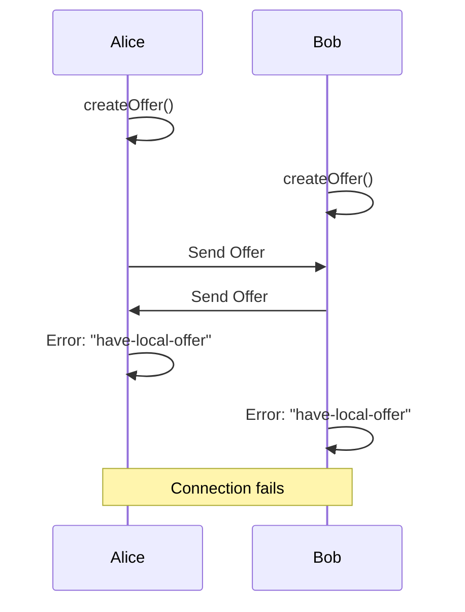
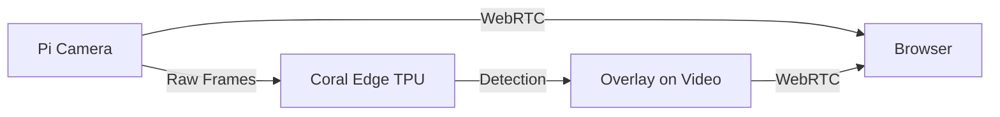

# WebRTC API Workarounds: Perfect Negotiation & Browser Quirks

> **Source**: [WebRTC Hacks: Perfect Negotiation & Browser Compatibility](https://youtu.be/3OegN-lsOL0)

> [!IMPORTANT]
> **The Problem**: "Glare" (both peers negotiate simultaneously) breaks 10-20% of connections.
> **The Solution**: Perfect Negotiation (standardized in 2020) eliminates race conditions.

---

## 🚨 Problem 1: Glare (Race Condition)

### What Is Glare?
**Scenario**: Alice and Bob both try to create an offer at the same time.



**Result**: Connection fails with `InvalidStateError: "have-local-offer"`.

**Frequency**: 10-20% of connections (depending on network timing).

---

## ✅ Solution: Perfect Negotiation

### The Design (Jan-Ivar, Mozilla + All Browser Vendors)

**Core Idea**: Designate one peer as "polite" (always rolls back) and one as "impolite" (always wins).

### Implementation
```javascript
// Determine who is polite (e.g., caller = impolite, callee = polite)
const isPolite = myRole === 'callee';

let makingOffer = false;

pc.onnegotiationneeded = async () => {
  try {
    makingOffer = true;
    await pc.setLocalDescription();
    signaling.send({ description: pc.localDescription });
  } finally {
    makingOffer = false;
  }
};

signaling.onmessage = async ({ from, data }) => {
  if (data.description) {
    const offerCollision = 
      data.description.type === 'offer' &&
      (makingOffer || pc.signalingState !== 'stable');
    
    const ignoreOffer = !isPolite && offerCollision;
    if (ignoreOffer) {
      return; // Impolite peer ignores incoming offer
    }
    
    // Polite peer rolls back
    if (isPolite && offerCollision) {
      await pc.setLocalDescription({ type: 'rollback' });
    }
    
    await pc.setRemoteDescription(data.description);
    
    if (data.description.type === 'offer') {
      await pc.setLocalDescription();
      signaling.send({ description: pc.localDescription });
    }
  }
};
```

### The Result
*   **Glare resolution**: 100% connection success rate (vs 80-90% without).
*   **Browser support**: Chrome 80+, Firefox 75+, Safari 14+.

---

## 🍎 Problem 2: macOS Catalina Screen Sharing

### The Issue
**macOS Catalina** (2019) treats screen sharing as "screen recording" (privacy feature).

### The Pain
1.  User clicks "Share Screen".
2.  Browser shows permission dialog.
3.  **Browser must restart** for permission to take effect.
4.  User frustrated (kicked out of meeting mid-call).

### The Workaround
**Pre-call check**:
```javascript
navigator.mediaDevices.getDisplayMedia({ video: true })
  .then(stream => {
    // Success → Permission granted
    stream.getTracks().forEach(t => t.stop());
    showMessage('✅ Screen sharing enabled');
  })
  .catch(err => {
    if (err.name === 'NotAllowedError') {
      showMessage('❌ Please enable screen recording in System Preferences → Security → Privacy → Screen Recording → Add Chrome');
    }
  });
```

**Guide users** to enable permission **before** joining call.

---

## 🌐 Problem 3: Edge Legacy Compatibility (Pre-2020)

### The Old Problem
**Legacy Edge** (EdgeHTML) had a **completely different WebRTC stack** than Chrome.

**Compatibility matrix**:
```
Chrome ↔ Firefox: ✅
Chrome ↔ Safari: ✅
Chrome ↔ Edge (Legacy): ❌ (50% failure rate)
```

### The Solution: Chromium Edge ("Edgium")
**2020**: Microsoft moved Edge to Chromium base.

**Result**: Edge WebRTC stack = Chrome WebRTC stack (identical).

**Impact**: Developers no longer need Edge-specific workarounds.

---

## 📺 Problem 4: Screen Sharing Optimization (Crisp Text)

### The Challenge
**Default WebRTC**: Optimized for **faces** (smooth motion, soft edges).
**Screen sharing**: Needs **crisp lines** (text, spreadsheets).

### The Fix (Chrome 88+)
**`getDisplayMedia` with constraints**:
```javascript
const stream = await navigator.mediaDevices.getDisplayMedia({
  video: {
    width: { ideal: 1920 },
    height: { ideal: 1080 },
    frameRate: { ideal: 30 },
    // NEW: Content hint for screen sharing
    contentHint: 'detail'
  }
});

// Apply content hint to track
const videoTrack = stream.getVideoTracks()[0];
videoTrack.contentHint = 'detail'; // vs 'motion' (default)
```

**Result**: Text is **readable** at 1080p (vs blurry with default settings).

---

## 🤖 Advanced: AI on Raspberry Pi (Edge Processing)

### The Use Case
Run **TensorFlow Lite** on Raspberry Pi for object detection.

**Hardware**: Google Coral AI (Edge TPU) + Raspberry Pi 4.

**Architecture**:


### The Code (Simplified)
```python
# On Raspberry Pi
import tflite_runtime.interpreter as tflite
from aiortc import RTCPeerConnection, VideoStreamTrack

# Load TensorFlow Lite model
interpreter = tflite.Interpreter(model_path="detect.tflite")

class AIVideoTrack(VideoStreamTrack):
    async def recv(self):
        frame = await camera.get_frame()
        
        # Run inference
        detections = interpreter.invoke(frame)
        
        # Overlay bounding boxes
        annotated_frame = draw_boxes(frame, detections)
        return annotated_frame
```

**Performance**: 30 FPS object detection on Raspberry Pi 4 (with Coral TPU).

---

## ✅ Principal Architect Checklist

1.  **Implement Perfect Negotiation**: Eliminates 10-20% of connection failures (production-tested).
2.  **Pre-call Screen Sharing Check** (macOS): Guide users to enable permissions **before** call.
3.  **Use `contentHint: 'detail'`**: For screen sharing (crisp text at 1080p).
4.  **Drop Legacy Edge Support** (2026): EdgeHTML is deprecated. Focus on Chromium Edge only.
5.  **Test Glare Scenarios**: Simulate simultaneous `createOffer()` calls in automated tests.

---

## 🔗 Related Documents
*   [WebRTC Production Challenges](./webrtc-production-challenges-guide.md) — Safari quirks, NAT traversal.
*   [WebRTC Debugging](./webrtc-debugging-guide.md) — `chrome://webrtc-internals` for glare diagnosis.
*   [Edge AI Processing](./edge-ai-processing-guide.md) — Raspberry Pi + Coral TPU.
