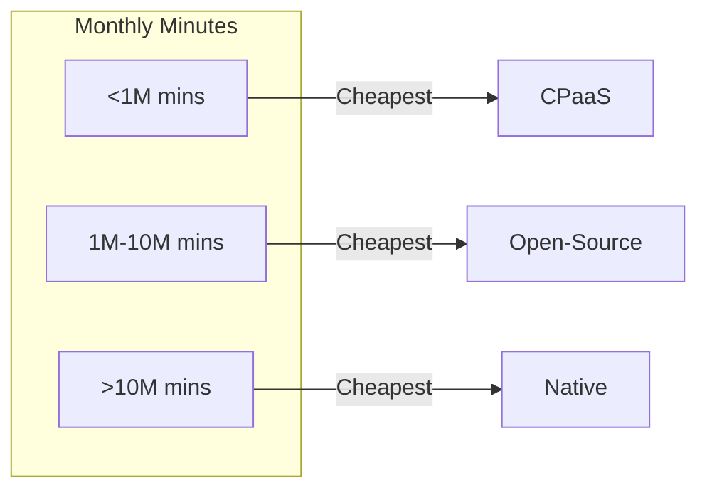

# WebRTC Architecture Decision: Native vs Open-Source vs CPaaS

> **Source**: [WebRTC Architecture Trade-offs](https://youtu.be/XQCNO3JhRZU)

> [!IMPORTANT]
> **The Question**: Should you build on **Native WebRTC**, **Open-Source Servers** (Janus/Jitsi), or **CPaaS** (Twilio/Agora)?
> **The Answer**: It depends on your **scale**, **budget**, and **control** requirements.

---

## 🏗️ The Three Architectures

### Architecture 1: Native WebRTC (Build from Scratch)

**What You Build**:
*   WebRTC stack (compile from source).
*   Signaling server (WebSocket).
*   STUN/TURN servers.
*   Codec management (VP8, H.264, Opus).
*   Browser/mobile compatibility layers.

**Effort**: 6-12 months (2-3 engineers).

**Use Cases**:
*   **AI Integration**: Custom video processing (object detection, background blur).
*   **Embedded Hardware**: Smart glasses, drones, custom IoT devices.
*   **Extreme Optimization**: Minimize latency (<50ms) or bandwidth (<500 kbps).

---

### Architecture 2: Open-Source Media Servers

**Popular Options**:
| Server | Type | Language | Best For |
| :--- | :--- | :--- | :--- |
| **Janus** | SFU | C | Low latency, plugin arch |
| **Jitsi** | SFU | Java | Deploy in 1 hour |
| **Kurento** | SFU/MCU | C++ | AI plugins (face detection) |
| **mediasoup** | SFU | C++/Node | Custom applications |
| **Pion** | SFU | Go | Cloud-native (K8s) |

**What You Build**:
*   Application logic (signaling, UI).
*   Server deployment (AWS/GCP).
*   Scaling infrastructure (load balancers).

**What You Get**:
*   Group chat (SFU topology).
*   Recording (server-side).
*   Broadcasting (1-to-many).

**Effort**: 1-3 months (1-2 engineers).

**Use Cases**:
*   **Millions of users**: Low per-user cost at scale.
*   **Custom features**: Spatial audio, custom layouts.
*   **Open-source ethos**: Avoid vendor lock-in.

---

### Architecture 3: CPaaS (Communications Platform as a Service)

**Popular Vendors**:
| Vendor | Pricing | Free Tier | Strengths |
| :--- | :--- | :--- | :--- |
| **Twilio** | $0.004/min | 25 GB TURN | Best docs, SMS integration |
| **Agora** | $0.0009/min | 10k mins/month | Lowest cost, global reach |
| **Daily** | $0.002/min | 10k mins/month | Best DX, AI-ready |
| **Vonage** | $0.0045/min | None | Enterprise features |

**What You Build**:
*   Application logic (UI, business logic).

**What You Get**:
*   Everything (signaling, TURN, SFU, recording).
*   Updates (new features, security patches).
*   Support (24/7 for enterprise plans).

**Effort**: 1-2 weeks (1 engineer).

**Use Cases**:
*   **MVP/Startup**: Fastest time to market.
*   **Enterprise**: Compliance, SLAs, support.
*   **Low volume**: <100k minutes/month.

---

## 💰 Cost Analysis (100k Minutes/Month)

### Scenario: Telehealth App (1,000 users, avg 5 calls/month, 20 min/call)

**Native WebRTC**:
*   **Development**: $200k (6 months, 2 engineers @ $100/hr).
*   **Infrastructure**: $2k/month (SFU servers, TURN).
*   **Maintenance**: $50k/year (1 engineer @ 25% time).
*   **Year 1 Total**: $274k.
*   **Year 2 Total**: $74k.

**Open-Source (Janus)**:
*   **Development**: $50k (2 months, 1 engineer).
*   **Infrastructure**: $3k/month (managed K8s, TURN).
*   **Maintenance**: $30k/year (DevOps + updates).
*   **Year 1 Total**: $116k.
*   **Year 2 Total**: $66k.

**CPaaS (Twilio)**:
*   **Development**: $10k (2 weeks, 1 engineer).
*   **Usage**: 100k min/month * $0.004 = **$400/month** = $4.8k/year.
*   **Year 1 Total**: $14.8k.
*   **Year 2 Total**: $4.8k.

### Breakeven Analysis

**CPaaS Breakeven**: 1M minutes/month = $4k/month = $48k/year. Open-source infrastructure costs $36k/year (cheaper).

---

## 🎯 The Decision Matrix

| Factor | Native | Open-Source | CPaaS |
| :--- | :--- | :--- | :--- |
| **Time to Market** | 🔴 6-12 months | 🟡 1-3 months | 🟢 1-2 weeks |
| **Upfront Cost** | 🔴 $200k | 🟡 $50k | 🟢 $10k |
| **Ongoing Cost (at scale)** | 🟢 Lowest | 🟡 Medium | 🔴 Highest |
| **Control** | 🟢 Total | 🟡 High | 🔴 Minimal |
| **Maintenance** | 🔴 High | 🟡 Medium | 🟢 Zero |
| **Vendor Lock-in** | 🟢 None | 🟢 None | 🔴 High |

---

## ✅ Principal Architect Guidelines

### Choose Native If:
*   You need **AI processing** in the video pipeline (e.g., real-time object detection).
*   You're building for **custom hardware** (smart glasses, drones).
*   You have **10M+ minutes/month** (cost savings justify effort).

### Choose Open-Source If:
*   You have **1M-10M minutes/month** (sweet spot).
*   You need **custom features** not offered by CPaaS.
*   You want to **avoid vendor lock-in**.
*   You have **DevOps capacity** to manage infrastructure.

### Choose CPaaS If:
*   You need **MVP in <1 month**.
*   You have **<1M minutes/month**.
*   You lack **DevOps resources** (small team).
*   You need **compliance** (HIPAA, SOC 2) handled for you.

---

## 🔬 Hybrid Pattern: Start CPaaS, Migrate to Open-Source

### Phase 1: MVP (Months 0-6)
*   Use **Twilio/Daily** for validation.
*   **Spend**: $5k-10k.
*   **Goal**: Prove product-market fit.

### Phase 2: Growth (Months 6-18)
*   Stay on CPaaS.
*   **Spend**: $50k-100k/year.
*   **Goal**: Reach 500k minutes/month.

### Phase 3: Scale (Year 2+)
*   Migrate to **Janus/mediasoup**.
*   **Effort**: 3 months (2 engineers).
*   **Savings**: $200k+/year (at 5M minutes/month).

---

## 🔗 Related Documents
*   [Twilio WebRTC Go Strategy](./twilio-webrtc-go-strategy-guide.md) — CPaaS freemium analysis.
*   [WebRTC Production Challenges](./webrtc-production-challenges-guide.md) — Open-source deployment tips.
*   [Group Streaming Architecture](./group-streaming-architecture-guide.md) — SFU scaling patterns.
