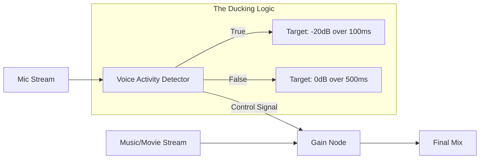

# WebRTC Audio Ducking: Intelligent Side-Chaining at Scale

> **Scope**: Voice Activity Detection (VAD), Web Audio API Nodes, and AEC Feedback Loop Optimization.

> [!IMPORTANT]
> **The Problem**: In a "Watch Party" or "Social Streaming" context, background music/media masks the human voice, leading to "audio fatigue."
> **The Principal Solution**: Don't just lower volume; implement **Dynamic Side-chain Compression** triggered by real-time Voice Activity.

---

## 🏗️ 1. Architecture: The Web Audio Pipeline

Ducking is not a simple "volume down" button. It must be reactive.

### The Signal Chain

### Components
1.  **AudioContext**: The centralized clock and routing engine.
2.  **DynamicsCompressorNode**: Use the `reduction` property or a standard `GainNode` for more manual control.
3.  **AnalyserNode**: Used to calculate the RMS (Root Mean Square) energy of the human voice to determine *how much* to duck.

---

## 🧠 2. The Logic: Attack, Release, and Threshold

To pass "Principal Architect" scrutiny, your implementation must handle the "Envelope" of human speech.

| Parameter | Recommended Value | Why? |
| :--- | :--- | :--- |
| **Threshold** | -40dB | Sensitive enough to catch whispers but ignore keyboard clicks. |
| **Attack** | 50ms - 100ms | Too fast feels "choppy"; too slow and the first syllable is masked. |
| **Release** | 500ms - 1s | Prevents music from "bumping" back up between short pauses in a sentence. |
| **Ratio** | 4:1 | Standard professional ducking ratio. |

---

## ⚡ 3. The "God Mode" Optimization: AEC Integration

**Acoustic Echo Cancellation (AEC)** is the hardest part of WebRTC.
*   **The Conflict**: Music playing from speakers gets picked up by the mic, causing an echo for the other peer.
*   **The Hack**: Audio Ducking is a **Natural AEC Enhancer**. By lowering the speaker output whenever the local user speaks, you significantly reduce the amount of "linear echo" the AEC algorithm has to subtract.
*   **Strategy**: Link your ducking logic directly to the `getStats()` result for `voiceActivityFlag`.

---

## 🛡️ 4. Local vs. Server-Side Ducking

| Strategy | Latency | Consistency | Use Case |
| :--- | :--- | :--- | :--- |
| **Local (Browser)** | 🟢 0ms | 🔴 High Variance | Watch Parties (one user's music, one user's voice). |
| **Server (MCU)** | 🔴 200ms+ | 🟢 100% | Radio Broadcasts / Professional Webinars. |

**The Principal Choice**: Implement **Hybrid Lucking**. Perform ducking at the edge (browser) for immediate responsive feedback, but keep the server-side "Reference Signal" for recording and broadcast durability.

---

## ✅ Principal Architect Checklist

1.  **Use `exponentialRampToValueAtTime`**: Never use linear volume changes; human hearing is logarithmic. Smooth curves prevent "audio popping."
2.  **Anti-Flicker Logic**: Implement a "Hysteresis" timer (e.g., 2 seconds). If the user stops talking, wait 2 seconds before restoring the music to full volume to handle natural speech cadence.
3.  **Frequency-Specific Ducking**: Advanced: Only duck the frequencies where the human voice lives (300Hz - 3kHz). Keep the bass (low end) of the music intact for a more "premium" feel.
4.  **Accessibility**: Ensure users with hearing impairments can disable ducking or adjust the specific ratios.

---

## 🔗 Related Documents
- [Media Engine Architecture](./webrtc-media-engine-architecture-guide.md) — How the AEC engine works.
- [Client Performance](./webrtc-client-performance-guide.md) — Running Web Audio in Workers.
- [Collaborative AV](./collaborative-av-architecture-guide.md) — UX modes for social streaming.
