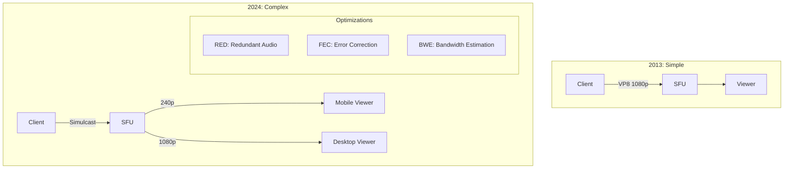
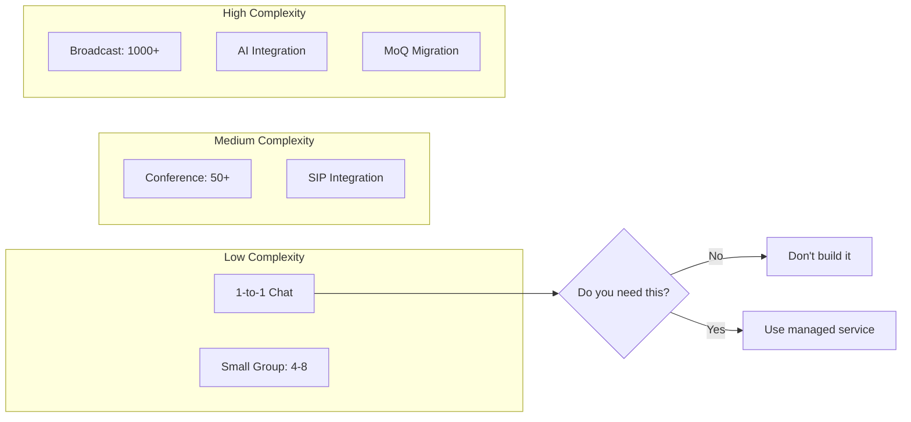

# WebRTC Complexity: Perception vs Reality

> **Source**: [Is WebRTC Too Complex?](https://youtu.be/jfLxTMeFC-Q)

> [!IMPORTANT]
> **The Thesis**: WebRTC's **core API** hasn't changed. The complexity comes from:
> 1. **Higher user expectations** (Must match Google Meet/Zoom).
> 2. **Integration with legacy systems** (SIP, RTMP, AI).
> 3. **Advanced optimizations** (Simulcast, RED, SVC).

---

## 📜 The Historical Context: H.323 vs WebRTC

### The "Bad Old Days": H.323
*   **Complexity**: "A gazillion different ways" to start a call.
*   **Testing**: Months of interoperability testing before production.
*   **Vendor Lock-in**: Each vendor had proprietary extensions.

### The "Good Old Days": Early WebRTC (2013)
*   **Simplicity**: Mandated standards.
    *   **Audio**: Opus (only).
    *   **Video**: VP8 (only).
    *   **Security**: SRTP (mandatory).
*   **Result**: "Just works" out of the box.

> [!TIP]
> **Principal Architect Insight**: The early WebRTC success was **constraint-driven design**. Fewer choices = Faster adoption.

---

## 🔄 The Evolution: From Simple to Sophisticated

### What Changed?

| Era | Codec Options | Optimizations | Use Case |
| :--- | :--- | :--- | :--- |
| **2013** | VP8, Opus | None | 1-to-1 video chat |
| **2018** | VP8, VP9, H.264 | Simulcast | Small group calls |
| **2024** | VP8, VP9, H.264, **AV1** | Simulcast, RED, FEC, SVC | Zoom-scale (1000+ participants) |

### Modern Techniques (The "Complexity")
1.  **RED (Redundant Encoding)**: Send duplicate audio packets to survive packet loss.
2.  **FEC (Forward Error Correction)**: Send parity bits to reconstruct lost packets.
3.  **Simulcast**: Send 3 quality layers (240p, 480p, 1080p) simultaneously.
4.  **SVC (Scalable Video Coding)**: 1 stream, multiple layers (still experimental).

> [!WARNING]
> **The Trap**: Developers try to implement **all** techniques because Google Meet does. Most apps only need **Simulcast**.

---

## 🏢 The "Google Meet Effect"

### The Problem
Users compare every WebRTC app to **Zoom** or **Google Meet**.
*   **Expectation**: 100-person calls with perfect quality.
*   **Reality**: Google has 1000+ engineers. Your startup has 5.

### The Complexity Ladder

| Use Case | Difficulty | Required Tech |
| :--- | :--- | :--- |
| **1-to-1 Video Chat** | 🟢 Easy | Vanilla WebRTC |
| **Small Group (4-8)** | 🟡 Medium | Simulcast |
| **Large Conference (50+)** | 🔴 Hard | Simulcast + SVC + Bandwidth Management |
| **Broadcast (1000+)** | 🔴🔴 Very Hard | Cascading SFUs or HLS fallback |

> [!TIP]
> **Principal Architect Recommendation**: Don't build Zoom. Build **80% of Zoom** for **20% of the cost**. Users won't notice.

---

## 🔗 Integration: Where the Real Complexity Lives

### The Integration Tax
Most "WebRTC complexity" is actually **integration complexity**.

**Common Integrations**:
1.  **SIP Telephony**: Bridging WebRTC to PSTN (phone networks).
    *   **Challenge**: Codec transcoding (Opus ↔ G.711).
    *   **Solution**: Use Asterisk or FreeSWITCH as a gateway.

2.  **RTMP Ingest**: OBS streaming to WebRTC.
    *   **Challenge**: RTMP is TCP, WebRTC is UDP.
    *   **Solution**: Use **Janus** or **mediasoup** as a bridge.

3.  **AI (STT/LLM/TTS)**: Conversational bots.
    *   **Challenge**: Latency (AI inference takes 100-300ms).
    *   **Solution**: Run AI at the edge (Cloudflare Workers).

4.  **Firewall Traversal**: Corporate networks block UDP.
    *   **Challenge**: TURN servers are expensive.
    *   **Solution**: Use managed TURN (Twilio, Cloudflare).

---

## 🚀 The Darkhorse: Media over QUIC (MoQ)

### The Pitch
"MoQ is simpler than WebRTC. Start fresh!"

### The Reality

| Aspect | WebRTC | MoQ |
| :--- | :--- | :--- |
| **Maturity** | 14 years (2011-2025) | <1 year (2025) |
| **Browser Support** | Universal | Chrome only |
| **Ecosystem** | 1000+ libraries | ~5 libraries |
| **Production-Ready** | ✅ Yes | ❌ 2027-2028 |

### The Skillset Problem
*   **If you struggle with WebRTC** (14 years of Stack Overflow answers), you will **struggle more** with MoQ (zero production examples).
*   **Advice**: MoQ is "research work" for 2028 products. Stick with WebRTC for 2026.

---

## ✅ Principal Architect Checklist

1.  **Define Your Use Case First**: Don't implement Simulcast for 1-to-1 calls. It's overkill.
2.  **Avoid Premature Optimization**: Start with vanilla WebRTC. Add RED/FEC only if packet loss >5%.
3.  **Outsource Complexity**: Use managed services (Agora, Daily, LiveKit) for SFU/TURN. Don't self-host unless you have 10+ DevOps engineers.
4.  **Set Realistic Expectations**: Your app doesn't need to match Zoom. Users care about **reliability** > **4K video**.

---

## 📊 The Complexity Matrix

---

## 🔗 Related Documents
*   [WebRTC 2026 Predictions](./webrtc-2026-predictions-guide.md) — MoQ timeline and AV1 adoption.
*   [Cloudflare Strategy](./cloudflare-webrtc-strategy-guide.md) — Managed TURN and Edge AI.
*   [Group Streaming Architecture](./group-streaming-architecture-guide.md) — Simulcast implementation.
