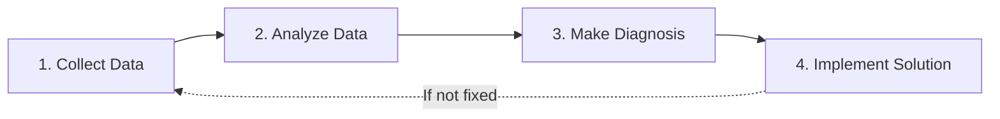

# WebRTC Debugging: Tools & Methodologies

> **Source**: [WebRTC Debugging Best Practices](https://youtu.be/zJ_2Mu3E5eg)

> [!IMPORTANT]
> **The Reality**: Communication apps have the **worst UX when they fail** (users can't talk = instant frustration).
> **The Approach**: Systematic **4-step methodology** > random fixes.

---

## 🔬 The 4-Step Debugging Methodology



**Critical**: Never skip Step 1 (data collection). "It doesn't work" is not debuggable.

---

## 🐛 Common WebRTC Failures (Ranked by Frequency)

### 1. Connection & Signaling Failures (40%)

**Symptoms**:
*   Call never starts.
*   "Connecting..." forever.

**Root Causes**:
*   **WebSocket failure**: Signaling server down or unreachable.
*   **SDP Glare**: Both peers create offer simultaneously → `"have-local-offer"` error.
*   **Malformed SDP**: Missing codec or invalid SSRC.

**Debug Tool**: `chrome://webrtc-internals` → Check "setLocalDescription" / "setRemoteDescription" events.

---

### 2. Missing TURN Server (30%)

**Symptom**: Works on localhost, fails in production.

**Root Cause**: Corporate firewall blocks **UDP** (WebRTC's default transport).

**Fix**: Deploy **TURN server** (coturn).

**Verification**: Use **Trickle ICE** tool.
```bash
# Test TURN server
https://webrtc.github.io/samples/src/content/peerconnection/trickle-ice/
```

**Expected Output**: `typ relay` candidates (not just `typ host` or `typ srflx`).

---

### 3. `getUserMedia` Errors (15%)

| Error | Cause | Solution |
| :--- | :--- | :--- |
| **NotAllowedError** | User denied permission | Show permission prompt tutorial |
| **NotFoundError** | No camera/mic detected | Check hardware, drivers |
| **NotReadableError** | Device in use (other tab/app) | Close conflicting apps, reload page |
| **SecurityError** | Site not HTTPS | Deploy SSL certificate |

**Debug Code**:
```javascript
navigator.mediaDevices.getUserMedia({ video: true, audio: true })
  .catch(err => {
    console.error(`getUserMedia error: ${err.name} - ${err.message}`);
    // Log to server for analysis
  });
```

---

### 4. Browser Interoperability (10%)

**Known Issues**:
*   **Safari 14 (2020)**: Audio stutters for 60 seconds after join.
*   **Chrome 88 (2021)**: `AudioLevel` stuck at zero (fixed in Chrome 89).

**Workaround Example** (Chrome 88 audio bug):
```javascript
// Detect stuck audio level
let audioLevel = 0;
let stuckCounter = 0;

setInterval(() => {
  pc.getStats().then(stats => {
    stats.forEach(report => {
      if (report.type === 'inbound-rtp' && report.audioLevel === audioLevel) {
        stuckCounter++;
        if (stuckCounter > 10) {
          // Audio level stuck → Rebind audio source
          const stream = remoteVideo.srcObject;
          remoteVideo.srcObject = null;
          remoteVideo.srcObject = stream;
          stuckCounter = 0;
        }
      } else {
        audioLevel = report.audioLevel;
        stuckCounter = 0;
      }
    });
  });
}, 1000);
```

---

### 5. Network Instability (5%)

**Symptoms**:
*   Video freezes.
*   Audio cuts out.
*   "Blurry" video.

**Root Cause**: Packet loss >5% or jitter >50ms.

---

## 🛠️ The 3 Essential Debugging Tools

### Tool 1: `chrome://webrtc-internals` (Free, Built-in)

**What It Shows**:
*   **API Trace**: All WebRTC method calls (`createOffer`, `setLocalDescription`).
*   **ICE States**: Candidate gathering, connection state transitions.
*   **SDP**: Full offer/answer exchange.
*   **Stats Graphs**: Bitrate, packet loss, jitter (real-time).

**How to Use**:
1.  Open in **new Chrome tab** (not incognito).
2.  Start your WebRTC call.
3.  Watch for red errors in API trace.

**Critical Stat**: `packetsLost` → If >5%, network is the problem.

---

### Tool 2: `getStats()` API (Programmatic Logging)

**Use Case**: Production debugging (can't ask users to open Chrome internals).

**Implementation**:
```javascript
setInterval(async () => {
  const stats = await pc.getStats();
  const report = {};
  
  stats.forEach(stat => {
    if (stat.type === 'inbound-rtp' && stat.mediaType === 'video') {
      report.packetsLost = stat.packetsLost;
      report.jitter = stat.jitter;
      report.roundTripTime = stat.roundTripTime;
    }
  });
  
  // Send to logging server
  fetch('/api/webrtc-stats', {
    method: 'POST',
    body: JSON.stringify({ userId, sessionId, stats: report })
  });
}, 5000); // Every 5 seconds
```

**Store in**: Postgres, CloudWatch, Datadog.

---

### Tool 3: Third-Party Services

| Service | Features | Cost |
| :--- | :--- | :--- |
| **Callstats.io** | Real-time dashboards, alerts | $500+/month |
| **testRTC** | Load testing, monitoring | $500+/month |
| **Vonage Inspector** | Free (for Vonage customers) | Free |

**When to Use**: When `getStats()` logs become too large to analyze manually (>1000 sessions/day).

---

## 📊 Quality Thresholds (Good vs Bad Call)

| Metric | Good | Acceptable | Bad |
| :--- | :--- | :--- | :--- |
| **RTT** (Round Trip Time) | <100ms | 100-400ms | >400ms |
| **Packet Loss (Audio)** | <1% | 1-20% | >20% |
| **Packet Loss (Video)** | <1% | 1-5% | >5% |
| **Jitter** | <30ms | 30-50ms | >50ms |
| **Bitrate (HD)** | >500 kbps | 350-500 kbps | <350 kbps |
| **Bitrate (VGA)** | >250 kbps | 200-250 kbps | <200 kbps |

**Insight**: Opus audio codec is **resilient** (works up to 20% loss). Video is **fragile** (breaks at 5% loss).

---

## 🧪 Testing & Validation Tools

### Cross-Browser Testing
*   **Kite**: Open-source Selenium for WebRTC (runs on AWS).
*   **BrowserStack**: Commercial cloud browser testing.

### Network Simulation
*   **Chrome DevTools**: Throttle network to "3G" or "Slow 3G".
*   **tc (Traffic Control)**: Linux tool to simulate packet loss.

```bash
# Simulate 5% packet loss on eth0
sudo tc qdisc add dev eth0 root netem loss 5%
```

### Hardware/Network Check
*   **test.webrtc.org**: Tests camera, microphone, bandwidth.
*   **AppRTC** (appr.tc): Google's reference WebRTC app (isolate browser vs app bugs).

---

## ✅ Principal Architect Checklist

1.  **Log `getStats()` in Production**: Store RTT, packet loss, jitter for every session. Critical for support tickets.
2.  **Deploy TURN Before Launch**: 30% of calls need it. Self-host `coturn` or use Twilio ($5k/month at scale).
3.  **Test on Safari Early**: It has the most bugs. Don't discover in production.
4.  **Build Automatic Reconnect**: Network blips happen. Detect `iceConnectionState === 'disconnected'` and trigger re-negotiation.
5.  **Monitor Packet Loss**: Alert if >5% (video will be unusable).

---

## 🔗 Related Documents
*   [WebRTC Production Challenges](./webrtc-production-challenges-guide.md) — TURN deployment, Safari quirks.
*   [Pre-Call Testing](./webrtc-precall-testing-guide.md) — Prevent issues before calls start.
*   [WebRTC Production Readiness](./webrtc-production-readiness-guide.md) — Interoperability testing.
