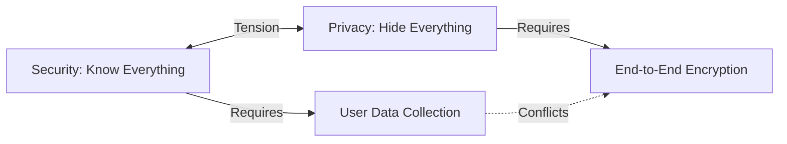
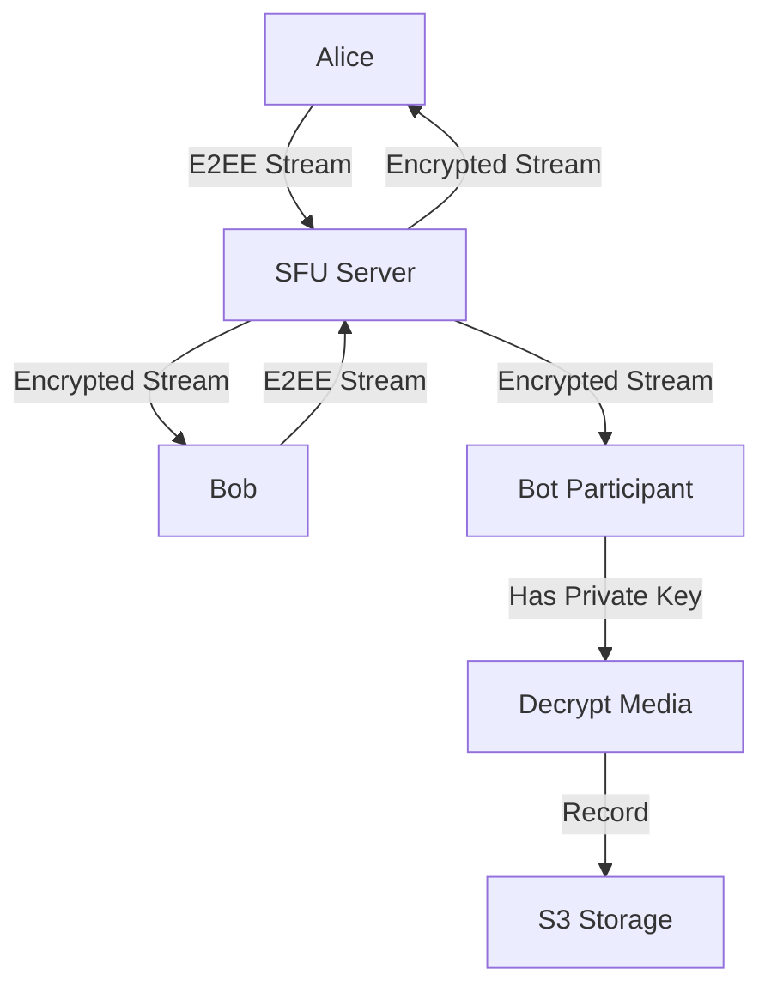
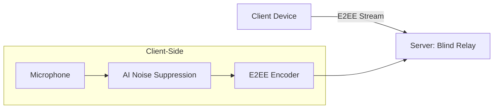

# E2EE in WebRTC: Security vs Privacy Trade-offs

> **Source**: [E2EE: Is It Worth It?](https://youtu.be/-KzC5-o0T4U)

> [!IMPORTANT]
> **The Verdict**: <10% of businesses actually need E2EE.
> **The Trade-off**: E2EE kills **recording, transcription, and AI features**.

---

## 🔐 Security vs Privacy: The Fundamental Conflict

### Definitions
*   **Security**: Knowing **who** is doing **what** (authentication, authorization).
*   **Privacy**: Hiding data from **everyone**, including the service provider.

### The Conflict


### Example: Child Safety
*   **Without E2EE**: Server monitors video/audio for inappropriate content.
*   **With E2EE**: Server is blind → Cannot detect abuse.

**Result**: Most consumer platforms (Discord, Zoom) **do not use E2EE** for child safety reasons.

---

## 💔 The Dealbreaker: E2EE Kills Server-Side Features

### What E2EE Breaks

| Feature | Without E2EE | With E2EE |
| :--- | :--- | :--- |
| **Recording** | ✅ Server records | ❌ Impossible (server can't decrypt) |
| **Transcription** | ✅ Real-time captions | ❌ Impossible |
| **Translation** | ✅ Auto-translate | ❌ Impossible |
| **AI Summaries** | ✅ Post-call summary | ❌ Impossible |
| **Sentiment Analysis** | ✅ Detect frustration | ❌ Impossible |
| **Noise Suppression** | ✅ Google Meet style | ❌ Impossible (server-side) |

### The Business Decision
**CEO's Choice**: AI features > E2EE (99% of the time).

**Why**: $100k/year AI contract revenue > $0 "we're private" marketing.

---

## 🏗️ Workaround: The "Dummy Participant" Model

### How It Works


### The Process
1.  **Enterprise** runs a "bot" in their own cloud (AWS).
2.  **Bot** joins call as a participant (has encryption key).
3.  **Bot** decrypts media and records.

### The Problems
*   **Cost**: Dedicated VM per recording = $0.68/hour (c5.4xlarge for transcoding).
*   **Complexity**: Maintain bot infrastructure (crashes, scaling).
*   **Trust**: Enterprise must trust the bot operator (usually themselves).

**Who Uses This**: Governments, defense contractors (high security + compliance).

**Who Doesn't**: SMBs (not worth $500k/year infrastructure cost).

---

## 📊 Market Reality: Who Needs E2EE?

### The 10% (E2EE Required)
*   **Healthcare**: HIPAA compliance (encrypted patient data).
*   **Finance**: Bloomberg terminal competitors (SEC regulations).
*   **Legal**: Attorney-client privilege.
*   **Government**: Classified communications.

### The 90% (E2EE Not Needed)
*   **Education**: Teachers want recordings.
*   **Corporate**: Managers want AI summaries.
*   **Telehealth**: Doctors want transcripts.
*   **Customer Support**: QA teams review calls.

---

## 🤖 The Future: Edge Processing (5-10 Years Out)

### The Vision
Run AI **on the client device**, not the server.



### The Challenge
*   **CPU**: Noise suppression = 20% CPU. Transcription = 40% CPU. LLM = 200% CPU (impossible).
*   **Battery**: Running AI drains phone in 2 hours.

### Current Status
*   **Apple**: On-device Siri (works, but limited).
*   **Google**: Server-side Gemini (powerful, but no privacy).

**Reality**: Edge AI is 5-10 years away from matching server-side quality.

---

## 📉 User Behavior: Features > Privacy

### Case Study: Google Meet Noise Suppression

**2020 Announcement**:
*   Google: "Our servers listen to your audio to suppress noise."
*   Privacy Advocates: "This is surveillance!"

**User Response**:
*   **Churn**: <1% (users didn't leave).
*   **Adoption**: 80% of users enable noise suppression.

**Lesson**: Users say they want privacy. Users **choose** features.

---

## ✅ Decision Framework: Should You Implement E2EE?

### Implement E2EE If:
*   **Legal Requirement**: HIPAA, SEC, attorney-client privilege.
*   **Competitor Offers It**: Bloomberg, Signal (you must match).
*   **No Server Features Needed**: Pure P2P chat (no recording, no AI).

### Skip E2EE If:
*   **Recording Required**: Compliance, training, QA.
*   **AI Features Needed**: Transcription, summaries, sentiment.
*   **Budget <$500k/year**: Can't afford "dummy participant" infrastructure.

---

## 🔬 Advanced Option: Insertable Streams (Partial E2EE)

### What It Is
Encrypt **video/audio frames** before sending to SFU.

```javascript
const sender = pc.getSenders()[0];
const streams = sender.createEncodedStreams();

streams.readable.pipeThrough(new TransformStream({
  transform(frame, controller) {
    const encrypted = encryptFrame(frame.data, myKey);
    frame.data = encrypted;
    controller.enqueue(frame);
  }
})).pipeTo(streams.writable);
```

### What It Enables
*   **SFU Routing**: Server can route encrypted frames (doesn't need to decrypt).
*   **No Recording**: Server can't decrypt.

### What It Doesn't Enable
*   **AI**: Server still can't analyze media.

**Verdict**: Niche (financial trading platforms like Bloomberg).

---

## 🔗 Related Documents
*   [WebRTC Production Readiness](./webrtc-production-readiness-guide.md) — Insertable Streams implementation.
*   [SFU vs MCU](./sfu-mcu-architecture-guide.md) — E2EE only works with SFU (not MCU).
