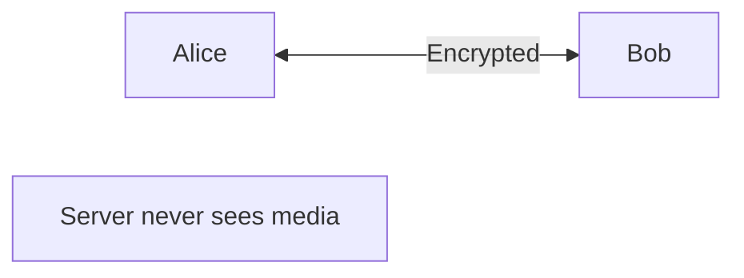
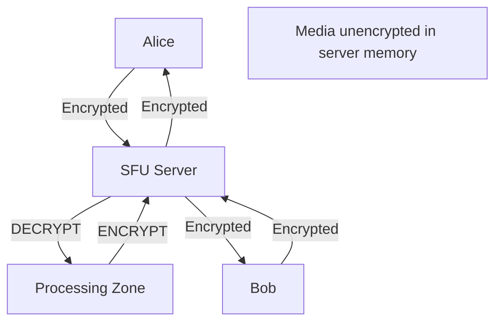
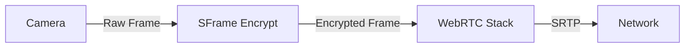

# E2EE Implementation: Insertable Streams & SFrame

> **Source**: [E2EE Technical Deep Dive with Dr. Alex Gouaillard](https://youtu.be/SaibE-iYwI4)

> [!IMPORTANT]
> **The Breakthrough**: Insertable Streams API (Chrome, 2020) enables **true E2EE in browsers** for the first time.
> **The Warning**: "Rolling your own crypto" = Security disaster. Use audited libraries.

---

## 🔐 P2P vs SFU: The E2EE Problem

### P2P (Peer-to-Peer)


*   **E2EE**: ✅ Inherent (media never touches server).
*   **Scalability**: ❌ Max 4-5 participants.

---

### SFU (The Traditional Limitation)


**Problem**: Server **must decrypt** to route → No E2EE.

---

## 🎯 The Two Generations of E2EE

### Generation 1: PERC (2016)

**Full Name**: Privacy Enhanced RTP Conferencing

**How It Works**: "Double encryption"
```
Original Media → SRTP (Wire Encryption) → PERC (Content Encryption)
```

**Pros**:
*   ✅ Easy for legacy hardware (Cisco, Polycom).
*   ✅ Standardized (RFC 8871).

**Cons**:
*   ❌ No retransmission (can't resend lost packets).
*   ❌ No bandwidth estimation (can't adapt to network).
*   ❌ RTP-only (doesn't work with Data Channels).

**Verdict**: Dead-end. Nobody uses it in production (2026).

---

### Generation 2: SFrame (2018)

**Full Name**: Secure Frame

**How It Works**: Encrypt **entire video/audio frames** (not packets).


**Pros**:
*   ✅ **Low overhead**: 1-2% bandwidth increase (vs 10-15% for PERC).
*   ✅ **Transport agnostic**: Works with QUIC, WebSockets, Data Channels.
*   ✅ **Supports retransmission**: Can resend lost frames.

**Cons**:
*   ❌ Requires **Insertable Streams API** (not available in all browsers yet).

**Adoption** (2026):
*   **Zoom**: Uses SFrame for E2EE mode.
*   **Jitsi**: Beta support.
*   **Google Meet**: No E2EE (by design).

---

## 💡 The Insertable Streams API (The Game Changer)

### Before Insertable Streams (Pre-2020)
**Claim**: "Our web app has E2EE!"
**Reality**: ❌ **Lying**. Browsers didn't expose media frames to JavaScript.

### After Insertable Streams (2020+)
**What It Enables**: JavaScript can intercept raw video/audio frames **before** they're sent to the network.

### Implementation Example
```javascript
// Get the sender (video track)
const sender = pc.getSenders().find(s => s.track.kind === 'video');

// Create encoded streams (raw frames)
const streams = sender.createEncodedStreams();

// Encrypt frames
const encryptTransform = new TransformStream({
  transform(encodedFrame, controller) {
    // Get raw frame data
    const data = new Uint8Array(encodedFrame.data);
    
    // Encrypt with SFrame
    const encrypted = sframe.encrypt(data, mySecretKey);
    
    // Replace frame data
    encodedFrame.data = encrypted.buffer;
    controller.enqueue(encodedFrame);
  }
});

// Pipe encrypted frames to network
streams.readable
  .pipeThrough(encryptTransform)
  .pipeTo(streams.writable);
```

**Browser Support** (2026):
*   **Chrome**: ✅ Since version 86 (2020).
*   **Firefox**: ✅ Since version 117 (2023).
*   **Safari**: ❌ No support (Apple blocks for "child safety" reasons).

---

## 🔑 Key Management: The Hardest Part

### The Problem
**You**: "We have E2EE!"
**Auditor**: "Who manages the keys?"
**You**: "Our server."
**Auditor**: "Then you don't have E2EE."

### The Solution: Client-Side Key Generation
```javascript
// Generate key on client (browser)
const key = await crypto.subtle.generateKey(
  { name: 'AES-GCM', length: 256 },
  true,
  ['encrypt', 'decrypt']
);

// Export key
const exported = await crypto.subtle.exportKey('raw', key);

// Share with other participants via out-of-band channel
// (QR code, Signal message, etc.)
```

**Critical**: Server **never** sees the key.

---

## 🔒 MLS: Key Management for Groups

**Full Name**: Messaging Layer Security (IETF Standard, RFC 9420)

**What It Solves**: Distributing keys to **50,000 participants** securely.

**How It Works**:
1.  Each participant has a **key pair** (public/private).
2.  Group key is **ratcheted** (changed) every time someone joins/leaves.
3.  Server **never** sees plaintext key.

**Libraries**:
*   **OpenMLS**: Rust implementation.
*   **mls-ts**: TypeScript wrapper.

**Adoption**:
*   **Wire**: Uses MLS for group chats.
*   **Apple iMessage**: Migrating to MLS (2024-2026).

---

## ⚠️ Security Audit: Don't Roll Your Own

### The Reality
*   **95%** of custom E2EE implementations have vulnerabilities.
*   **Common mistakes**:
    *   Using ECB mode (insecure).
    *   Reusing nonces (breaks encryption).
    *   Timing attacks (attacker can infer key).

### The Solution
**Hire external security auditors**:
*   **Trail of Bits**: $50k-100k for audit.
*   **NCC Group**: $75k-150k.

**Open-Source Libraries** (Pre-Audited):
*   **SFrame**: Medooze implementation.
*   **PERC**: Jitsi implementation.

---

## 📊 Performance Impact

### Bandwidth Overhead
| Method | Overhead |
| :--- | :--- |
| **No E2EE** | 0% (baseline) |
| **PERC** | +10-15% (per-packet encryption) |
| **SFrame** | +1-2% (per-frame encryption) |

### CPU Impact
| Operation | CPU (per stream) |
| :--- | :--- |
| **AES-GCM Encrypt** | 2-3% |
| **Key Ratcheting (MLS)** | 5-10% (only on join/leave) |

**Insight**: SFrame is **5x more efficient** than PERC.

---

## ✅ Implementation Checklist

1.  **Use SFrame** (not PERC) for new implementations.
2.  **Implement Insertable Streams** in browsers (Chrome/Firefox only, 2026).
3.  **Use MLS** for key management (groups >10 participants).
4.  **Hire external auditors** before launch ($50k-100k).
5.  **Fallback to non-E2EE**: Safari doesn't support Insertable Streams → Offer non-E2EE mode or native app.

---

## 🔗 Related Documents
*   [WebRTC E2EE Guide](./webrtc-e2ee-guide.md) — Business trade-offs (features vs privacy).
*   [WebRTC Production Readiness](./webrtc-production-readiness-guide.md) — Safari limitations.
