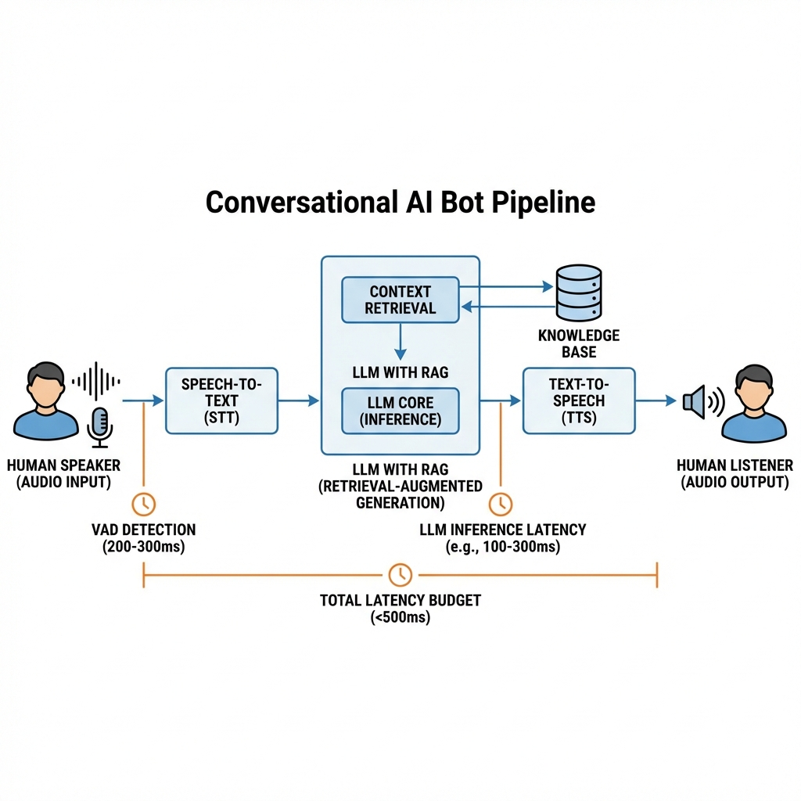
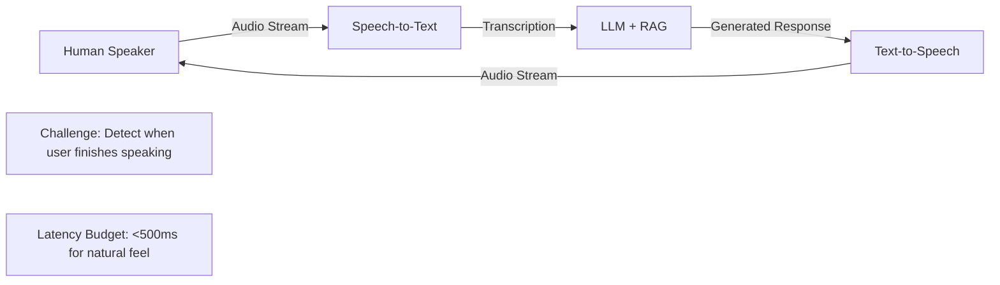
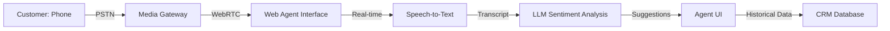

# WebRTC Evolution: The AI Era

> **Source**: [The Changing WebRTC Landscape (2024)](https://youtu.be/MEvWKkSUxaY)

> [!IMPORTANT]
> **The Paradigm Shift**: WebRTC is no longer just "video chat". It's the **real-time transport layer** for AI agents.
> **The New Normal**: One-to-Machine communication (Human ↔ Bot) is now the dominant use case.

---

## 📅 The Four Eras of WebRTC

| Era | Years | Focus | Key Innovation |
| :--- | :--- | :--- | :--- |
| **1. Exploration** | 2011-2015 | "Make it work" | Browser standardization |
| **2. Growth** | 2015-2019 | Cross-platform | Firefox, Safari, Edge support |
| **3. Differentiation** | 2020-2023 | "Better than Zoom" | SFU architectures, Simulcast |
| **4. Generative AI** | 2024+ | **AI Agents as Participants** | Speech-to-Text → LLM → Text-to-Speech |

> [!TIP]
> **The Current Reality**: "Nobody cares about anything else besides AI." Investment and innovation are strictly tied to automation.

---

## 🤖 Pattern 1: Conversational AI Bots

### The Pipeline

A conversational AI bot joining a Teams/Meet call requires a **multi-stage real-time pipeline**:

### The Latency Challenge
*   **Problem**: The bot must detect "pause" vs "finished speaking" without an "Enter" key.
*   **Solution**: Use **Voice Activity Detection (VAD)** with a 200-300ms silence threshold.
*   **Trade-off**: Too short = Bot interrupts. Too long = Awkward silence.

### Scalability
*   **Bottleneck**: AI processing (LLM inference) is 10x more expensive than WebRTC media transport.
*   **Architecture**: Treat the bot as "just another participant" in the SFU mesh.

---

## 📡 Pattern 2: Low-Latency Broadcasting (WHIP/WHEP)

### The Problem with HLS
HLS is stable but **5-30 seconds delayed** due to chunking + CDN cache.

### The Solution: WHIP + WHEP
*   **WHIP** (WebRTC-HTTP Ingestion Protocol): Standardized way to push WebRTC streams to a server.
*   **WHEP** (WebRTC-HTTP Egress Protocol): Standardized way to pull WebRTC streams from a server.
*   **Benefit**: Sub-second latency for mass broadcasting (replaces proprietary protocols).

### Adoption Status
*   **Growing**: OBS Studio, FFmpeg, and most CDNs now support WHIP/WHEP.
*   **Limitation**: Still requires WebRTC-capable clients (browsers). Not for legacy TV apps.

---

## 🛰️ Pattern 3: Extreme Low-Bandwidth (Satellite Networks)

Some use cases operate in **non-terrestrial networks** with brutal constraints.

### The Constraints
*   **Bandwidth**: 100 kbps (total).
*   **Latency**: 150ms baseline (satellite round-trip).
*   **Goal**: Maintain voice quality for emergency/remote workers.

### The Optimization Stack
1.  **Opus Narrow Band**: Compress audio to **6 kbps** (vs 64 kbps for standard voice).
2.  **Silence Suppression**: Send **zero data** during pauses.
3.  **Media Gateways**: Use SignalWire to transcode to G.711/G.729 for PSTN interop.

> [!WARNING]
> **The Trade-off**: At 6 kbps, audio quality is "intelligible" but not "natural". Human brain fills in the gaps.

---

## 🎥 Pattern 4: Browser-Based Video Processing

Modern browsers are becoming **video editing suites**.

### Insertable Streams
*   **What**: Low-level API to manipulate individual video frames.
*   **Use Case**: Real-time filters (blur background, de-noise, color grading).

### WebAssembly (Wasm)
*   **Breakthrough**: FFmpeg and GStreamer now run **in the browser**.
*   **Use Case**: Live video editing (cut, splice, transcode) without a server.

### WebTransport (HTTP/3)
*   **Promise**: Better performance than WebRTC Data Channels.
*   **Blocker**: Node.js's OpenSSL doesn't support QUIC natively. Adoption stalled.

---

## 🏢 Use Case: AI-Powered Call Centers

### The Old Model
*   Agent uses a physical phone.
*   All context (notes, history) is in a separate CRM.

### The New Model (WebRTC + AI)

*   **Real-time Transcription**: Agent sees what customer is saying (helps with accents).
*   **Sentiment Analysis**: LLM detects frustration and suggests "offer discount".
*   **Infrastructure**: FreeSwitch (Open Source) or Amazon Connect (Cloud).

---

## ✅ Principal Architect Checklist

1.  **Design for AI-First**: If you're building WebRTC in 2025, assume 50% of participants will be bots. Plan for LLM latency.
2.  **Use WHIP/WHEP for Broadcasting**: Stop building proprietary ingest protocols. WHIP is the standard now.
3.  **Optimize for Mobile**: Many users are on 4G with 500ms+ latency. Use Opus, enable Simulcast, and test on real networks.
4.  **Monitor End-to-End Latency**: The "glass-to-glass" latency (User A mic → User B speaker) must be <300ms for natural conversation.

---

## 🔗 Related Documents
*   [Live Streaming Guide](../live-streaming-guide.md) — WebRTC vs HLS trade-offs.
*   [Async Systems](../../distributive-backend/async-systems-guide.md) — Back pressure in real-time pipelines.
