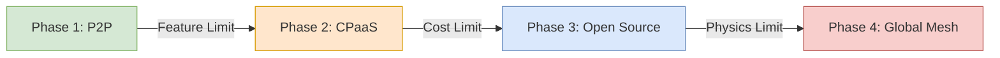

# WebRTC Growth Playbook: The 0 to 1 Million Journey

> **Source**: [Scaling WebRTC in 2021](https://youtu.be/vRM46mHJffA)

> [!IMPORTANT]
> **The Golden Rule**: Do not solve "Google Scale" problems at "Startup Scale".
> **The Pivot**: Scaling is not just about servers; it's about changing your *architecture* at key user milestones.

---

## 🐣 Phase 1: Prototype (0 - 50 Users)
**Architecture**: Peer-to-Peer (Mesh).
**Goal**: Proof of Concept, Maximum Privacy, Zero Cost.

*   **Topology**: Mesh (Everyone connects to everyone).
*   **Infrastructure**:
    *   **Signaling**: Simple WebSocket server (Node.js/Socket.io).
    *   **Media**: Direct P2P (No server cost).
    *   **TURN**: Free tier (Twilio 25GB) or public STUN.
*   **Limit**: CPU explodes at >4 participants (N*N-1 connections).
*   **Cost**: ~$0/month.

> **Decision Point**: "We need to record calls" OR "We need 5+ people". -> **Move to Phase 2**.

---

## 📈 Phase 2: Growth (50 - 10,000 Users)
**Architecture**: CPaaS (Managed SFU).
**Goal**: Feature parity, Stability, Speed to Market.

*   **Topology**: SFU (Star).
*   **Strategy**: **Buy vs Build**. Do NOT build your own media server yet.
    *   **Why**: Engineering time ($100k/yr) > CPaaS Bill ($500/mo).
*   **Provider**: Twilio Video, Daily, Agora.
*   **Features Gained**: Cloud Recording, PSTN Dial-in, Room state scaling.
*   **Limit**: Economics. At 100k minutes, the bill hits ~$400-$1000/mo. At 1M minutes, it hurts.

> **Decision Point**: "Our CPaaS bill exceeds the cost of hiring 1 DevOps engineer ($100k/yr)." -> **Move to Phase 3**.

---

## 🚀 Phase 3: Scale (10,000 - 1 Million Users)
**Architecture**: Proprietary Open-Source (Self-Hosted SFU).
**Goal**: Unit Economics, Custom AI, Vendor Independence.

*   **Topology**: Clustered SFU.
*   **Strategy**: Migrate to **Janus, MediaSoup, or LiveKit**.
*   **Infrastructure**:
    *   **Orchestration**: Kubernetes (EKS/GKE). Auto-scaling groups of SFUs.
    *   **Signaling**: Redis Pub/Sub for room state across nodes.
    *   **Operations**: You now own the "3am pager duty".
*   **Key Upgrade**: **Load Testing**. You must simulate 5k concurrent users before launch (use TestRTC).
*   **Cost**: High Fixed Cost (Engineers + EC2), Low Variable Cost (Bandwidth only).

> **Decision Point**: "Users in Tokyo complain about latency (server is in Virginia)." -> **Move to Phase 4**.

---

## 🌍 Phase 4: Global Mesh (1 Million+ Users)
**Architecture**: Cascaded Geo-Distribution.
**Goal**: Sub-second latency anywhere on Earth.

*   **Topology**: Recursive/Cascaded SFU (Tree).
*   **Strategy**: Edge Termination.
    *   **Ingest**: User connects to edge node in their city.
    *   **Transport**: Aggregated stream travels over fiber backbone (AWS Direct Connect / Dark Fiber).
    *   **Egress**: Fan-out at local edge nodes.
*   **Advanced Tech**:
    *   **Custom Codecs**: AV1 / SVC for efficiency.
    *   **Monitoring**: MOS score tracking per-region (Grafana + Prometheus).
    *   **Failover**: DNS-based geo-routing active-active failover.

---

## 📊 The "Build vs Buy" Economic Curve

### Metrics That Matter

| Phase | Key Metric | Bad Sign |
| :--- | :--- | :--- |
| **1 (P2P)** | Connection Success Rate | >20% failures (NAT issues) |
| **2 (CPaaS)** | Time-to-Call (Setup) | CPaaS outages / API limits |
| **3 (Scale)** | CPU % per SFU Core | "Bleeding" rooms (zombie processes) |
| **4 (Global)** | Inter-Region Latency (RTT) | Jitter on the backbone links |

---

## ✅ Principal Architect Checklist

1.  **Don't Optimize Prematurely**: Building a K8s MediaSoup cluster for 50 users is engineering malpractice. Use CPaaS.
2.  **Monitor the Bill**: Set strict budget alerts on CPaaS. It scales linearly (and infinitely).
3.  **Own the Client**: Even in Phase 2, try to abstract the CPaaS SDK behind your own Interface/Adapter. This makes the Phase 3 migration possible without rewriting the frontend.
4.  **Test the Network**: In Phase 3, you are the ISP. Monitor packet loss on your VPC egress. AWS bandwidth allows bursts but throttles sustained flows.

---

## 🔗 Related Documents
*   [Architecture Decision](./webrtc-architecture-decision-guide.md) — Detailed Cost Breakdown (CPaaS vs OS).
*   [Scaling Architecture](./webrtc-scaling-architecture-guide.md) — Technical details of Phase 3 & 4.
*   [Automated Testing](./webrtc-automated-testing-guide.md) — How to validate Phase 3.
