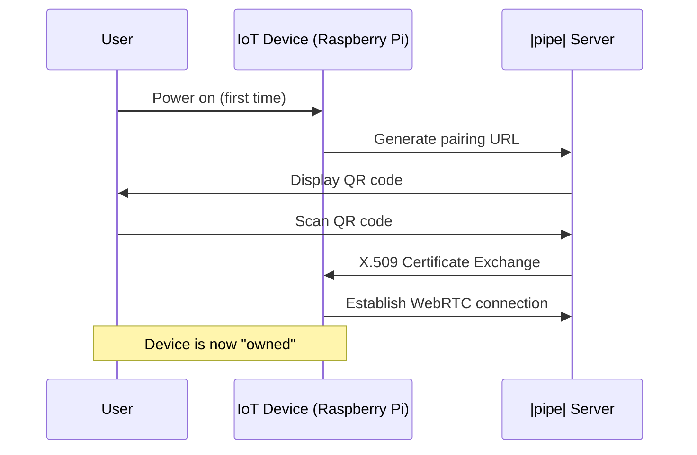
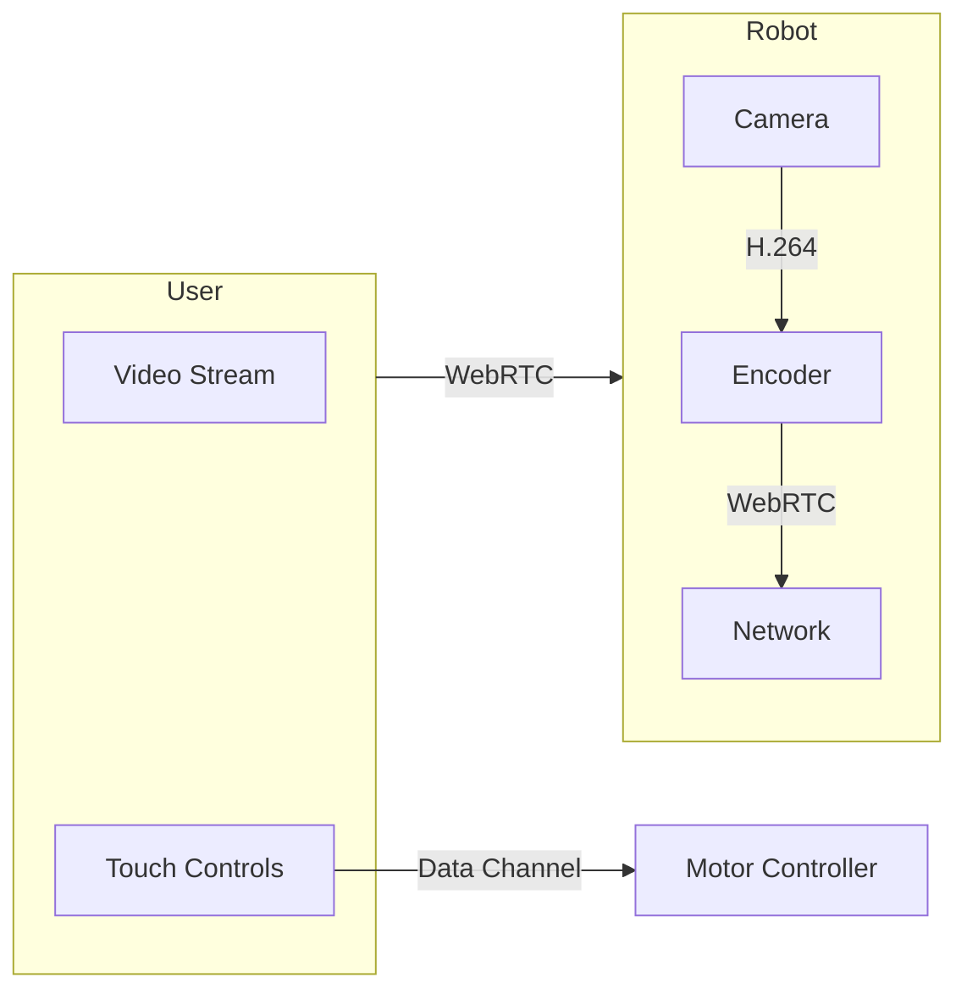
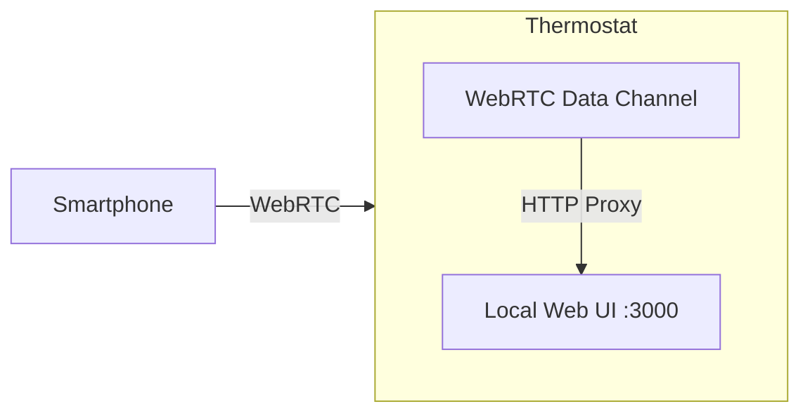
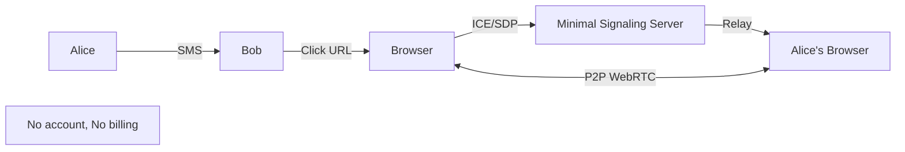

# WebRTC IoT Applications: Beyond Video Conferencing

> **Source**: [WebRTC Live #43: IoT & Niche Applications](https://youtu.be/cZvaCCq7yIo)

> [!IMPORTANT]
> **The Thesis**: WebRTC is not just for Zoom competitors. It's the **real-time transport layer** for IoT, robotics, and edge computing.
> **The Challenge**: Standard Google WebRTC stack is too heavy for Raspberry Pi.

---

## 🔐 Security Pattern: Trust on First Use (TOFU)

### The Problem
Traditional security (username + password) doesn't work for IoT devices (baby monitors, dishwashers, robots).
*   **Why**: No keyboard to type a password.
*   **Result**: Most IoT devices have **terrible security** (default passwords).

### The Solution: TOFU
**Trust on First Use**: The first person to power on the device **owns** it.



### Implementation
*   **Pairing URL**: `https://pipe.com/claim/ABC123`
*   **Crypto**: Full **X.509 certificate exchange** (same as HTTPS).
*   **Time**: 5 seconds to pair.

> [!TIP]
> **Principal Architect Insight**: TOFU is the **only scalable security model** for consumer IoT. Alternative (cloud-based auth) requires internet for local devices.

---

## 🚀 Custom WebRTC Stack for Low-Power Devices

### The Problem
Google's WebRTC stack:
*   **Size**: 200+ MB.
*   **CPU**: Requires >1 GHz multi-core.
*   **Memory**: 512 MB minimum.

Raspberry Pi Zero:
*   **CPU**: 600 MHz single-core.
*   **Memory**: 512 MB total.
*   **Verdict**: ❌ Cannot run standard stack.

### The Solution: Custom Stack (|pipe|)
Tim Panton's team **rewrote WebRTC from scratch**.
*   **Size**: 40 MB (vs 200 MB).
*   **Hardware Acceleration**: Delegate **AES encryption** and **H.264 encoding** to Pi's GPU.
*   **Congestion Control**: Custom bandwidth management for flaky Wi-Fi.

### Performance
*   **Latency**: <100ms (robot control).
*   **Bitrate**: 1-2 Mbps (enough for 480p video).
*   **CPU**: 40% (vs 100% with standard stack).

---

## 🤖 Use Case 1: Remote Robotics

### The Demo
Drive a **Raspberry Pi robot** via WebRTC video + data channel.



*   **Control**: Send JSON commands via **WebRTC Data Channel**: `{"left": 50, "right": 50}`.
*   **Video**: Receive H.264 stream (Pi Camera → GPU encoder → WebRTC).

### Real-World Applications
*   **Delivery Robots**: Remote operator takes over when robot gets stuck.
*   **Mars Rovers**: Human demonstrates terrain navigation to train AI.
*   **Security Patrols**: Remote operator investigates anomalies.

---

## 🏠 Use Case 2: Proxying Web Interfaces

### The Problem
You have a **smart thermostat** with a web UI (`http://192.168.1.50`).
*   **Goal**: Access it from anywhere.
*   **Traditional**: Port forwarding (security nightmare) or cloud service (monthly fee).

### The WebRTC Solution


*   **How**: WebRTC Data Channel acts as an **HTTP proxy**.
*   **User sees**: The thermostat's web UI rendered in their browser (no video needed).
*   **Benefit**: Zero cloud infrastructure. Secure. No monthly fees.

### Code Example (Simplified)
```javascript
// On Raspberry Pi
const dataChannel = peerConnection.createDataChannel('http-proxy');
dataChannel.onmessage = (event) => {
  const request = JSON.parse(event.data);
  fetch(`http://localhost:3000${request.path}`)
    .then(res => res.text())
    .then(html => dataChannel.send(html));
};
```

---

## 🎧 Use Case 3: Spatial Audio (Edge Computing)

### The Problem
Traditional SFU sends **N audio streams** to each participant. The browser mixes them into **mono**.

### The Solution: Browser-Based Mixing
Use **Web Audio API** to mix in the browser with **spatial positioning**.

```javascript
const audioContext = new AudioContext();

participants.forEach((p, index) => {
  const panner = audioContext.createPanner();
  panner.positionX.value = index * 2 - 5; // Spread participants
  p.audioStream.connect(panner).connect(audioContext.destination);
});
```

### The Experience
*   **Traditional**: All voices sound like they're "in your head".
*   **Spatial**: Alice is on your left, Bob is center, Carol is on your right.
*   **Benefit**: You can **identify who's speaking** by spatial location (like real life).

---

## 📞 Use Case 4: SMS-Based P2P Calling

### The Problem
Starting a video call requires: Account creation, app download, contact exchange.

### The Solution
Send a **single SMS** with a URL.
*   **URL**: `https://call.example.com/join/ABC123`
*   **Browser**: Opens WebRTC peer connection directly (P2P, no SFU).
*   **Time**: 3 seconds to connect.

### Architecture


*   **Signaling**: Minimal (only ICE/SDP exchange).
*   **Media**: Direct P2P (no server).
*   **Cost**: ~$0.01 per call (vs $0.004/min for Twilio).

---

## ✅ Principal Architect Checklist

1.  **Use TOFU for Consumer IoT**: Cloud authentication adds latency and single point of failure.
2.  **Optimize for Hardware**: Delegate encryption/encoding to GPU. Pi can handle WebRTC at 40% CPU.
3.  **Explore P2P for Edge Cases**: Not everything needs an SFU. P2P saves $100k+/year in server costs.
4.  **Use Data Channels Creatively**: HTTP proxy, robot control, sensor data—not just chat.

---

## 🔬 Advanced Pattern: AI Training via WebRTC

### The Vision
Use WebRTC as a **real-time training pipeline** for autonomous systems.

**Example: Mars Rover**
1.  **Human** drives rover via WebRTC (controls + video).
2.  **AI** records: Terrain (video), Actions (data channel), Outcomes (success/failure).
3.  **Training**: AI learns driving patterns offline.
4.  **Deployment**: Rover operates autonomously, falls back to human for edge cases.

---

## 🔗 Related Documents
*   [WebRTC Evolution](./webrtc-evolution-guide.md) — AI as the Fourth Era.
*   [Edge AI Processing](./edge-ai-processing-guide.md) — Client vs server AI trade-offs.
*   [WebRTC Complexity](./webrtc-complexity-analysis-guide.md) — Custom stack justification.
