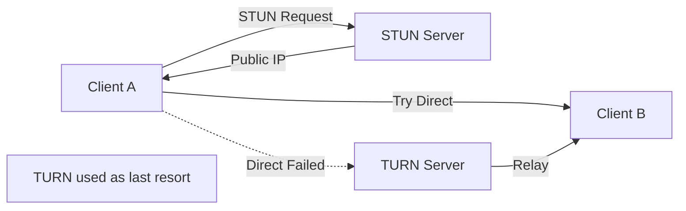
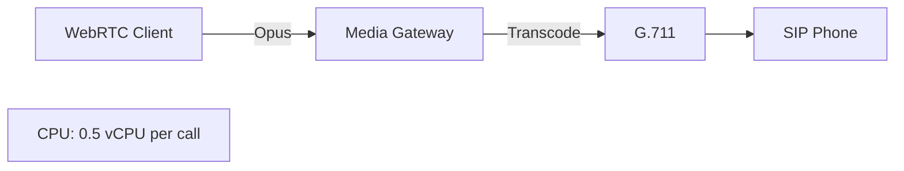
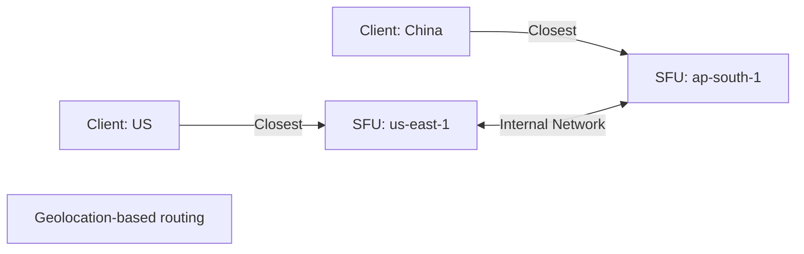

# WebRTC Production Challenges: The 9 Real-World Obstacles

> **Source**: [WebRTC Live #39: Technical Challenges](https://youtu.be/zElr4cfV_Mk)

> [!IMPORTANT]
> **The Reality**: Local testing works perfectly. Production fails mysteriously.
> **The Root Cause**: Corporate firewalls, Safari quirks, codec mismatches, and network congestion.

---

## 🚨 Challenge 1: Restrictive Networks (NAT Traversal)

### The Problem
*   **Local**: Works perfectly (same LAN).
*   **Production**: Corporate proxies block **UDP** (WebRTC's transport).

### The Solution: STUN + TURN



### Implementation
*   **STUN**: Free (Google provides public servers).
*   **TURN**: Self-host **coturn** (open source) or use Twilio/Cloudflare.
*   **Cost**: TURN bandwidth = $0.09/GB (AWS). For 1000 concurrent calls, budget $5k/month.

> [!TIP]
> **Principal Architect Tip**: Monitor **TURN usage** percentage. If >30% of calls use TURN, investigate firewall rules.

---

## 📉 Challenge 2: Busy Networks & Packet Loss

### The Problem
Shared Wi-Fi (coffee shops, offices) = 5-10% packet loss.

### Monitoring RTP Messages
| Message | Meaning | Action |
| :--- | :--- | :--- |
| **PLI** (Picture Loss Indicator) | Frame corrupted | Resend keyframe |
| **FIR** (Full Intra Request) | Decoder lost sync | Force keyframe |
| **NACK** | Specific packet lost | Resend packet |

### Solution: Adaptive Bitrate
*   **Tool**: `chrome://webrtc-internals` → Monitor `packetLossRate`.
*   **Threshold**: If loss >3%, reduce bitrate automatically.
*   **Implementation**: Use **Simulcast** (send 3 layers: 240p, 480p, 1080p). Client selects based on network.

---

## 🍎 Challenge 3: Safari Quirks (The Eternal Pain)

### The Problems

#### Problem 1: Autoplay Restrictions
Safari **blocks** autoplay unless:
```html
<video autoplay playsinline muted></video>
```
*   **Critical**: `playsinline` prevents fullscreen takeover.
*   **Critical**: `muted` allows autoplay.

#### Problem 2: getUserMedia Mutes Previous Streams
*   **Scenario**: Admin dashboard monitors 5 streams. User clicks "Join Call" (new `getUserMedia`).
*   **Result**: All 5 background streams **mute automatically**.
*   **Workaround**: Use a **shared `MediaStream`** across all components.

> [!CAUTION]
> **The Golden Rule**: Test on Safari **first**, not last. Safari-specific bugs take 10x longer to debug.

---

## 🧪 Challenge 4: Testing Complexity

### The Problem
You need to test **Chris (Chrome) ↔ Sarah (Safari) ↔ Fred (Firefox)** interoperability.

### Tools

| Tool | Use Case | Cost |
| :--- | :--- | :--- |
| **Selenium** | Browser automation | Free |
| **Kite** | WebRTC interop testing | Free (AWS credits) |
| **testRTC** | Cloud-based testing | $500/month |

### Test Matrix
```
Chrome 120 ↔ Safari 17 ✅
Chrome 120 ↔ Firefox 121 ✅
Safari 17 ↔ Firefox 121 ❌ (codec mismatch)
```

---

## 🔍 Challenge 5: Debugging Tools

### Chrome Internals (`chrome://webrtc-internals`)
*   **Graphs**: Bitrate, packet loss, framerate.
*   **Stats**: Codec, resolution, SSRC.
*   **Use Case**: Diagnose "why is video frozen?"

### Wireshark
*   **Capture**: RTP/RTCP packets.
*   **Analysis**: VoIP forensics (jitter, out-of-order packets).
*   **Use Case**: Debug "audio cutting out every 5 seconds".

---

## 📞 Challenge 6: Legacy SIP Integration

### The Codec Mismatch
| System | Audio | Video |
| :--- | :--- | :--- |
| **WebRTC** | Opus (48 kHz) | VP8/VP9 |
| **SIP** | G.711 (8 kHz) | H.264 |

### The Gateway (Transcoding)


### The RTCP Multiplex Problem
*   **WebRTC**: Uses **one port** for RTP + RTCP (multiplexed).
*   **Legacy SIP**: Uses **two ports** (RTP: 5004, RTCP: 5005).
*   **Fix**: Gateway must **de-multiplex**.

---

## 📈 Challenge 7: Scalability (SFU vs MCU)

### Mesh (Peer-to-Peer)
*   **Max**: 4-5 participants.
*   **Why**: Client uploads N-1 streams (4 participants = upload 4 Mbps).

### SFU (Selective Forwarding Unit)
*   **Scales to**: 100+ participants.
*   **How**: Client uploads **1 stream**. Server forwards to N viewers.

### Horizontal Scaling


---

## 🛠️ Challenge 8: Open-Source Media Servers

| Server | Type | Language | Strengths |
| :--- | :--- | :--- | :--- |
| **Jitsi** | SFU | Java | Full app (ready to deploy) |
| **Kurento** | SFU/MCU | C++ | Built-in AI plugins |
| **Janus** | SFU | C | Lowest latency, plugin arch |
| **mediasoup** | SFU | C++ / Node.js | Best for custom apps |
| **Pion** | SFU | Go | Cloud-native, K8s-friendly |

> [!TIP]
> **Recommendation**: Use **mediasoup** for custom apps, **Jitsi** for "deploy in 1 hour" needs.

---

## 📺 Challenge 9: 4K Video (The Bandwidth Monster)

### The Math
*   **4K**: 25 Mbps per stream.
*   **Scenario**: 4-person call.
*   **Client Upload**: 25 Mbps (acceptable).
*   **Client Download**: 3 * 25 = **75 Mbps** (not possible on typical home internet).

### The Solution: Don't Use 4K
*   **Reality**: Most users are on 1080p monitors.
*   **Alternative**: Send 1080p, use **AI upscaling** on client side if needed.

---

## ✅ Principal Architect Checklist

1.  **Deploy TURN Early**: Don't wait for production to discover 30% of calls fail due to corporate firewalls.
2.  **Test Safari First**: Safari bugs take 10x longer to debug. Start there.
3.  **Monitor Packet Loss**: Set alerts for `packetLossRate > 3%`. Trigger bitrate reduction automatically.
4.  **Use SFU for >5 Participants**: Mesh doesn't scale. Period.
5.  **Avoid 4K**: It's marketing, not engineering. Use 1080p.

---

## 🔗 Related Documents
*   [WebRTC Complexity Analysis](./webrtc-complexity-analysis-guide.md) — H.323 vs WebRTC evolution.
*   [Group Streaming Architecture](./group-streaming-architecture-guide.md) — SFU scaling patterns.
