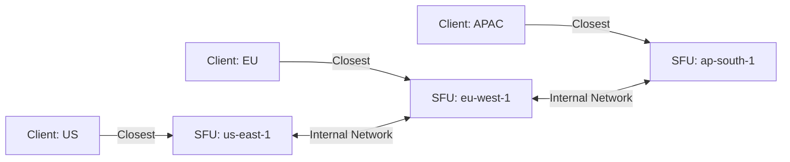

# WebRTC Production Readiness: 5 Years of Lessons

> **Source**: [Things I Wish I Knew Before Building WebRTC](https://youtu.be/jBIq8ltl4O0)

> [!IMPORTANT]
> **The Reality**: WebRTC is not "just an API". It's a **complex framework** requiring specialized expertise.
> **The Learning Curve**: 6-12 months to proficiency.

---

## 🎯 The Core Technical Challenges

### 1. Interoperability (Device & Browser Variance)

**The Problem**:
*   **Cameras**: iPhone (H.264 only) vs Android (VP8/VP9).
*   **Microphones**: Desktop (stereo) vs Mobile (mono).
*   **Browsers**: Chrome (full support) vs Safari (limited).

**Solutions**:
*   Use **`webrtc-internals`** (Chrome) for debugging.
*   Implement **device-specific error messages**: "Your iPhone 6 camera is not supported. Please use iPhone 7+."

---

### 2. Safari: The Eternal Challenge

| Feature | Chrome/Firefox | Safari (macOS) | Safari (iOS) |
| :--- | :--- | :--- | :--- |
| **Screen Sharing** | ✅ | ✅ | ❌ |
| **Multiple Cameras** | ✅ | ✅ | ❌ |
| **Autoplay** | ✅ (with `muted`) | ⚠️ Requires `playsinline` | ⚠️ Requires `playsinline` |

**Workaround**: Browser detection.
```javascript
const isSafari = /^((?!chrome|android).)*safari/i.test(navigator.userAgent);
if (isSafari && iOS) {
  alert('Screen sharing not supported on iPhone. Use desktop');
}
```

---

## 📈 Scalability: Mesh vs SFU vs MCU

### Architecture Comparison

| Topology | Max Participants | Upload (per client) | CPU (per client) | Use Case |
| :--- | :--- | :--- | :--- | :--- |
| **Mesh** | 4-5 | N-1 streams (4 Mbps for 5 people) | 100% | P2P only |
| **SFU** | 100+ | 1 stream (2 Mbps) | 30% | Group chat |
| **MCU** | 1000+ | 1 stream (2 Mbps) | 10% | Webinars |

### Geographical Cascading (2000+ Participants)


---

## 🌐 Networking: NAT & Congestion

### STUN vs TURN
*   **STUN**: Discovers public IP (free, Google provides servers).
*   **TURN**: Relays media when direct P2P fails (expensive, ~30% of calls need it).

**Cost**: 1000 concurrent calls * 30% TURN * 2 Mbps * $0.09/GB = **$5k/month**.

### Congestion Control (Adaptive Bitrate)
**The Problem**: Wi-Fi degrades → 5% packet loss → Video freezes.

**Solution**: Use **VP8 Simulcast** (send 3 layers).
```javascript
const sender = pc.addTrack(videoTrack, stream);
const params = sender.getParameters();
params.encodings = [
  { rid: 'h', maxBitrate: 1500000 }, // 1080p
  { rid: 'm', maxBitrate: 600000 },  // 480p
  { rid: 'l', maxBitrate: 200000 }   // 240p
];
sender.setParameters(params);
```

**Server** selects layer based on client's bandwidth.

---

## 🔐 Security: Insertable Streams (E2EE with SFU)

### The Problem
*   **P2P**: End-to-end encrypted (good).
*   **SFU**: Server must decrypt to route (bad for privacy).

### The Solution: Insertable Streams API
```javascript
const sender = pc.getSenders()[0];
const streams = sender.createEncodedStreams();

// Encrypt outgoing frames
streams.readable.pipeThrough(new TransformStream({
  transform(frame, controller) {
    const encrypted = encrypt(frame.data, myKey);
    frame.data = encrypted;
    controller.enqueue(frame);
  }
})).pipeTo(streams.writable);
```

**Result**: SFU relays encrypted frames **without decoding**.

---

## 🧪 Testing: The Expensive Reality

### The Challenge
Test **all combinations**:
*   **Browsers**: Chrome, Firefox, Safari, Edge.
*   **OS**: Windows, macOS, Linux, iOS, Android.
*   **Networks**: 1 Mbps, 10 Mbps, 100 Mbps.

**Matrix**: 4 browsers * 5 OS * 3 networks = **60 test scenarios**.

### Tools
| Tool | Type | Cost | Use Case |
| :--- | :--- | :--- | :--- |
| **Kite** | Open-source | Free (AWS credits) | WebRTC interop |
| **BrowserStack** | Commercial | $200/month | Cross-browser |
| **testRTC** | Commercial | $500/month | Load testing (1000+ users) |

---

## ⚡ Optimization: Bandwidth Reduction

### UI Pattern: Active Speaker Detection
**Traditional**: Show 9-person grid (9 * 2 Mbps = **18 Mbps download**).
**Optimized**: Show active speaker (1 stream = **2 Mbps download**).

**Savings**: 89% bandwidth reduction.

```javascript
session.on('streamPropertyChanged', (event) => {
  if (event.changedProperty === 'hasAudio' && event.newValue === true) {
    // This is the active speaker
    showVideoLarge(event.stream);
  }
});
```

---

## ✅ Principal Architect Checklist

1.  **Test Safari First**: It has the most limitations. Don't discover them in production.
2.  **Use SFU for >5 Participants**: Mesh doesn't scale. Period.
3.  **Budget for TURN**: 30% of calls need it. Self-host `coturn` or use Twilio ($5k/month at scale).
4.  **Implement Simulcast**: Essential for handling variable bandwidth (coffee shop Wi-Fi).
5.  **Use Insertable Streams for E2EE**: Only if privacy is mandatory (healthcare, finance).

---

## 🔗 Related Documents
*   [WebRTC Production Challenges](./webrtc-production-challenges-guide.md) — NAT traversal, Safari quirks.
*   [Group Streaming Architecture](./group-streaming-architecture-guide.md) — SFU vs MCU.
*   [WebRTC Complexity](./webrtc-complexity-analysis-guide.md) — Learning curve analysis.
