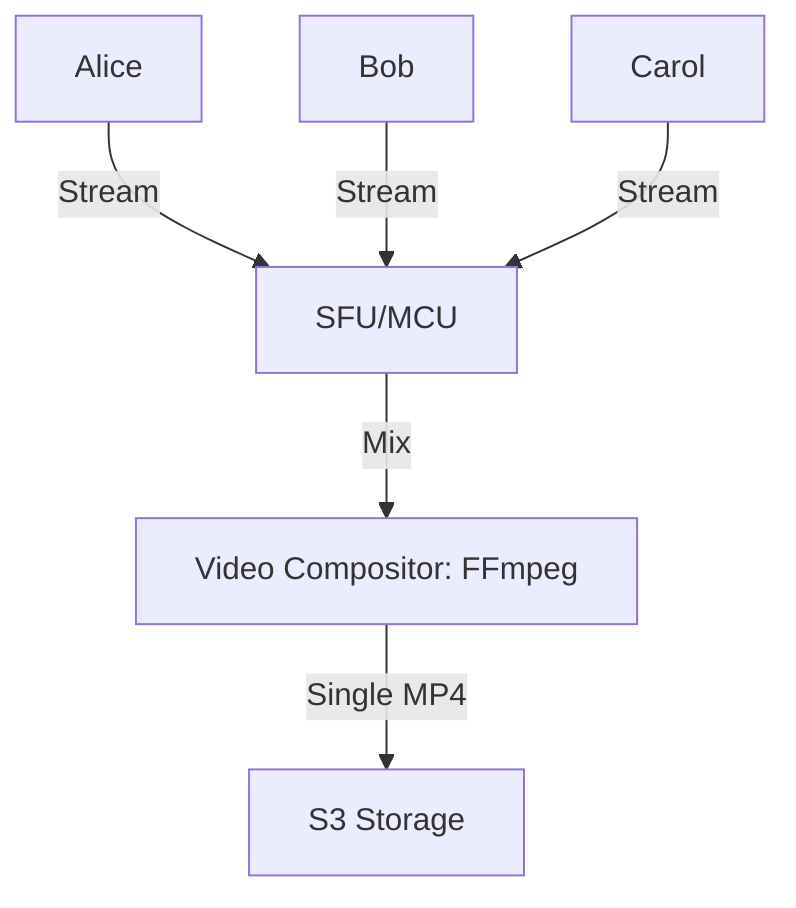
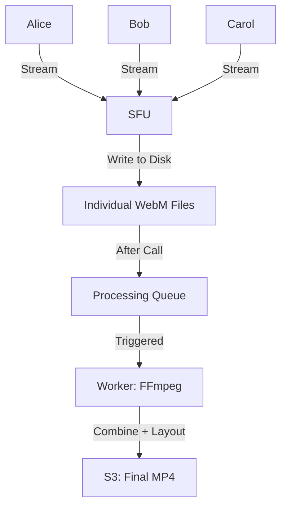
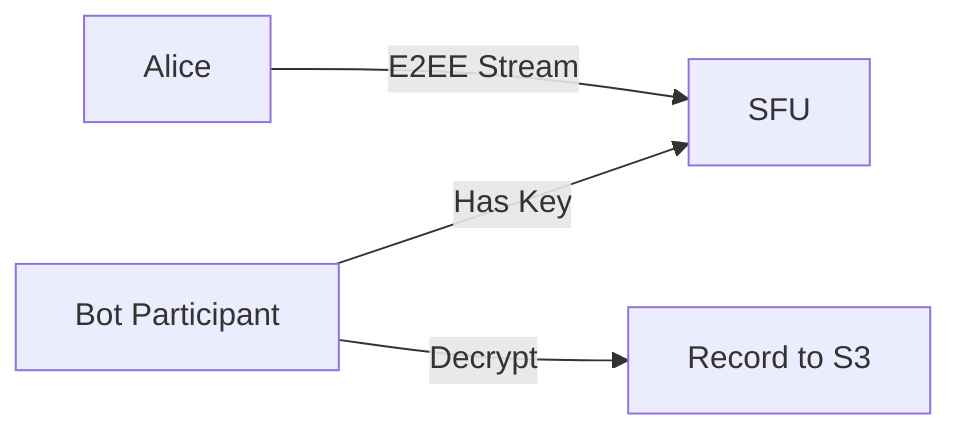

# WebRTC Recording: Architecture & Cost Analysis

> **Source**: [Adding Recording to WebRTC Apps](https://youtu.be/H9vAnv2WoKI)

> [!IMPORTANT]
> **The Decision**: Recording architecture must be chosen **upfront** (can't change later without major refactor).
> **The Trade-off**: Composite (simple, inflexible) vs Individual Streams (complex, flexible).

---

## 📹 The Three Use Cases

| Use Case | Recording Frequency | Retention | Priority |
| :--- | :--- | :--- | :--- |
| **Meeting Records** | 10-50% of calls | 30-90 days | Layout quality |
| **Customer Service (QA)** | 100% of calls | 1-7 years | Compliance, storage cost |
| **Content Production** | 100% of calls | Permanent | Highest quality, custom layouts |

---

## 🏗️ Architecture 1: Composite Recording (Server-Side Mix)

### How It Works

### The Process
1.  **Server** receives all participant streams.
2.  **Compositor** (FFmpeg) mixes into grid layout (Brady Bunch style).
3.  **Output**: Single MP4 file.

### Pros
*   ✅ **Simple**: One click → One file.
*   ✅ **Instant**: Available immediately after call ends.
*   ✅ **Easy playback**: Users just click "Watch Recording".

### Cons
*   ❌ **Fixed layout**: Grid can't be changed post-call.
*   ❌ **Poor screen sharing**: Screen share = small box in grid (unreadable).
*   ❌ **High CPU**: Server must encode composite video in real-time.
*   ❌ **Scalability**: 1 server = 20 concurrent recordings (vs 100 without recording).

### Cost (100 Calls/Day)
*   **Server**: c5.4xlarge (16 vCPU) = $0.68/hour.
*   **Capacity**: 20 concurrent calls.
*   **Instances**: 5 (to handle peak load).
*   **Cost**: 5 * $0.68 * 24 * 30 = **$2,448/month**.

---

## 🎬 Architecture 2: Individual Streams (Post-Processing)

### How It Works

### The Process
1.  **During call**: SFU writes each participant's video to separate file (WebM).
2.  **After call**: Job queued for post-processing.
3.  **Worker**: FFmpeg combines files, applies custom layout.
4.  **Output**: Single MP4 available **5-30 minutes later**.

### Pros
*   ✅ **Custom layouts**: Screen share always full-screen, speakers in sidebar.
*   ✅ **Low CPU during call**: SFU just writes to disk (no encoding).
*   ✅ **Scalability**: 1 server = 100 concurrent calls (same as non-recording).
*   ✅ **Post-editing**: Can re-render with different layout later.

### Cons
*   ❌ **Complex**: Must sync timestamps, handle late joiners/early leavers.
*   ❌ **Delayed**: 5-30 min processing time before available.
*   ❌ **Storage**: 2x storage (individual files + final MP4).
*   ❌ **Dev effort**: 2-3 weeks (vs 2 days for composite).

### Cost (100 Calls/Day)
*   **SFU Server**: c5.large (2 vCPU) = $0.085/hour (no encoding).
*   **Processing Workers**: c5.2xlarge (8 vCPU) = $0.34/hour.
*   **Queue**: 100 calls/day * 30 min processing = 50 hours/day.
*   **Worker Cost**: 50 * $0.34 = **$17/day** = **$510/month**.
*   **Total**: $61 (SFU) + $510 (workers) = **$571/month**.

**Insight**: Individual streams = **4x cheaper** at scale (100+ concurrent calls).

---

## 💾 Storage Cost Analysis

### Scenario: Customer Service (100% Recording, 1-Year Retention)
*   **Calls/Day**: 1000.
*   **Avg Duration**: 20 minutes.
*   **Bitrate**: 2 Mbps (HD video + audio).

**Monthly Data**:
*   1000 calls/day * 20 min * 2 Mbps = **40 GB/day** = **1.2 TB/month**.

**Annual Storage**:
*   1.2 TB/month * 12 months = **14.4 TB**.

**S3 Cost**:
*   14.4 TB * $0.023/GB = **$331/month** (growing monthly).

**Insight**: Storage exceeds server costs after 6 months.

---

## 🔒 Compliance & Privacy

### HIPAA (Healthcare)
*   **Encryption**: At-rest (S3 SSE) + In-transit (HTTPS).
*   **Access Control**: IAM policies (only authorized staff).
*   **Audit Logs**: CloudTrail tracks who accessed what.

### GDPR (EU)
*   **Right to Deletion**: Must support "Delete my recording" requests.
*   **Consent**: Explicit opt-in before recording starts.
*   **Data Residency**: Store EU customer recordings in EU region (S3 eu-west-1).

### Retention Policies
| Industry | Typical Retention |
| :--- | :--- |
| **Corporate** | 30-90 days |
| **Customer Service** | 1-3 years |
| **Healthcare** | 7 years (HIPAA) |
| **Finance** | 7 years (SOX) |

---

## ⚡ The E2EE Conflict

### The Problem
**E2EE** (End-to-End Encryption) = Server **cannot decrypt** media.

**Recording** = Server **must decrypt** media to record.

**Result**: E2EE + Recording = **Mutually exclusive** (in traditional architecture).

### The Workaround (Enterprise Only)
**"Dummy Participant" Model**:

**Cost**: Additional $0.68/hour per recording (dedicated bot VM).

**Who Uses**: Governments, finance (high compliance + E2EE both required).

---

## 🎯 Decision Matrix

### Choose Composite If:
*   **Simple UX** is priority (instant playback).
*   **Fixed layout** is acceptable (no screen sharing).
*   **Low call volume** (<100/day).

### Choose Individual Streams If:
*   **Custom layouts** needed (screen share full-screen).
*   **High call volume** (>100/day).
*   **Post-editing** required (re-render with different layout).
*   **Budget** allows 2-3 weeks dev time.

---

## ✅ Principal Architect Checklist

1.  **Decide recording strategy upfront**: Can't easily migrate composite → individual streams later.
2.  **Budget for storage growth**: After 6 months, storage > server costs (use lifecycle policies: S3 → Glacier after 90 days).
3.  **Implement retention policies**: Auto-delete after N days (GDPR compliance + cost savings).
4.  **Use separate S3 buckets**: Separate production recordings from dev/test (avoid accidental deletion).
5.  **Monitor processing queue**: Individual streams = potential bottleneck (alert if queue depth >100).

---

## 🔗 Related Documents
*   [SFU vs MCU](./sfu-mcu-architecture-guide.md) — Composite recording requires MCU.
*   [WebRTC E2EE](./webrtc-e2ee-guide.md) — Why E2EE breaks recording.
*   [Group Streaming Architecture](./group-streaming-architecture-guide.md) — Client-side recording alternative.
