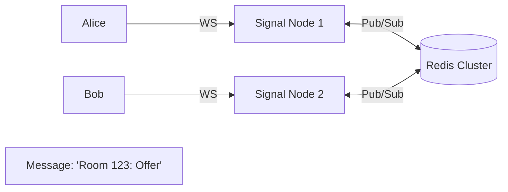
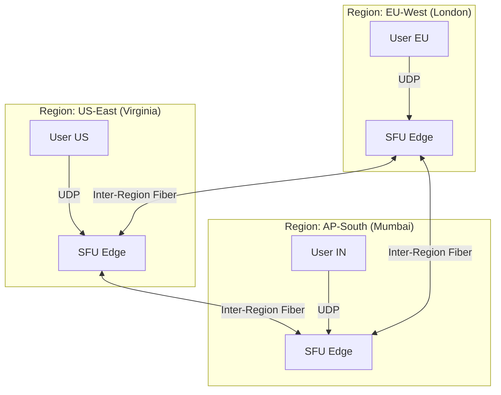

# WebRTC Scaling Architecture: From 1 to 1 Million

> **Level**: Principal Engineer
> **Scope**: SFU Cascading, Geo-Routing, Signaling Fan-out, and TURN Optimization.

> [!IMPORTANT]
> **The Myth**: "WebRTC is Peer-to-Peer, so it scales infinitely."
> **The Reality**: P2P fails at >5 users. SFUs (Selective Forwarding Units) are required, and *they* are the bottleneck.

---

## 🏗️ 1. The Signaling Layer (WebSocket Fan-out)

Signaling (SDP exchange) is the easy part. It's just JSON over WebSockets.

### The Problem: Statefulness
You can't just put a Round-Robin Load Balancer in front of 10 WebSocket servers.
*   Alice connects to `Server-A` for Room 123.
*   Bob connects to `Server-B` for Room 123.
*   `Server-A` doesn't know about Bob.

### The Solution: Redis Pub/Sub Adapter

*   **Architecture**: Stateless WebSocket nodes + Stateful Storage (Redis).
*   **Scale**: 1 Redis node handles ~50k msgs/sec. For 1M+ users, use **Redis Cluster** sharded by `RoomID`.

---

## 🌍 2. The Media Layer (SFU Cascading)

### The Problem: Single SFU Limits
*   **CPU**: Decoding/Encapsulating packets.
*   **Bandwidth**: The real killer. 1 Gigabit NIC = ~500 streams (2 Mbps each).
*   **Physics**: A user in Tokyo connecting to an SFU in NY = 200ms latency.

### The Solution: Cascaded SFUs (Mesh of Stars)
Instead of backhauling everyone to one server, we **edge-terminate** the media.

### The "Cost of Cascading" Matrix
| Model | Latency | Bandwidth Cost | Implementation Difficulty |
| :--- | :--- | :--- | :--- |
| **Mesh (All-to-One)** | High (Backhaul) | High (Cross-region egress) | Low |
| **Tree Cascade** | Medium | Medium | Medium |
| **Via-Router (Relay)** | **Lowest** | **Lowest** | **Extreme** |

> **"Via-Router"**: Only *one copy* of the stream traverses the ocean. The SFU in US sends 1 stream to EU, and the EU SFU replicates it to 1000 local viewers.

---

## 🛡️ 3. NAT Traversal (TURN at Scale)

### The Problem
*   **P2P Success Rate**: ~80%.
*   **Enterprise Firewalls**: Block everything except TCP 443.
*   **Result**: 20% of your users (often the highest-paying corporate ones) need TURN.

### Scaling TURN
1.  **Geo-DNS**: `turn.example.com` resolves to the closest TURN server.
2.  **UDP Preference**: Always try TURN-UDP first. TCP introduces head-of-line blocking (latency spike).
3.  **TURN-TLS on 443**: The ultimate fallback. Mimics HTTPS traffic to penetrate heavy firewalls.

**Cost Warning**: relaying 2 Mbps video = **720 GB/hour**.
*   **AWS Bandwidth**: $0.09/GB → **$64/hour per TURN stream**.
*   **Solution**: Use bare-metal providers (Hetzner/OVH) or negotiate bulk rates.

---

## ⚖️ 4. Load Balancing Strategies

How do you assign a user to an SFU?

### A. Least-Loaded (Naive)
*   *Algorithm*: Pick SFU with lowest CPU.
*   *Flaw*: Might put a Tokyo user on a generic server in Iowa.

### B. Geo-Proximity (Better)
*   *Algorithm*: Pick closest SFU (GeoIP).
*   *Flaw*: "Closest" might be full.

### C. The "Spillover" Hierarchy (Best)
1.  **Try**: Closest Region + Least Loaded.
2.  **If Full**: Closest Region + Spawn New Node (Cloud).
3.  **Fallback**: Neighbor Region + Least Loaded.

**Sticky Rooms**:
Crucial Optimization: Ideally, all users in `Room 123` should be on the **same SFU** (or minimum set of Cascaded SFUs) to minimize inter-server traffic.

---

## ✅ Principal Architect Checklist

1.  **Implement Cascading**: Stop backhauling media. Edge-terminate users.
2.  **Sharding Implementation**: Shard Signaling by `RoomID`. Shard Media by `Region`.
3.  **Monitor Packet Loss on Inter-Region Links**: Cloud providers guarantee bandwidth, not latency/jitter. Use overlay networks (Subspace/Agora) if public internet fails.
4.  **TURN Auth**: Use ephemeral credentials (HMAC) with short Time-To-Live (TTL) to prevent unauthorized relay usage.
5.  **Warm Pool**: Always keep +10% capacity warm. Booting a new SFU takes 30-60s (too slow for a viral burst).

---

## 🔗 Related Documents
*   [Live Streaming Architecture](./live-streaming-architecture-guide.md) — HLS fallback.
*   [WebRTC vs WebTransport](./webrtc-vs-webtransport.md) — Future protocols.
*   [SFU Architecture](./sfu-mcu-architecture-guide.md) — Single node internals.
