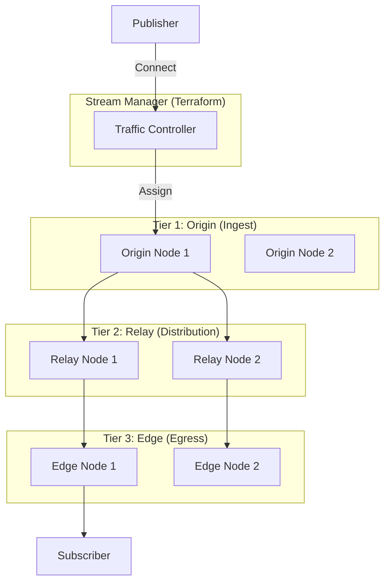

# XDN Architecture: Experience Delivery Networks

> **Source**: [Experience Delivery Networks & Fixing WebRTC](https://youtu.be/vRM46mHJffA)

> [!IMPORTANT]
> **The Evolution**: CDN (Content Delivery Network) = 1 Publisher, Million Viewers.
> **The Revolution**: XDN (Experience Delivery Network) = 1000 Publishers, 1000 Viewers (Multi-directional).

---

## 🌐 1. XDN vs CDN: The Ingest Bottleneck

Traditional scaling focuses on "Egress" (Watching). XDN solves "Ingest" (Publishing).

### Use Case: Exam Proctoring
*   **Scenario**: 1,000 students taking a test.
*   **Requirements**:
    *   1,000 **concurrent uplinks** (Webcams).
    *   1 Admin watching a "Grid" of 50 students at a time.
*   **Problem**: A standard SFU melts under 1,000 *publishers* (Ingest is CPU heavy). A standard CDN takes 30s latency.
*   **Solution**: XDN Distributed Ingest.

### Use Case: Drone Fleets
*   **Scenario**: 500 Drones inspecting a pipeline.
*   **Requirements**: 20ms latency for control.
*   **Solution**: **AWS Wavelength** (5G Edge).

---

## 🏗️ 2. The XDN Architecture (Red5 Pro Model)

A 3-Tier autoscaling topology managed by a **Stream Manager**.

### Components
1.  **Stream Manager**: The Brain. Uses Terraform to spin up/down nodes based on load. Not in the media path.
2.  **Origin (Ingest)**: Handles DTLS handshakes & SRTP decryption from publishers.
3.  **Relay**: Dumb pipe. Just moves UDP packets between regions.
4.  **Edge**: Handles SRTP encryption & Last-mile delivery to viewers.
5.  **Cauldron (Transcoder)**: Optional node for ABR (Adaptive Bitrate) generation.

---

## ⚡ 3. Next-Gen Capabilities

### 5G Edge (AWS Wavelength)
**Architecture**: Place XDN Edge Nodes *inside* the Telecom Carrier's data center (Verizon/Vodafone).
*   **Benefit**: Bypasses the public internet backbone.
*   **Result**: 20ms Glass-to-Glass latency. Allows remote music performance (Jamming).

### Forensic Watermarking (Per-Stream)
**Feature**: Real-time overlay of UserID on the video.
**Challenge**: Requires re-encoding (CPU heavy).
**XDN Approach**: Watermark at the **Edge Node** (distributed load) rather than the Origin.

---

## 🔧 4. Operational Excellence: The "Rescue Mission"

When a WebRTC app fails, 90% of teams blame the Media Server. They are usually wrong.

### The 4 Levels of "Fixing It"

#### Level 1: Re-architect Media Server (The Trap)
*   **Symptom**: "Quality is bad, let's switch from Twilio to Vonage."
*   **Reality**: CPaaS providers have massive engineering teams. Your bug is likely in your client implementation. Switching just wastes 6 months.

#### Level 2: The "Compounding Bug" Hunt (80/20 Rule)
*   **Strategy**: Fix the "Silent Killers".
    *   *Race Conditions*: Websocket messages arriving out of order.
    *   *Memory Leaks*: Creating new PeerConnections without closing old ones.
*   **Impact**: Fixing 3 bugs solves 80% of crashes.

#### Level 3: App Logic Separation
*   **Pattern**: "Video SDK" vs "App State".
*   **Anti-Pattern**: Putting React State updates *inside* the `onTrack` callback.
*   **Fix**: Decouple. The Video Layer should emit events; the App Layer should react.

#### Level 4: UX & Error Handling (Highest ROI)
*   **Philosophy**: You cannot fix the user's WiFi. You *can* fix how they feel about it.
*   **Implement**:
    *   **Pre-call Tests**: Don't let them join if bandwidth < 300kbps.
    *   **Auto-Mute Video**: If packet loss > 10%, prompt user to turn off camera.
    *   **Friendly Errors**: "Your firewall is blocking UDP" (not "ICE Failed").

---

---

## 📡 3. The Future of Edge: Camara & Network Slicing

For mission-critical XDN apps (Drones, Surgery, Self-Driving Taxis), the "Best Effort" public internet isn't enough.

### What is Camara?
**Camara** is an open-source project (Linux Foundation) that provides standardized APIs for developers to interact with **Telco Networks** (Verizon, Vodafone, etc.).

### Key Capabilities:
1.  **Network Slicing**: Request a "Virtual Lane" on the 5G network specifically for video. This lane has guaranteed priority and zero congestion from other users (e.g., people streaming TikTok).
2.  **Quality-on-Demand (QoD)**: Programmatically tell the network: "User X is a doctor; give them the highest priority for the next 45 minutes."
3.  **Geo-Fencing**: Ensure data never leaves a specific legal jurisdiction (Critical for Sovereignty/HIPAA).

---

## ✅ Principal Architect Checklist

1.  **Define Ingest Scale**: Do you have 1 publisher (Broadcast) or 1000 publishers (Proctoring/Drone)? If 1000, you need XDN.
2.  **Audit 5G Necessity**: Do you need <50ms? If yes, deploy to AWS Wavelength. If no, standard regions are fine.
3.  **Stop "Server Hopping"**: Before migrating away from a CPaaS, audit your client-side error logs. The call is likely coming from inside the house.
4.  **Implement Throttling UX**: Hard-code logic: `if (loss > 5%) disableVideo()`. Be aggressive.

---

## 🔗 Related Documents
*   [WebRTC Scaling](./webrtc-scaling-architecture-guide.md) — Standard Fan-out.
*   [Interactive Streaming](./interactive-streaming-architecture-guide.md) — Broadcast (1-to-many).
*   [WebRTC Debugging](./webrtc-debugging-guide.md) — For Level 2 bug hunting.
