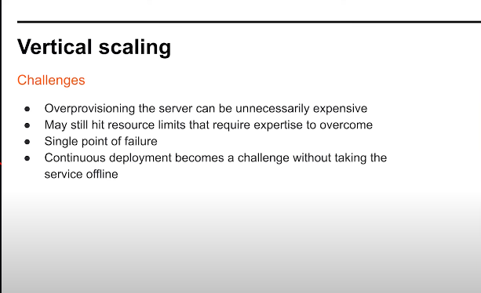
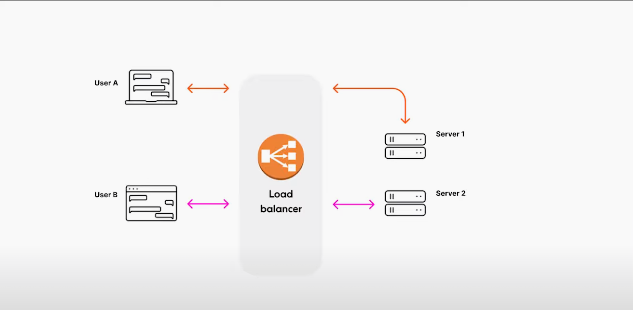
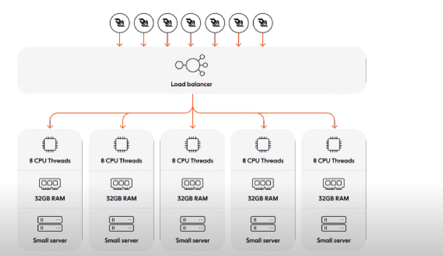
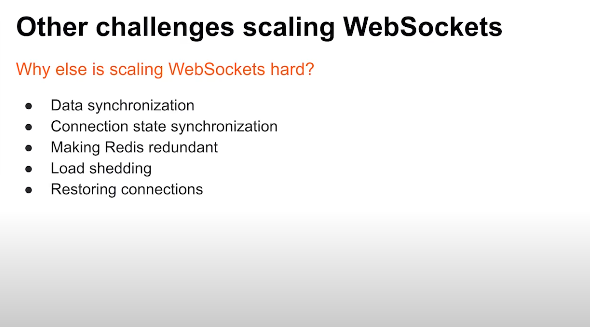

# Websockets

- Heartbeat
- Buffer undelivered messages
- Messages routing
- Broadcast
- Handling backpressure
- Automatic reconnection
- Message acknowledgements
- Encryption
- Multiplexing
- Fallback (HTTP long polling)

# Scalling websockets

- When comes to scalling often `websockets` by design native `Websocket API` is minimal thus efficient

- Scalling Native `Websocket API` to millions is difficult thus

- when scalling `websockets` to millions, requires addtional steps or tools e.g. `pusher wraps around native websocket and does the additional processing on top of it to make websocket scallable to millions on production`

# Any server (could) primarily be scalled in two ways: vertical and horizontal

## Vertical scalling: challenges

## Horizontal scalling: challenges

- With this approach, remove or add more servers on demand
- Another important aspect of this apporach, `load balancer` which efficiently as per business demand/logic distribute the `incoming websocket connectsion` as per applied `load balancer algorithim`

- architechtural problem: imagine building a chat application and the load balancer routes `User A to Server 1` and then (by default round-robin algorithm) `User B routed to Server 2` -> now how does these (User A, User B) communicates ? so, there is no link between (refer to below image)

- Solution: store the connection state out of process using a message broke such as Redis *using pub-sub architechture -> so, now when `User A sends a message through Server 1, Server 1 forwards the message to Server 2 via Redis there Redis here act as middleman then Server 2 (where User B) can send message throuh websocket connection to User A via Redis` - but keep in mind that that this will have its own challenges

## Scalling websocekts: other challenges

- data sychronization and syncing of connection states: When User A goes offline, User B has not notified so again going back to `chat example` User B must see that User A is offline

- Since, now sharing the connection state within Redis, so now it becomes a `single source/point of faliure: so this create another challenge that needs to solved`

- When one of the serves are being overloaded and reaching its hardware limit (refer: below image), then to ensure a server doesn't become overloaded or close to being overloased, there has to some logic at backend/infrastructure-level to detect when any server nearly its hardware limit then first of reject incoming websocket connection on that server to not put more laod and then **probably** shed some existing connections as well which is where you force them to disconnect they will then tty  recconect to the service and hopefully make their way to a healthier back-end node -> this has to impleented properly else it could break things in production -> But there is another issue tied to it i.e. "restoring connections" because even if you do shed connections from one server to the other or maybe one server just goes offline and in both cases now  a bunch of connectionss can come thundering home-hitting the same server at the same time , this will undue presssure on the server which can lead to kind of errors connecting delay and also affects server's performance can degrade , increase latency and even server goes offline at some point => so, all these things must be handled meticulously and properly tested before production  

