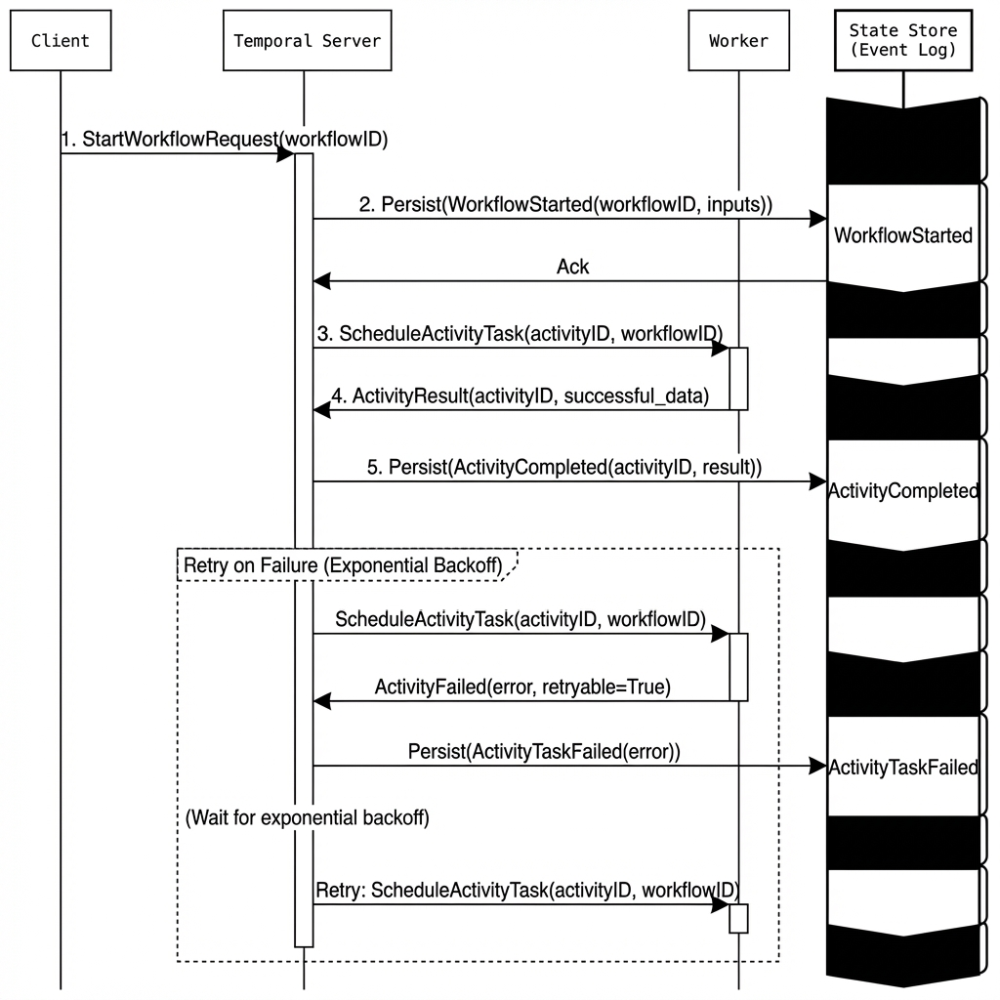
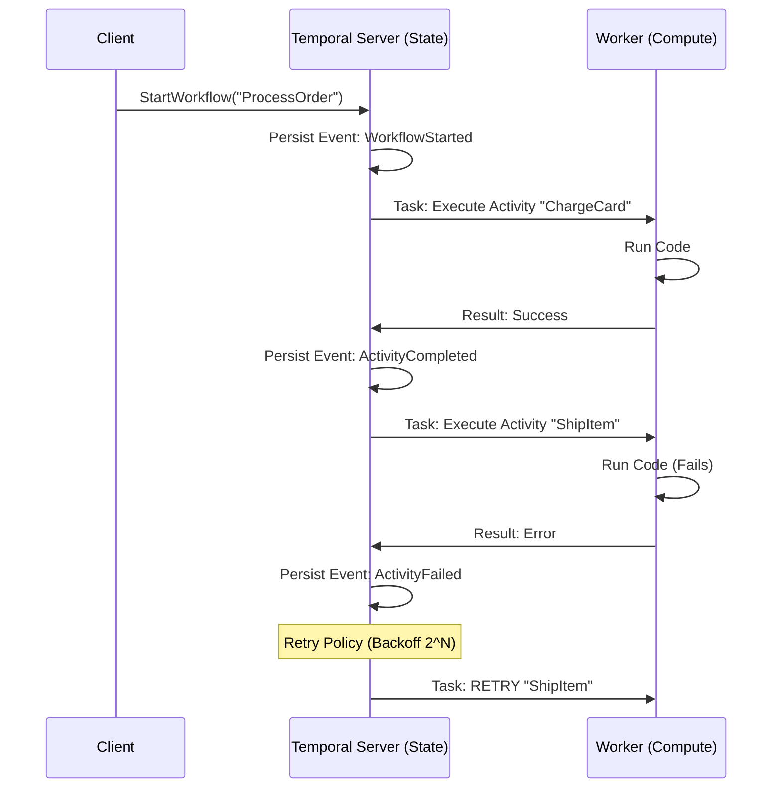

# Workflow Engines: Temporal vs AWS Step Functions

> **Source**: [Temporal Deep Dive (Believe in Serverless)](https://youtu.be/ODa23kAWHko)

> [!IMPORTANT]
> **The Trade-off**: AWS Step Functions is "fully managed" but declarative (JSON). Temporal is "code-first" but self-hosted.
> **The Question**: Do you want AWS to manage the state machine, or do you want to manage the worker fleet?

---

## 🏗️ The Architecture: State vs Compute

Both systems separate **State Management** from **Compute**.

| Component | Step Functions | Temporal |
| :--- | :--- | :--- |
| **State Store** | AWS-managed (DynamoDB) | Self-hosted (Cassandra/Postgres) |
| **Compute** | AWS-managed (Lambda) | User-managed (Workers in Docker/Fargate) |
| **Definition** | Amazon States Language (JSON) | TypeScript/Go/Java/Python (Code) |
| **Max Duration** | 1 year (Standard), 5 min (Express) | 20+ years (until 50k events) |

---

## 🎯 When to Use Each

### Use Step Functions If:
*   You want **zero operational overhead**.
*   Your workflow is **simple** (linear steps, basic retries).
*   You are already deep in the AWS ecosystem (Lambda, DynamoDB).

### Use Temporal If:
*   You need **complex logic** (loops, dynamic branching, decades-long workflows).
*   You need **testability** (run the entire workflow in CI/CD without AWS).
*   You want **multi-cloud portability** (Temporal runs anywhere).

---

## 🔄 The Workflow Lifecycle

### Temporal's Event Sourcing Model



Temporal does not store "current state". It stores **every decision** and replays them.



*   **Determinism**: The workflow code must be **deterministic**. You cannot use `Math.random()` or `new Date()` directly. Use Temporal's API.

---

## ⚙️ Configuration: Retries & Timeouts

### Temporal Retry Policy
```typescript
{
  initialInterval: "1s",
  backoffCoefficient: 2.0,  // Must be >= 1.0
  maximumAttempts: 5,
  maximumInterval: "100s"
}
```

### Step Functions Retry (ASL)
```json
{
  "Retry": [{
    "ErrorEquals": ["States.Timeout"],
    "IntervalSeconds": 1,
    "BackoffRate": 2.0,
    "MaxAttempts": 3
  }]
}
```

Both support exponential backoff. Temporal's advantage: You write it in **real code** with autocomplete.

---

## 💰 The Cost Model

### Step Functions
*   **Pricing**: Per state transition.
*   *Example*: 1M transitions/month = $25 (Standard), $1 (Express).

### Temporal Cloud
*   **Pricing**: Minimum **$200/month** support plan.
*   *Self-Hosted*: Free (but you manage Cassandra/Postgres + Workers).

> [!WARNING]
> **Hidden Cost**: With Temporal, you **own the worker fleet**. You must monitor CPU, memory, and queue depth. With Step Functions, AWS handles this.

---

## ✅ Principal Architect Checklist

1.  **Test Locally**: Temporal's killer feature is the ability to run workflows in unit tests. Step Functions requires LocalStack or mocking.
2.  **Monitor State Transitions**: In Temporal, every "decision" is a billable event (if using Cloud). In Step Functions, every state transition is billed. Optimize accordingly.
3.  **Use Schedules for Cron**: Both support CRON. Temporal's UI makes this trivial. In Step Functions, use EventBridge Scheduler.
4.  **Plan for Capacity**: Temporal requires you to scale workers manually (or use Auto Scaling Groups). Step Functions scales automatically.

---

## 🔗 Related Documents
*   [Saga Pattern](../distributive-backend/database/saga/saga-pattern-guide.md) — Temporal is a Saga Orchestrator.
*   [Event Sourcing](../distributive-backend/event-drive-microservices/event-sourcing/event-sourcing-guide.md) — Temporal's internal model.
